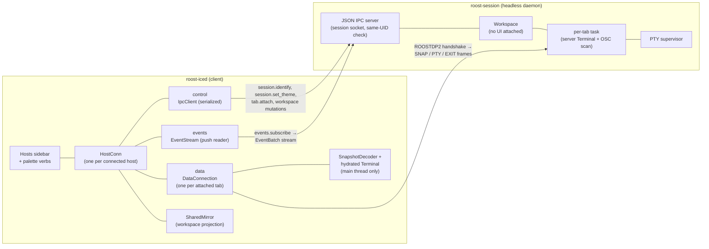
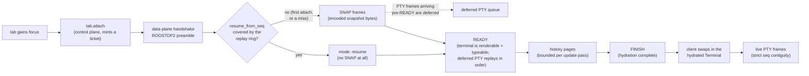
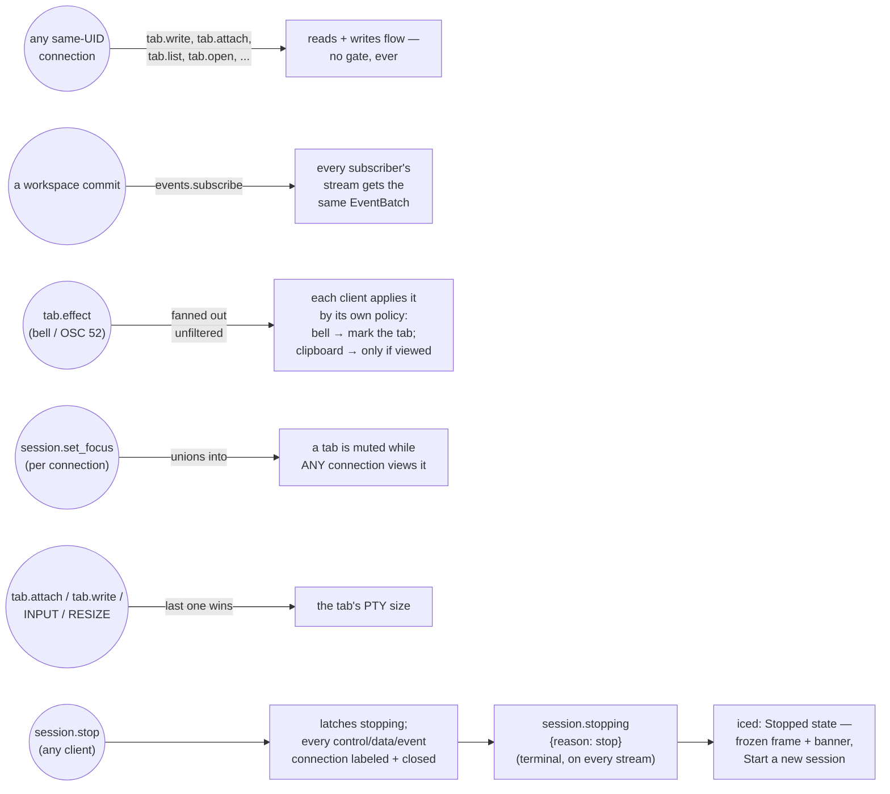

# Host Sessions

Host sessions (HS-1a/HS-1b/HS-2 in the [roadmap](https://github.com/charliek/roost/blob/main/discovery/host-sessions-roadmap.md)) let a `roost-session` daemon own a workspace + PTY supervisor that outlives any UI attached to it, and let the iced UI attach to one as a client. This page is the shipped architecture: the component topology, the attach sequence, and how multiple clients share one session. [`reference/ipc.md`](../reference/ipc.md#session-sockets) is the **normative wire spec** — this page explains the shape, that page is the contract. The design rationale and the full decision history live in [`discovery/host-sessions-architecture.md`](https://github.com/charliek/roost/blob/main/discovery/host-sessions-architecture.md) and [`discovery/host-sessions-roadmap.md`](https://github.com/charliek/roost/blob/main/discovery/host-sessions-roadmap.md).

Scope: iced-only (`crates/roost-iced`); the server crate (`crates/roost-session`) now builds and ships for both Linux and macOS. The Swift Mac app has none of this. See [DL-17](vision.md#dl-17-an-opt-in-headless-roost-session-daemon-for-host-sessions-2026-08-28) and [DL-18](vision.md#dl-18-hosts-ux-attach-on-focus-effects-theme-reseed-and-the-mac-gate-2026-08-29) in the decision log for why the shape is what it is, and the [user guide](../guides/host-sessions.md) for how it looks from the outside.

## Component topology



**Three connections per host, not one.** `IpcClient` is strictly request/response and sequential (`roost-ipc/src/client.rs`), so a single connection can't both serve ordinary control calls *and* stream events or terminal bytes without one blocking the other. `HostConn` (`crates/roost-iced/src/host_conn.rs`) owns three: **control** for everything request/response against the *session* (identify, connect, `session.set_theme`, the workspace mutations a host's rows accept, minting `tab.attach` tickets — serialized through a per-host op queue, plan 037 §3.9, so a mutation and an attach can never interleave on the wire); **events**, a push reader subscribed once and read forever, feeding a `SharedMirror` — a client-side projection of that host's workspace, fenced against the subscribe ack revision exactly like `tools/roosttest/eventstream.py` does; and **data**, one per *attached* tab (attach is on-focus — background host tabs stay current via the mirror alone, and only the focused tab pays for a live byte stream). The mirror and the decoded terminal are read by the UI at draw time and updated in place — there is no per-commit clone to keep, which is what keeps a chatty host from piling full-workspace copies onto an unbounded channel.

**Everything lands on one feed.** `HostWorkspace(HostId, ...)` and `HostState(HostId, ...)` variants ride the same `EngineFeed` local workspace events and PTY output already use (`crates/roost-iced/src/engine_feed.rs`), so a host's mirror wake and a local tab's PTY chunk drain through the identical FIFO on the main thread — no second event loop, no second threading story. `HostId` identifies a connection **instance**, not a host: every connect attempt that follows one which published data mints a fresh id, so a reconnect's first `Connecting` message names the incarnation it replaces and a consumer purges-then-rebuilds off that one message rather than tracking staleness itself.

## The attach sequence

Attach is **on-focus**: a tab dials its data connection only while it's the one you're looking at, and detaches (dropping the connection, never the session) the moment you switch away. Re-focusing resumes from where it left off when the server's replay ring still covers the gap, and silently re-snapshots when it doesn't — the wire guarantees the fallback in the same reply, so the client never has to ask twice.



**The terminal swaps at FINISH, not READY.** `SnapshotDecoder` (`crates/roost-vt/src/snapshot.rs`) owns its terminal until `finish()` completes, so the client keeps rendering the **previous** terminal — the old frame, or nothing on a first attach — until the new one is fully hydrated. This is a recorded deviation from the plan's original swap-at-READY: a swap-at-READY would need a second render path into the published snapshot for a terminal the decoder still owns, and it was deferred as unbuilt because a retry loop must never blank the tab either way, and a fresh tab's READY and FINISH arrive close enough together that the difference isn't visible in practice. Live PTY bytes interleave into the decoder throughout, so nothing arriving between READY and FINISH is lost — it's simply replayed in decode order once the terminal exists to receive it.

**Resize is withheld, not sent live, until the hydration settles.** A user resize between attach and FINISH is queued (latest-wins) and sent once — at FINISH, or after a 2s timeout, whichever comes first — because resizing a decoder that hasn't finished producing a terminal would forfeit the history pages still in flight. Once live, `seq` must be exactly `last + 1`; a gap, duplicate, wrong epoch/generation, or an `EOF` before `FINISH` all mean the same thing — the stream can no longer be trusted — and the client drops the attach and re-attaches with capped backoff, which resets only once the connection reaches `Live` again.

## Multiple clients {: #the-leasetakeover-lifecycle }

A session has no owner. R1 (plan 049) opened reads; R15 (plan 057,
[#453](https://github.com/charliek/roost/issues/453)) opened writes;
what remained after both was "the foreground" — an interactive lease
that decided whose event stream got `tab.effect`, whose focus muted
notifications, and which connection the session-wide settings ops would
accept. Plan 061 retired it (protocol `5`, [DL-26](vision.md#dl-26-there-is-no-lease-2026-09-12)):
there is no `session.connect`, no `lease` field on any op, and no
`session.driver_changed` event. Every same-UID connection is symmetric,
and reconnecting is just a reconnect — never a claim on anything
another connection holds.



**Effects fan out; the viewing client applies them.** Every subscriber
receives every `tab.effect` — there is no per-connection classification
of the stream, and no client is anybody else's side-channel. What each
client does with one is its own policy: a bell is worth marking on any
tab it owns (there is no ring seam to gate — marking a background tab
is what a bell should do), while an OSC 52 clipboard write is applied
only to the tab that client is actually *viewing* — its own selection,
never a mirrored "active tab" that some other client's connection
happens to be looking at — and independent of window focus, so a copy
in the viewed tab lands even while the window is unfocused, the way
tmux behaves. A client attached to a different tab, or not attached at
all, simply never sees its own clipboard touched by somebody else's
paste.

**Focus is a union, not an election.** `session.set_focus` is a plain
per-connection statement — "this connection is looking at tab N" — and
moves nothing else: the session's active selection and persisted
selection move only through `tab.focus`. A tab is muted while **any**
connection says it is looking at that tab
(`tab_is_being_watched(tab) = (window_focused && active_tab_id
== tab) || viewing.values().any(|t| *t == tab)`); a connection's
statement is forgotten the moment it restates `null` or the connection
closes, and nothing else clears it. Two clients on two different tabs
therefore both get muted correctly, with zero further coordination
traffic once each has said its own tab once — there is no re-push to
answer, because nothing about one connection's statement can disagree
with another's.

**Geometry is last-interactor** ([DL-25](vision.md#dl-25-raw-input-is-open-to-every-same-uid-client-the-lease-is-the-foreground-2026-09-08)),
unchanged by this plan: whichever connection last sent a geometry-
bearing frame (`tab.attach` with `focus: true`, `tab.resize`, or a
data-plane `INPUT`/`RESIZE`) sizes the tab. Nothing elects a size
holder; the PTY simply has the size the last such frame asked for.

**`session.stop` still closes everything, from any client.** It labels
and closes every control connection, every data connection, and every
event stream this session ever admitted, regardless of who opened it —
the same behavior as before this plan, because stopping the session was
never part of the lease.

**A reconnect is a reconnect.** There is no takeover to detect, no
tombstone to fall back to, no "observer of the foreground" mode, and no
"take the foreground" affordance — a client that lost its connection
simply reconnects through the ordinary ladder below and is admitted
exactly like any other connection, symmetric with whatever else is
already attached.

**Auto-reconnect never auto-spawns.** Launch-time reconnect — on both platforms — is *connect-if-present* and **localhost-only**: it probes that socket, and if nothing answers, the section shows disconnected with a manual ↻ rather than silently starting a daemon. A saved SSH host is not dialed at launch at all — `reconnect_saved_hosts` declines every non-localhost transport before resolving it, so an SSH host is skipped rather than probed and found wanting. Connecting to a remote machine is an outbound decision, and at launch nobody has asked for it. A *mid-session* drop is different. A `localhost` session that was running and *went away* is retried with jittered, capped backoff (`Backoff` in `host_conn/state.rs`, 250ms base up to a 30s ceiling); a saved SSH host runs the same kind of ladder once two gates hold at the moment of the drop — the host resolves to `ResolvedTransport::Ssh` (a plain `UnixSocket` target stays manual, unchanged) and the connection had actually reached `Connected` at least once, so a host that never worked in the first place doesn't grow a ladder off its own first failure. The SSH ladder runs its own schedule — 1s base, doubling, jittered `[0.5, 1.0]×`, capped at 30s — and gives up after 10 attempts, settling to `disconnected` with copy that says so; ↻ Reconnect never leaves the screen and is the recovery either way. Not every drop is retried: a changed or unknown host key, a refused login, and a session that is actually gone all settle immediately instead of looping, because each has a different correct next step (see the [user guide's troubleshooting table](../guides/host-sessions.md#troubleshooting) for the full set). Either way, if the session itself died, the host settles on "session ended" (or "no session," for SSH) and only an explicit Connect starts a fresh one — auto-reconnect never starts one for you.

**A session that could not *start* is not a drop, and settles once.** The ladder above is for a session that was there and went away. A launch failure is unrecoverable by construction: `spawn_failure` (`host_conn/task.rs`) classifies the spawn stage into an `AttemptError::Unrecoverable { reason, detail }`, which ends the connect task through `HostStateMachine::settled` and publishes `Disconnected { reason, detail, retry_in: None }` on **every** transport — the localhost bool is deliberately not consulted, because a retry would dial a socket nothing is going to create and overwrite the honest message with a generic io error every 250ms. A locate failure is `cannot find roost-session`; a cwd failure, an exec error (an `io::Error` anywhere in the chain, which `spawn_and_read_verdict` attaches exactly once) or the daemon's own error verdict are `roost-session failed to start`. The two timeout rows stay *retryable* for the mirror-image reason: the daemon was exec'd and may still be on its way to binding, and a dial is the right retry for that. The settled `reason` is written for the band's ~45 characters; what actually happened travels beside it as `detail` — the launch ladder's rungs verbatim, or the exec error — which [`host.status`](../reference/ipc.md#host-registry-host) publishes and `roostctl host status` prints. ↻ Reconnect is the recovery, exactly as after an SSH give-up. The redial path got the matching correction: a `Dial`-mode `NotFound` or `ConnectionRefused` against the socket now reads `no session is running at <socket>` — the same copy the connect-if-present probe uses — instead of `roost_ipc`'s raw `io error: No such file`.

## Server-side additions (HS-2, additive)

Two small additions ride the existing events stream as new event types — additive, and of the kind that does not move `SESSION_PROTOCOL_VERSION` (an older client simply ignores an event name it doesn't recognize), so it stayed at `2` for HS-2. Plan 047 later moved it to `3` for `session.put_file`, which a pre-047 session could only answer `unknown-op` — see the versioning rule in [`ipc.md`](../reference/ipc.md#session-sockets):

- **`tab.effect` events** — a session's per-tab OSC scan now emits `bell` and OSC 52 `clipboard-write` as client-directed effects on the events stream (`crates/roost-engine/src/tab_task.rs`), fanned out to every subscriber for each to apply by its own rule (see [Multiple clients](#the-leasetakeover-lifecycle)) — not to a single owner, and not gated on who is actually typing. Everything else the scanner sees (pointer shape, today) stays dropped and debug-logged in the tab task, by design — the envelope is scoped to these two effects rather than left open to "just one more."
- **`session.set_theme`** — closes the reseed gap the architecture doc left open: a connecting client seeds every tab's server `Terminal` with its own palette (sent right after `session.identify`, before the first `tab.attach`), so a program that queries a color from a session gets back what the attached client is actually rendering, not the server's factory default.

See [`reference/ipc.md`](../reference/ipc.md#events) for the full event catalog and [`session.set_theme`](../reference/ipc.md#sessionset_theme)'s wire shape.

HS-3 adds one more in the same spirit — [`session.set_focus`](../reference/ipc.md#sessionset_focus), the client's real focus (window focus + which tab is selected), pushed down so the session suppresses notifications for the tab the user is actually looking at rather than for whichever tab its headless workspace defaulted to. Any same-UID connection may send it, and it is deliberately short-lived: the connection that reported it closing, or that same connection restating `null`, reverts *that connection's* slot in the union to "nobody is looking" — because a focus is a statement about a window that may no longer exist, and it is scoped to the connection that made it (see [Multiple clients](#the-leasetakeover-lifecycle)). An older session answers `unknown-op` and keeps the HS-2 behavior described under [Known limitations](#known-limitations).

## Reordering a host's sidebar section

A host's projects and tabs drag-reorder the same way LOCAL's always could ([#398](https://github.com/charliek/roost/issues/398), plan 044): the drop dispatches over that host's own connection as an ordinary `project.reorder` / `tab.reorder` call, rather than mutating the local workspace, and the sidebar's new order comes back through the `projects.reordered` / `tabs.reordered` events on the mirror, never from the op's own reply. That's the subtle half: the reply and the event ride separate connections with no ordering between them, so a successful drop *holds* its preview rather than clearing it, until the mirror's order actually moves (or a short belt expires) — clearing on the reply alone would snap the row back and then re-order it a moment later.

Both reorder ops also take the host-qualified `h<host>.<id>` spelling on the **UI socket** now — see [`tab.reorder`](../reference/ipc.md#tabreorder) and [`project.reorder`](../reference/ipc.md#projectreorder) for the wire form and the full routing matrix — so the drag gesture isn't the only way to drive it. `app.sidebar_dump`'s additive [`hosts`](../reference/ipc.md#hosts-the-sections-below-local) array reports a host section's authoritative (mirror) order using those same keys, which is also how `test_host_client.py`'s reorder cases read a host's tab/project order without probing for the incarnation first.

## Transport: SSH hosts

A saved host whose target classifies as an SSH destination (`workbox`, `user@host`, `ssh://user@host:port` — the rule table lives on `crates/roost-ipc/src/ssh.rs`'s `classify`) is not a socket forward. The client drives a local Unix-domain-socket bridge of its own — one per connected host — that reaches the remote session over `ssh` directly:

```text
client (roost-iced)                                    remote machine
  │
  ├─ local bridge.sock  ◄── control / events / data connections (per-tab)
  │        │
  │        ▼
  │   ssh -T <target> "sh -c '...exec roost-session client-bridge'"
  │        (one exec per accepted connection, over a shared private
  │         ControlMaster — control, events, and each attached tab)
  │
  └──────────────────────────────────────────────► roost-session client-bridge
                                                        │
                                                        ▼
                                                 the session's own UDS
                                                 (stdio pumped ↔ socket,
                                                  byte for byte)
```

- **Per-attempt scratch dir, not per-host.** Every connect attempt claims its own directory — `roost-ssh-<host_id>-<pid>-<seq>` under `$TMPDIR` (falling back to `/tmp`; see [`paths.md`](../reference/paths.md#ssh-scratch-directories)) — holding the generated `ssh_config`, the `ControlMaster` control socket, and `bridge.sock`. Naming it per *attempt* rather than per *host* is what lets a double Connect, a disconnect racing the reconnect behind it, or a superseded establish landing late each own a directory nothing else is touching. A fresh attempt sweeps its host's older directories first: this process's own are reclaimed with no probe, and another process's are only reclaimed once its `bridge.sock` probes dead — anything live, or anything that can't be classified, is left alone (fail-safe, the same rule `socket_state` unlinks under).
- **Establish-then-connect.** Opening a tunnel is two steps: a warm-up `ssh` exec (running the remote no-op `true`) pays for the TCP + auth handshake once, up front, where a failure can be classified and reported as itself — `host.connect` answers `connecting`, not the eventual verdict, exactly as it does for a socket target. Only once the warm-up succeeds does the local `bridge.sock` get bound and start accepting. Every connection accepted after that gets its own `ssh -T … exec roost-session client-bridge` over the same shared master, so a long-lived events connection can never block the next `tab.attach`'s exec behind it — spawn-per-connection is the pinned shape specifically to avoid that deadlock.
- **One `ssh` binary is trusted the whole way, and it never prompts.** The generated `ssh_config` `Include`s the user's own `~/.ssh/config` and `/etc/ssh/ssh_config` **first** — their settings, including any keepalive of their own, win over Roost's fallback — then appends a `Host *` block (`ServerAliveInterval 15`, `ServerAliveCountMax 4`, `ConnectTimeout 15`). Every invocation runs with `BatchMode=yes`: key/agent auth only, no password and no interactive 2FA prompt, this slice. `ROOST_SSH_BIN` overrides the `ssh` binary (the test suite points it at a fake — `tools/roosttest/fixtures/fake-ssh.sh`).
- **Teardown is explicit.** Disconnecting runs `ssh -O exit` against the control socket, tearing the shared master down (and every multiplexed connection riding it) before the scratch directory is removed. `SshTunnel`'s `Drop` owes the same teardown synchronously if `shutdown` was never called.
- **The reason overlay.** A failed connection attempt is classified into one of six families (`SshFailure` — changed/unknown host key, auth, no session, `roost-session` not found, or an opaque transport failure) with copy written for a user to act on. It reaches the sidebar band as `disconnected — <reason>`, `host.status`'s `reason`, and the log; an attempt the user asked for additionally raises a toast. See the [user guide's troubleshooting table](../guides/host-sessions.md#troubleshooting) for the full set and remedies. **Where to read the family while a retry is armed:** `reason` shows the armed-rung line (`reconnecting in 8s (3/10)`) — it is the band's input and the sidebar's rollup is derived from it — so the family lives in its own field, `retry.reason`, for exactly as long as that rung is armed ([#399](https://github.com/charliek/roost/issues/399)). Before writing an assertion against it: **read it when it is present, and do not gate on the attempt number.** Absence is ordinary — the drop that starts an outage is usually the live connection dying, a bare bridge EOF with nothing to classify, and the classified copy arrives with the next dial's failure — but it is not tied to the rung's position: a suspend/wake resets the ladder to attempt 1 and deliberately carries the family across, because it is still the same outage. A lane that waited for `attempt >= 2` would throw away a family that is legitimately there.
- **The wire itself doesn't know it crossed a network.** The bridge is a pure byte pump — the same ROOSTDP2 control/events/data protocol reaches a session over SSH byte-identical to a local socket dial (see [`ipc.md`](../reference/ipc.md#session-sockets)).

**Concurrency depends on the one-attach policy.** A connected host realistically holds on the order of 4-5 concurrent `ssh` channels over the shared master at once — the sequential connect prologue (control, then events) plus one attached tab's data connection, with headroom for an in-flight reconnect — comfortably under sshd's default `MaxSessions 10`. That estimate assumes this client's own [one-attached-tab-per-host policy](#known-limitations) — attach-on-focus, unchanged by R15 — rather than any server-side limit; a future multi-attach-from-one-client slice has to re-check it against `MaxSessions` before it can promise more than one live tab per host from here.

**Target classification is Rust-only.** `roost-ipc::ssh::classify` — the rule table that decides whether a saved host's `target` string is an SSH destination, a socket path, or the `localhost` sentinel — has no Swift twin. The Swift Mac app treats a host's `target` as an opaque display string (it round-trips the field through its `state.json` mirror per the HS-0 schema-twin rule, but never interprets it); `roostctl host *` against the Swift socket answers `unknown-op` regardless. A future Swift host-client surface needs the classifier's rule table (`ResolvedTransport`'s doc comment in `crates/roost-ipc/src/ssh.rs`) ported or shared, not re-derived from scratch.

For the full failure-mode table, see [`discovery/host-sessions-architecture.md` §10](https://github.com/charliek/roost/blob/main/discovery/host-sessions-architecture.md#10-ssh-transport-hs-3).

## Bootstrap: install/upgrade over SSH

The transport above still assumes `roost-session` is already installed on the far side, at the right build, and started — miss any of the three and the failure copy above is only advice: install it here, start it there. HS-3's bootstrap slice (plan 039) turns that advice into buttons: on an attended connect that fails `NotFound` or `NoSession`, Roost probes what's actually on the far side and — with explicit consent — installs or upgrades `roost-session` to this client's exact build, starts it, and reconnects. `crates/roost-ipc/src/bootstrap.rs` is the transport-agnostic half (scripts, parsers, the option types); `crates/roost-iced/src/app/bootstrap.rs` is the UI half (the action matrix, the consent card, the job).

**The candidate ladder is one list with two consumers.** `CANDIDATES` in `bootstrap.rs` is defined once and generates *both* the probe's discovery script and an extension of `ssh.rs`'s `remote_command()` (the exec chain a connect actually runs) — so anything the probe can find is exactly what the transport can `exec`, closing the failure mode where a compatible binary sits on a rung the connect path never tried. Eight rungs, tried in order, first executable match wins:

1. `$HOME/.local/bin/roost-session`
2. bare `roost-session`, resolved off the remote's non-interactive `PATH` via `command -v`
3. `/usr/bin/roost-session`
4. `/home/linuxbrew/.linuxbrew/bin/roost-session`
5. `$HOME/.nix-profile/bin/roost-session`
6. `/etc/profiles/per-user/$USER/bin/roost-session`
7. `/nix/var/nix/profiles/default/bin/roost-session`
8. `/run/current-system/sw/bin/roost-session`

The install destination (`$HOME/.local/bin/roost-session`) is rung 1, `const INSTALL_DEST` derived from `CANDIDATES[0]` at compile time rather than hand-duplicated, so a fresh install always wins the very next connect. A unit test parses both generated scripts and asserts they enumerate the identical rung order.

Every bootstrap exec — discovery, identity, install, stop, start — shares one fresh, job-scoped `ssh` `ControlMaster` (`-S <job-scratch>/ctl -o ControlMaster=auto -o ControlPersist=60s`), explicitly `-O exit`ed when the job (or a pre-dialog probe) ends. It's immune to a wedged tunnel master and costs one auth handshake for the whole bootstrap rather than one per rung — the difference between one and roughly nine Touch-ID prompts on a confirm-mode agent key. The identity exec walks the discovered rungs in ladder order and stops at the first one that answers `roost-session identify`; **the verdict is always about that first-found candidate**, never a compatible one further down the ladder. A match at rung 3 while rung 1 exists but won't answer `identify` means rung 1 is a stale binary shadowing a good one — reporting the *deeper* rung `Compatible` would leave the transport still `exec`ing the stale rung 1 forever, with no dialog ever explaining why attach keeps failing. Reporting `Mismatch` on rung 1 instead installs over it, which self-heals.

### The action matrix

What a probe outcome and the far side's session state add up to, once the user consents:

| Probe outcome | Session state | Action |
|---|---|---|
| `Missing` | no session | install → start(installed dest) |
| `Mismatch` | no session | install → start(installed dest); stop skipped, nothing to stop |
| `Compatible{path}` | no session | start(path) only — nothing written |
| `Mismatch` | running | install → stop → await-gone → start(installed dest) |
| `Compatible{path}` | running but mismatched (binary already updated on disk, process stale) | stop → await-gone → start(path); no install |
| Darwin remote / unmapped arch / no source available | — | classified failure, host untouched |

The `Compatible` + running row is the asymmetry worth noticing: the disk is already right, so the job is a restart, not an install.

### The install

Streaming and committing the new binary is four bounded execs over the job master, each running `/bin/sh -s`:

1. **Prepare**: validates `$HOME` is set and absolute, computes `dest="$HOME/.local/bin/roost-session"`, sweeps any `<dest>.tmp.<digits>` left by an earlier interrupted attempt (that shape is this script's own, so those files are ours by construction — a cancelled bootstrap future has no runtime left to run its own remote cleanup), then names a fresh `tmp="${dest}.tmp.$$"` and **reserves** it: `[ ! -L "$tmp" ]` refuses a pre-planted symlink, `(set -C; : > "$tmp")` (noclobber) refuses if the path is somehow already there. The reported `(tmp, dest)` pair is validated against the exact shape this script could have produced — `dest` absolute and ending `/roost-session`, `tmp` exactly `<dest>.tmp.<digits>` — before either name is used for anything, because both are about to be `chmod`ed, `tee`ed into, and renamed.
2. **Stream**: `sh -c 'tee -- <tmp> > /dev/null'`, the local source file piped in as stdin. The `> /dev/null` is a deliberate deviation from herdr's bare `tee` — without it, `tee` would echo the whole binary back up the SSH connection for nobody to read.
3. **Verify staged**: `chmod -- 700 <tmp>`, then `exec <tmp> identify` — **before anything replaces `dest`**. The staged file lives its whole unverified life at 0700 (narrowing to 0700 and immediately widening back would reopen the exact window that mode closes). A mismatch or failure here removes the tmp and reports a classified failure with the prior `dest` byte-for-byte untouched.
4. **Commit**: `chmod -- 755 <tmp>` (only now does it become world-executable), moves any existing `dest` aside to `<dest>.bak.<pid>` in the same directory (so it's still one rename) rather than overwriting it outright, then renames `tmp` into `dest`. A `[ ! -d dest ]` guard exists because POSIX `mv file dir` silently moves *into* a directory and exits 0 — without the guard, a `dest` that happened to be a directory would report a successful install with nothing actually installed, and the next connect would `exec` a directory and exit 126, a code nothing classifies as `NotFound`, so no install offer would ever appear again.

The backup is removed only after a post-install re-verify (the same identity exec, against `dest` this time) passes, and moved back over `dest` — reporting `restored` on stdout — on any failure after the commit `mv`. `rm -f <tmp>` runs best-effort on every failure/cancel/timeout path from phase 1 onward.

### The upgrade order

For an upgrade (`Mismatch` + running), the job runs **install → stop → await-gone → start → post-start identify → reconnect** — not the more obvious "stop first, then replace the binary." Three reasons, all load-bearing:

- No binary that has ever shipped has a `stop` subcommand, so the stop is a raw wire `session.stop` against the *currently running* (old) process — installing after stopping would have nothing to talk to.
- The atomic rename in phase 4 never disturbs the running process; installing first means a failed install leaves the old session running and untouched, rather than the host with neither an old session nor a working new one.
- `session.stop` replies **before** the process actually finalizes (unlink + lock release happen post-reply), so the job polls a bridge dial — bounded, scaled — until it reports "no session" before starting. Skipping this "await-gone" step lets a blind `start` lose the race to the dying old process, print `already-running pid=<old>`, and exit 0: a masked failure on the happy path.

`session.stop` needs no prior connection setup and has no eviction side effects — any same-UID socket can send it; a `client-bridge: no session` reply on the stop step reads as already-stopped, i.e. success. The post-start identify step then asserts the running session's protocol + build actually match the client — catching "started the right binary and it immediately crashed" — before the job reports success and hands off to the normal `connect_saved_host` reconnect. That post-start check runs the full triple (`app_version` included) only when this job just wrote the bytes; a start-only flow (`Compatible{path}`, no install) instead checks the same protocol+build pair the ordinary runtime attach gate checks, because a `Compatible` probe already means that gate was going to pass.

### Compatibility: install rule vs. runtime gate

A remote binary matches for **install** purposes iff all three `SessionBinaryIdentity` fields — `app_version`, `session_protocol`, `libghostty_build` — equal the client's, exact string compare, no semver ordering. `roost-session identify` prints exactly this JSON on stdout and exits 0, answerable by a binary that has never run (no socket, no profile, no side effects); an old binary that doesn't have the subcommand at all exits non-zero on it, which degrades to "no identity" rather than an error, and reads as needs-upgrade.

This is **deliberately stricter** than the runtime attach gate (`check_compatibility` in `host_conn/state.rs`), which never checks `app_version`. The asymmetry is intentional: the installer refuses to install anything but the exact build, while the runtime keeps accepting an already-running, same-build, adjacent-*version* session and never volunteers an update for it. Loosening the runtime gate to match the install rule would force a restart across every adjacent release with no actual ghostty bump — a localhost UX regression.

**What the runtime gate checks, as of plan 053** — three questions in this order, and it deliberately predicts nothing about which payload kind will actually be negotiated (that is `tab.attach`'s job):

1. `session_protocol` equals this client's constant, or `MismatchKind::Protocol`. Nothing bridges a wire-generation disagreement.
2. The session advertises at least one of `CLIENT_PAYLOAD_KINDS` (`ghostty-snapshot`, `vt`), or `MismatchKind::PayloadKind`.
3. `libghostty_build` equals this client's — **and if it does not, the gate fails only when the session cannot serve `vt`**, which means a pre-053 daemon where a snapshot the two builds cannot exchange was all there ever was. That is `MismatchKind::Build`, and the old `NeedsRestart` behaviour is still exactly right for it. Otherwise the gate returns `Compatibility::BuildSkew` and the connection proceeds, attaching over `vt` at its [documented fidelity](../reference/ipc.md#payload-kinds).

The cost of that third rung was recorded on `RestartAction::OfferRemoteUpdate` where it bit: the remote-update offer is raised only out of `NeedsRestart`, so a skewed **ssh** host connects instead of reaching the one state that could have offered to update it — and, before #447, there was no on-demand replacement. That cost is now paid: `ConnectFacts.reduced_fidelity` (`host_conn/state.rs`) is known at `Connected`, before any tab attaches, and it drives its own band indicator, inline row and command-palette verb that open the bootstrap consent card directly, with the fidelity reason on it, skipping the `NeedsRestart` prompt entirely — see the [guide](../guides/host-sessions.md#when-a-build-skew-connects-instead-the-vt-fallback). `localhost` gets the equivalent restart card instead of the bootstrap ladder; a Unix-socket target still gets no offer, unchanged.

### The trust chain, honestly

Every release-asset download is checksum-verified **locally, before any byte crosses to the host**: the paired `.sha256` file must contain exactly one two-field `sha256sum` record whose filename matches the asset and whose hash is 64 hex characters, or the download refuses outright. What this proves: the bytes about to be installed are exactly what GitHub served for that release asset, and — separately, via the staged verify-before-commit step above — that they identify as this client's exact build.

What it does **not** prove: the release's own integrity. The checksum file is served from the same origin as the asset itself (a compromised release could ship a matching checksum for a compromised binary), and there is no artifact signing in this slice — no Linux key material exists yet, and Sparkle's EdDSA signing is Mac-appcast-only, so there's nothing to reuse cheaply. Artifact signing is named future work, not a current gap papered over. A sibling-stream or `ROOST_SESSION_INSTALL_BIN`-override install has no published checksum at all; its only gate is the staged verify-before-commit step every source goes through.

Downloads additionally enforce HTTPS, with a loopback (`http://127.0.0.1` / `localhost`) exception that exists solely for the test fixture server — any other scheme or host combination is a classified failure, so the override seam can't become a plaintext downgrade in practice. No `Authorization` header is ever sent this slice (the repo is public), and logged URLs are redacted of userinfo and query.

### Env seams

`BootstrapOptions::from_env` is the one function that reads process environment; everything else in the pure half is a function of values, matching `SshTunnelOptions`'s existing pattern.

- **`ROOST_SESSION_INSTALL_BIN`** — an explicit local file to stream instead of resolving a source (dev escape hatch + test seam). Read unconditionally, **not** gated on `ROOST_TEST_MODE`. Rung 1 of the *source* ladder (distinct from the candidate ladder above). What the file's own first bytes can settle is settled here, before a byte is streamed: an ELF for the wrong architecture, or for one roost publishes no build for, or a Mach-O is refused outright — a wrong-arch refusal names both the file's architecture and the host's. Anything the sniff can't classify — a shell script, a short file, an unfamiliar format — still goes through to the staged verify-before-commit step, which stays the gate that decides, so pointing this at garbage remains a clean no-op, never a broken host. The guard is early feedback on a dev escape hatch, not a security boundary: it reads a path the streamer later reopens, and it checks the architecture class only.
- **`ROOST_SESSION_ASSET_BASE`** — overrides the release-asset base URL (default `https://github.com/charliek/roost/releases/download/v<app_version>`, constructed only on stable tags — a prerelease client, where the tag doesn't spell `v<CARGO_PKG_VERSION>`, skips this rung entirely rather than guessing a URL). Also read unconditionally, not test-mode-gated — it's how a Mac client points its Linux install at a self-hosted mirror, not only a test fixture. The consent card names the actual origin whenever this is set (never rendered as `github.com`) — dishonest-friendly copy is exactly wrong here.
- **`ROOST_BOOTSTRAP_SOURCE`** (`asset` | `sibling` | `env`) — forces one rung of the source ladder. **`ROOST_TEST_MODE=1`-gated**: this exists so a CI lane can force the download path even on a machine where a compatible sibling binary would otherwise win, not as a shipped preference knob.
- **`ROOST_BOOTSTRAP_FS_ROOT`** — a path prefix the generated scripts splice in front of every *absolute* candidate rung (the `$HOME`-relative ones are already jailed by a fake `$HOME`). **`ROOST_TEST_MODE=1`-gated**, and deliberately a client-side decision rather than something the far side can set: an unguarded expansion here would let a hostile remote's own `~/.ssh/environment` or login rc redirect which binary gets `exec`ed. A shipped build never emits the expansion into a script at all — it names a literal `/usr/bin/roost-session`, full stop. Exists so the hermetic `run-remote` fake-ssh fixture can jail `/usr/bin/…`-shaped rungs into a tempdir instead of probing the developer's own machine.
- **`ROOST_SESSION_FAKE_BUILD`** — overrides the `libghostty_build` a `roost-session` reports from `identify` (and from a running session's own `session.identify`). **`ROOST_TEST_MODE=1`-gated**, same double gate `roost-session`'s own serving path already used before this slice — this is how a test lane manufactures a running-session or on-disk mismatch without an actual ghostty pin bump. Since plan 053 a fake build alone no longer reaches `NeedsRestart` — it lands on the `vt` fallback — so pair it with the variable below to reproduce the restart flow.
- **`ROOST_SESSION_LEGACY_KINDS`** — makes a `roost-session` advertise `payload_kinds: ["ghostty-snapshot"]` alone, the pre-053 shape. **`ROOST_TEST_MODE=1`-gated.** It exists because the fallback *removes* the state the restart flow hangs off: with `vt` advertised a skewed client connects rather than refusing, so this is what keeps the `NeedsRestart` → restart → layout-restored path reachable end to end.

### Known limits

- **The claim key that serializes one bootstrap per box cannot see an `ssh_config` `Host` alias, in either direction.** Mutual exclusion is keyed on `SshTarget::claim_key` — `user@host:port` with the scheme dropped, host lowercased, port defaulted to 22 — which collapses `workbox` and `ssh://WorkBox:22` onto the same key when they *are* textually the same authority, but cannot know that a `Host workbox` block in `~/.ssh/config` actually resolves to `charlie@10.0.0.4`, nor that a bare `workbox` alias's own `Port 2200` means this key's default-22 guess is wrong. Resolving that exactly would mean running `ssh -G` per target — a subprocess in the connect path this design specifically avoids. The residual case is two concurrent bootstraps racing on what is actually one box; the install itself is a staged write plus an atomic rename, so the loser overwrites cleanly rather than tearing anything.
- **The exec chain no longer honors a relative `PATH` entry.** The `PATH` rung resolves through `command -v` and is then gated on `case "$p" in /*)`, so only an absolute answer is used — a relative entry in the remote's non-interactive `PATH` is silently skipped rather than `exec`ed. Deliberate: `exec`ing out of a relative `PATH` component is a security hazard, and a non-interactive `BatchMode` shell's `PATH` is not a trust boundary worth widening for.
- **A client killed mid-install can leave a `dest.tmp.<pid>` on the host.** Nothing runs the remote cleanup for a cancelled or killed bootstrap — a cancelled future has no runtime left for the round trip, and a spawned cleanup task reliably never gets to run either. The *next* prepare phase sweeps any `<dest>.tmp.<digits>` it finds before staging its own, so this is self-healing on the next attempt, not a permanent leak.
- **A stale binary on an earlier ladder rung shadows a later compatible one** until an install lands over it — see the identity-exec note above. Self-healing via the action matrix, but the first attach after the shadow appears still fails once before the fixing dialog shows up.
- **A prerelease client never auto-downloads.** The default asset URL is constructed only when the running tag actually spells `v<CARGO_PKG_VERSION>`; a prerelease build (tag `v0.0.19-rc1`, `CARGO_PKG_VERSION` `0.0.19`) skips the download rung entirely and falls through to the classified "no build available to install" failure, naming `ROOST_SESSION_INSTALL_BIN` as the way around it — it never guesses at a prerelease asset URL nobody may have uploaded.

## Dev loop: a matching daemon on a real remote

The bootstrap above is easy to unit-test but hard to *see*: exercising it
for real means a Mac client, a `roost-session` binary built for a Linux
target's exact architecture, and a real `sshd` on the far end.
[`tools/session/dev-session.sh`](https://github.com/charliek/roost/blob/main/tools/session/dev-session.sh)
(usage in [`tools/session/README.md`](https://github.com/charliek/roost/blob/main/tools/session/README.md))
is that loop, run entirely from a Mac.

**No cross-compile, no container, no `roostctl` verb.** The repo's stance
on cross-compiling `roost-session` is the same as its stance on the
shipped Linux packages ([the trust chain, above](#the-trust-chain-honestly)
implies a real build, not an emulated one): build natively, on a shed
(Apple VZ Linux microVM, [`tools/shed/`](https://github.com/charliek/roost/tree/main/tools/shed))
of the target's own architecture. Two sheds cover the two architectures
that matter: `roost-dev` (aarch64, local — both build host and remote
target in one, the cheap loop) and a shed on a remote shed server such as
`mini3` (x86_64, the realistic loop, since it's a genuinely separate box
from the build host). `dev-session.sh build` builds `roost-session` there
(reusing `tools/shed/build-in-shed.sh`, now parameterized by
`ROOST_SHED_PACKAGES` so it can build just the daemon instead of the full
iced + `roostctl` pair `shed-test.sh` wants); a shed with no mounted
repo gets the working tree pushed first over a plain `tar | ssh tar x`
pipe (the shed image ships without `rsync`).

**The arch rule: `fetch` proves the version pin, `check` proves the
arch.** `dev-session.sh fetch` copies the built binary back to this Mac
and refuses outright unless its `identify` output — `app_version` and
`libghostty_build` — matches this checkout's own local build. That
catches a stale or differently-configured shed early, but it proves
nothing about *architecture*: those two identity fields are
target-independent (the ghostty pin and snapshot format don't vary by
CPU) — the same "arch is invisible to the triple" property that makes the
product-side ELF guard on `resolve_override` necessary in the first
place (see [Env seams](#env-seams)). `dev-session.sh check
<artifact> <ssh-target>` is the separate step that closes that gap: it
reads the artifact's ELF `e_machine` and compares it against `ssh
<target> uname -m`, refusing with both arches named before anything is
handed to the product. `launch` runs `check` automatically whenever
`--target` is given.

**The env seam, and its asymmetry with `ROOST_SESSION_BIN`.** `launch`
sets `ROOST_SESSION_INSTALL_BIN` (not `ROOST_SESSION_BIN`) in the
launched app's environment and then lets the product's own bootstrap —
Add Host → NotFound → the consent card → staged verify → atomic commit,
described above — do the actual install; the script never `scp`s a
daemon into place. `ROOST_SESSION_INSTALL_BIN` is the arch-guarded remote
seam (see [Env seams](#env-seams)); `ROOST_SESSION_BIN` is the unrelated,
unguarded localhost seam that feeds the *local* spawn ladder instead —
pointing that one at a Linux binary just fails to start, with no arch
message, because there is no remote to compare against. `tools/session/README.md`
names this asymmetry explicitly so it isn't rediscovered by surprise.

**`ROOST_STATE_DIR`, the third seam on that ladder, and its own
asymmetry.** The state-isolation seam
([`paths.md`](../reference/paths.md#file-locations)) is read by *every*
profile resolution, the daemon's included — so a UI launched under it
that spawned a `localhost` session used to hand that session the UI's
own state dir, where the UI's `state.lock` was already held, and the
start refused ("another session (pid N) is using this state directory").
Honest, and useless: the seam collided with itself, and the E2E harness
launches its UI that way every run, so no lane could ever spawn a
localhost daemon
([#397](https://github.com/charliek/roost/issues/397)). The shared
launch ladder now derives `<the launcher's state dir>/session` for the
child — isolation inherited rather than collided with — and because
both launchers (the UI's Connect and `roostctl session start`) take the
rule from the one `spawn_and_read_verdict`, they cannot drift apart on
where a session they started keeps its state. `roostctl` names the
derived path on stderr; the UI logs it at `info`, which on the app path
is the only trace. The asymmetry to remember: only a *launcher*
derives. `roost-session start` run directly under `ROOST_STATE_DIR=X`
still uses `X` verbatim — the daemon's own reading of the variable is
untouched — and a value the resolver would ignore anyway (empty, or
relative) derives nothing on either side. The daemon stays findable
throughout, because the socket never moves with this variable:
`roostctl session status|stop` address it by socket.

## Observing it: `host.status`, and the lanes that read it

**Connection state is read through an op, never a log line.** [`host.status`](../reference/ipc.md#host-registry-host) reports, for every saved host, exactly what the sidebar band is drawn from — `state`, `reason` (untruncated), `rollup` (the band's own output, taken from the refreshed cache rather than re-formatted), `detail`, and `retry` while a rung is armed — plus `generation`, which counts attempts *started* and is the monotonic edge a poll waits on: two consecutive attempts can fail with byte-identical reasons, so "disconnected, with a reason" cannot tell attempt N from N−1. `roostctl host status [--id] [--json]` is the same read from a shell, and `roostctl host list`'s `state=` column is a best-effort second call to it. A `tracing` line is an operator convenience a refactor is free to reword or drop, and a test reading one passes just as happily against a feature that has stopped working — which is precisely what the SSH lane did before plan 042, so every lane below asserts on the op instead.

| Lane | What it drives | What it holds up |
|---|---|---|
| `test_host_client.py` (`make e2e-host-client`) | a UI beside a real `roost-session` | HS-2's client half: attach fidelity, disconnect-vs-stop, a second client changing nothing for the first, `needs-restart` and the restart composition, the attention surfaces, and (#398) that a host-qualified `tab.reorder`/`project.reorder` reaches the session and the local workspace stays untouched |
| `test_host_ssh.py` (`make e2e-host-ssh`) | the same, with only `ssh` faked (`fixtures/fake-ssh.sh`) | the transport and the reconnect ladder — the armed band's format agreement against the same row's `retry` numbers, a give-up with `retry` gone, the classified failures |
| `test_host_bootstrap.py` (`make e2e-host-bootstrap`) | the same fixture in `run-remote` mode, jailed, so the generated remote scripts really execute | the install/upgrade job end to end; its verdicts are read out of `reason` and `generation` |
| `test_host_local_missing_daemon.py` (`make e2e-host-missing-daemon`) | a UI whose `ROOST_SESSION_BIN` points at nothing | the settle-once rule above: `generation` reaching 1 and staying there, `retry` absent, the rollup and `detail` held flat for 3s |
| `test_host_local_spawn.py` (`make e2e-host-local-spawn`) | a UI under `ROOST_STATE_DIR` that really does spawn its `localhost` session | the derivation above (#397): `connected` with no `detail` and no `retry`, the daemon's `state.lock` then `state.json` under `<the UI's state dir>/session`, and `roostctl session status` still finding it by socket |
| `crates/roost-ipc/tests/bootstrap_test.rs` | `cargo test -p roost-ipc` | `sniff_binary` and the source ladder: both arches, both endiannesses, ELF32, every Mach-O magic, and that a refusal leaves nothing staged |
| [`tools/session/live/`](https://github.com/charliek/roost/blob/main/tools/session/live/README.md) | a real `sshd`, severed with `iptables`, by hand in a shed | that the faked `ssh` above is telling the truth. Deliberately not a CI lane — it needs `sudo` and L2 spends the production attempt budget; [#395](https://github.com/charliek/roost/issues/395) tracks a `workflow_dispatch` one |

Each of the five pytest lanes needs a UI **and** a daemon, so none of them rides `ICED_E2E_TESTS`, each has its own `make` target (plus a `-ci` twin) and its own CI steps, and no two ever run beside one another — for `test_host_local_spawn.py` that separation is also a precondition it asserts, since it owns the machine's default session socket while it runs. They all carry the `host_client` marker, which is what a whole-directory run deselects — `make e2e-mac` in particular, where the Swift app answers `unknown-op` to every `host.*` op. The daemon's own side (`test_session.py`, `test_session_attach.py`, `test_ssh_transport.py`) carries `session_daemon` instead and runs with no UI at all, in the `session-e2e` job. [`tools/roosttest/README.md`](https://github.com/charliek/roost/blob/main/tools/roosttest/README.md) has the per-module detail and the two polling edges worth knowing before writing a wait against `host.status`.

## Known limitations

- **A host tab's own attention doesn't reach a client on an older session.** Closed for current sessions by HS-3's [`session.set_focus`](../reference/ipc.md#sessionset_focus): the client pushes its real focus (window focus + selection) down at every edge that moves it, so the session's suppression rule reads the same focus the user has, and the reported focus is forgotten the moment that connection closes. There is no longer an older-session case beneath it: protocol 5's compatibility gate tests exact equality, so a session too old to serve the op never reaches a connected state to exhibit HS-2's behaviour — it lands in `NeedsRestart` with the update or restart offer instead.
- **Kitty images render blank after attach.** The snapshot payload doesn't currently carry Kitty graphics protocol state (architecture §5).
- **Missed-while-detached effects still are not replayed; notifications within the replay window now are.** A `tab.effect` (bell, clipboard write) that fired while nobody was attached is still gone, by design (non-goal, not a bug). But a reconnect to the same `session_id` that lands inside the session's bounded replay ring (`ROOST_SESSION_REPLAY_WINDOW`) now *resumes* `events.subscribe` from the last-applied revision instead of re-snapshotting, so any `notification.fired` committed during the gap replays onto the carried mirror and its inbox row appears — the once-only replay and the no-effect rule are the server's existing contract (R5, #440), inherited here rather than changed. A reconnect that falls outside the window, or that the session refuses for any other reason (`replay-expired`, `revision-ahead`, `session-mismatch`), falls back to the ordinary fresh subscribe + `tab.list` snapshot — never fatal, just back to *current* state, exactly as before R11.
- **One attached tab per host at a time from this client — a client policy, not a server limit.** As of R15 (plan 057) the server itself admits any number of data connections to one tab (bounded only by the outstanding-token quota per TTL plus the concurrent-snapshot cap, both named in [`ipc.md`](../reference/ipc.md)); a second window or a phone can attach to the same tab this client has open and both type, with neither displacing the other. What is unchanged is this client's own attach-on-focus policy: it dials a tab's data connection only while that tab is focused and detaches on blur, so it never itself holds more than one live data connection at a time. Multi-attach *from one client* (a warm pool of several tabs' connections at once) is still explicit future work.
- **A drop classified `NoSession` settles immediately, not after a wait.** The far side dying and the far side merely restarting (a deploy, a reboot) look identical at the moment of the drop, and auto-reconnect settles on `NoSession` the first time it sees it rather than waiting to find out which — the same rule `localhost` already had, applied consistently. A session that would have come back on its own twenty seconds later still needs a manual ↻ (or, for a host that reboots on its own, running `roost-session` under a hand-written, lingering `systemd --user` unit — see the [user guide](../guides/host-sessions.md#adding-a-remote-host-over-ssh)). The same applies to a Mac's own `localhost` session across a reboot or logout, where the equivalent is a hand-written launchd LaunchAgent instead — see the guide's [recipe](../guides/host-sessions.md#surviving-reboots-launchd), whose `KeepAlive` is deliberately `{SuccessfulExit: false}` so an explicit Stop Session is not undone by the unit.

## See also

- [Host sessions (user guide)](../guides/host-sessions.md) — the task-shaped version of this page.
- [`reference/ipc.md`](../reference/ipc.md#session-sockets) — the normative wire spec (session ops, the data plane, the events catalog).
- [`reference/architecture.md`](../reference/architecture.md) — where `roost-session` sits in Roost's overall process topology.
- [`discovery/host-sessions-architecture.md`](https://github.com/charliek/roost/blob/main/discovery/host-sessions-architecture.md) — the original design document this shipped from.
- [`discovery/host-sessions-roadmap.md`](https://github.com/charliek/roost/blob/main/discovery/host-sessions-roadmap.md) — the milestone sequence (HS-0 through HS-5) and the pinned decision log (D1–D11).
