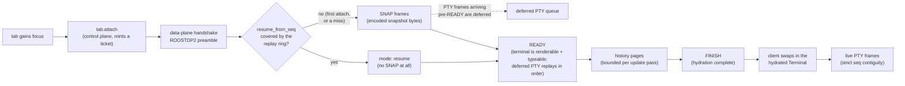
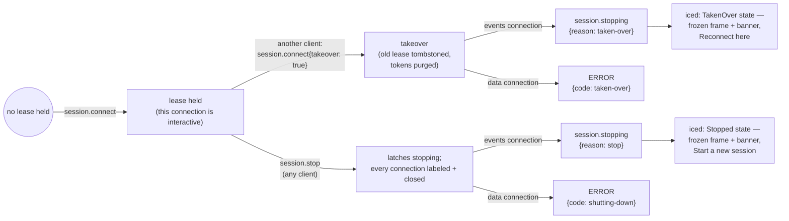

# Host Sessions

Host sessions (HS-1a/HS-1b/HS-2 in the [roadmap](https://github.com/charliek/roost/blob/main/discovery/host-sessions-roadmap.md)) let a `roost-session` daemon own a workspace + PTY supervisor that outlives any UI attached to it, and let the iced UI attach to one as a client. This page is the shipped architecture: the component topology, the attach sequence, and the lease/takeover lifecycle. [`reference/ipc.md`](../reference/ipc.md#session-sockets) is the **normative wire spec** — this page explains the shape, that page is the contract. The design rationale and the full decision history live in [`discovery/host-sessions-architecture.md`](https://github.com/charliek/roost/blob/main/discovery/host-sessions-architecture.md) and [`discovery/host-sessions-roadmap.md`](https://github.com/charliek/roost/blob/main/discovery/host-sessions-roadmap.md).

Scope: iced-only (`crates/roost-iced`), Linux server (`crates/roost-session`, Linux-only today). The Swift Mac app has none of this. See [DL-17](vision.md#dl-17-an-opt-in-headless-roost-session-daemon-for-host-sessions-2026-08-28) and [DL-18](vision.md#dl-18-hosts-ux-attach-on-focus-effects-theme-reseed-and-the-mac-gate-2026-08-29) in the decision log for why the shape is what it is, and the [user guide](../guides/host-sessions.md) for how it looks from the outside.

## Component topology

**Three connections per host, not one.** `IpcClient` is strictly request/response and sequential (`roost-ipc/src/client.rs`), so a single connection can't both serve ordinary control calls *and* stream events or terminal bytes without one blocking the other. `HostConn` (`crates/roost-iced/src/host_conn.rs`) owns three: **control** for everything request/response (identify, connect, the `host.*` ops, minting `tab.attach` tickets — serialized through a per-host op queue, plan 037 §3.9, so a mutation and an attach can never interleave on the wire); **events**, a push reader subscribed once and read forever, feeding a `SharedMirror` — a client-side projection of that host's workspace, fenced against the subscribe ack revision exactly like `tools/roosttest/eventstream.py` does; and **data**, one per *attached* tab (attach is on-focus — background host tabs stay current via the mirror alone, and only the focused tab pays for a live byte stream). The mirror and the decoded terminal are read by the UI at draw time and updated in place — there is no per-commit clone to keep, which is what keeps a chatty host from piling full-workspace copies onto an unbounded channel.

**Everything lands on one feed.** `HostWorkspace(HostId, ...)` and `HostState(HostId, ...)` variants ride the same `EngineFeed` local workspace events and PTY output already use (`crates/roost-iced/src/engine_feed.rs`), so a host's mirror wake and a local tab's PTY chunk drain through the identical FIFO on the main thread — no second event loop, no second threading story. `HostId` identifies a connection **instance**, not a host: every connect attempt that follows one which published data mints a fresh id, so a reconnect's first `Connecting` message names the incarnation it replaces and a consumer purges-then-rebuilds off that one message rather than tracking staleness itself.

## The attach sequence

Attach is **on-focus**: a tab dials its data connection only while it's the one you're looking at, and detaches (dropping the connection, never the session) the moment you switch away. Re-focusing resumes from where it left off when the server's replay ring still covers the gap, and silently re-snapshots when it doesn't — the wire guarantees the fallback in the same reply, so the client never has to ask twice.

**The terminal swaps at FINISH, not READY.** `SnapshotDecoder` (`crates/roost-vt/src/snapshot.rs`) owns its terminal until `finish()` completes, so the client keeps rendering the **previous** terminal — the old frame, or nothing on a first attach — until the new one is fully hydrated. This is a recorded deviation from the plan's original swap-at-READY: a swap-at-READY would need a second render path into the published snapshot for a terminal the decoder still owns, and it was deferred as unbuilt because a retry loop must never blank the tab either way, and a fresh tab's READY and FINISH arrive close enough together that the difference isn't visible in practice. Live PTY bytes interleave into the decoder throughout, so nothing arriving between READY and FINISH is lost — it's simply replayed in decode order once the terminal exists to receive it.

**Resize is withheld, not sent live, until the hydration settles.** A user resize between attach and FINISH is queued (latest-wins) and sent once — at FINISH, or after a 2s timeout, whichever comes first — because resizing a decoder that hasn't finished producing a terminal would forfeit the history pages still in flight. Once live, `seq` must be exactly `last + 1`; a gap, duplicate, wrong epoch/generation, or an `EOF` before `FINISH` all mean the same thing — the stream can no longer be trusted — and the client drops the attach and re-attaches with capped backoff, which resets only once the connection reaches `Live` again.

## The lease/takeover lifecycle

A session has one **interactive lease** at a time — the authority to drive tabs, not merely read them. Reconnecting is always a takeover on this wire (there is no separate "steal" op): the same `session.connect{takeover: true}` a fresh connect uses is what displaces a stale one.

**One tombstone, best-effort labels.** The session remembers only the *most recently* displaced lease, so its holder is told `taken-over` (someone else has it now) rather than the less informative `connect-required` (you were never connected) — a second takeover forgets the first tombstone in favor of the newest one, since the first holder has already been told. Every label above is best-effort under a short deadline: a peer that has stopped reading gets a bare `EOF` instead, which the client treats identically to a labeled close (reconnect and resync).

**The displaced window keeps its last frame.** `TakenOver` and `Stopped` are the only two states that leave a frame frozen on screen — every other state (`Disconnected`, `Connecting`, `NeedsRestart`) explains itself in the sidebar's own section band instead. The two banners promise different things on purpose: "Reconnect here" is honest only for `TakenOver` (the session is still alive, just held elsewhere), while `Stopped`'s "Start a new session" is deliberately not phrased as a reconnect — the shells are actually gone. A banner click carries the human latency of a press, so it names the frame it was drawn on and is refused if the state has since moved on (e.g. a reconnect already started, or `TakenOver` has since become `Stopped`) — silently reinterpreting a stale click as "start fresh" would be exactly the silent scrollback loss plan 037 §3.2 forbids.

**Auto-reconnect never auto-spawns.** Launch-time reconnect (localhost, Linux only) is *connect-if-present*: it probes the socket, and if nothing answers, the section shows disconnected with a manual ↻ rather than silently starting a daemon. A mid-session drop on localhost may auto-*retry the connect* with jittered, capped backoff (`Backoff` in `host_conn/state.rs`, 250ms base up to a 30s ceiling) — but if the session actually died, the host settles on "session ended" and only an explicit Connect starts a fresh one. A non-localhost host never auto-retries at all; reconnecting a remote host is always a deliberate action.

## Server-side additions (HS-2, additive)

Two small additions ride the existing events stream as new event types — additive, so `SESSION_PROTOCOL_VERSION` stays `2` and an older client simply ignores an event name it doesn't recognize:

- **`tab.effect` events** — a session's per-tab OSC scan now emits `bell` and OSC 52 `clipboard-write` as client-directed effects on the events stream (`crates/roost-engine/src/tab_task.rs`), for whichever client currently holds the tab's lease to apply. Everything else the scanner sees (pointer shape, today) stays dropped and debug-logged in the tab task, by design — the envelope is scoped to these two effects rather than left open to "just one more."
- **`session.set_theme`** — closes the reseed gap the architecture doc left open: a connecting client seeds every tab's server `Terminal` with its own palette (sent right after `session.connect`, before the first `tab.attach`), so a program that queries a color from a session gets back what the attached client is actually rendering, not the server's factory default.

See [`reference/ipc.md`](../reference/ipc.md#events) for the full event catalog and [`session.set_theme`](../reference/ipc.md#sessionset_theme)'s wire shape.

## Known limitations

- **A host tab's own attention doesn't reach an attached client.** `roost-session`'s workspace is headless and defaults `window_focused = true` at construction (there's no window to report otherwise), and no op yet exists to push an attached client's real focus state down to it. The regular focus-suppression rule (`suppress := window is active AND the target tab is the active tab`, [Notifications → Focus policy](../guides/notifications.md#focus-policy)) therefore reads as permanently satisfied for whichever tab a client has attached to, so `notification.fired` never fires for that one tab — every other tab on the host is unaffected. Recorded at C8 of plan 037; closing it is HS-3 work (it needs a client-focus op on the session wire, which doesn't exist today).
- **Kitty images render blank after attach.** The snapshot payload doesn't currently carry Kitty graphics protocol state (architecture §5).
- **Missed-while-detached effects and notifications are not replayed.** The mirror and the attach path both reflect *current* state on (re)connect; a bell or clipboard write that fired while nobody was attached is gone, by design (non-goal, not a bug).
- **One data connection per tab, one attached tab per host at a time from this client.** Multi-attach / warm pools are explicit future work, not a current constraint anyone hits by accident — the server's own per-session token quota (16 outstanding) is nowhere close to being pressured by a single client's one-tab-at-a-time policy.

## See also

- [Host sessions (user guide)](../guides/host-sessions.md) — the task-shaped version of this page.
- [`reference/ipc.md`](../reference/ipc.md#session-sockets) — the normative wire spec (session ops, the data plane, the events catalog).
- [`reference/architecture.md`](../reference/architecture.md) — where `roost-session` sits in Roost's overall process topology.
- [`discovery/host-sessions-architecture.md`](https://github.com/charliek/roost/blob/main/discovery/host-sessions-architecture.md) — the original design document this shipped from.
- [`discovery/host-sessions-roadmap.md`](https://github.com/charliek/roost/blob/main/discovery/host-sessions-roadmap.md) — the milestone sequence (HS-0 through HS-5) and the pinned decision log (D1–D11).
