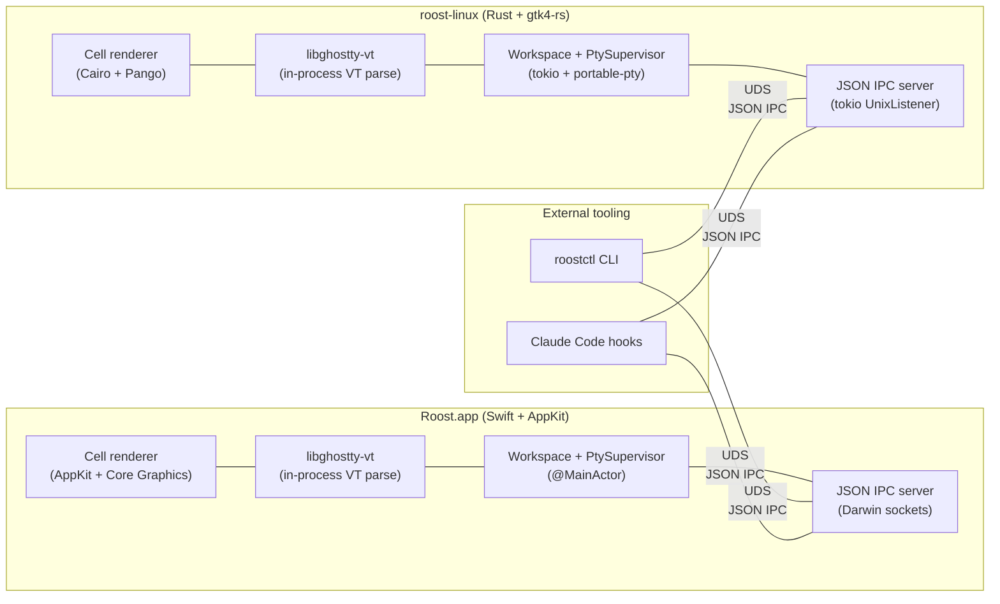

# Roost architecture & principles

This is Roost's **living architecture** and the principles behind it —
the north star every PR is measured against. The Rust + Swift port this
doc originally planned is **complete and merged to `main`** (cutover
2026-05-23); the migration's phased history is summarized in
[Migration history](#migration-history). The original Go + GTK4
implementation — its code, design spec, architecture notes, and the full
phased migration plan set — has since been removed from this repo
(the **GODELETE** step) and archived in the separate `roost-legacy-go`
repository.

## The product

A single-window, cross-platform terminal multiplexer: a sidebar of
projects, tabs per project, one terminal per tab. The differentiator is
the multi-project workspace with **notification routing for AI coding
agents** (Claude Code, Codex, …). It ships as **two native UIs that each
embed the workspace + PTY supervisor in-process** — Swift + AppKit on
macOS (`Roost.app`), Rust + gtk4-rs on Linux (`roost-linux`).
`libghostty-vt` is vendored once and linked into both for in-process VT
parsing and rendering. There is no daemon.

## The command core (north star)

Every way to drive Roost — **mouse/clicks, hotkeys, the `roostctl` CLI,
and Lua scripts** — converges on **one core: the workspace operation
set** (open/close/focus tab, create/rename/delete/reorder project,
set-state, notify, dump, … plus a few view ops like screenshot /
open-palette). Each surface is a *thin adapter* onto that core, and the
**UI is a reaction to the core's events — never its own source of
truth.**

```
  roostctl (CLI) ─┐
  Lua scripts ────┤──▶ IPC handler ──┐
                                      ├─▶  workspace op set  ──emit──▶ events ──▶ UI re-renders
  mouse / clicks ─┐                   │       (THE CORE)
  hotkeys ────────┤──▶ UI dispatch ───┘
```

- **CLI + Lua** are out-of-process → reach the core over the IPC socket
  (the handler is their adapter; Lua sits on top of the same op set).
- **Clicks + hotkeys** are in-process → call the same op set directly
  (their adapter is the UI command / keybind handler).
- A hotkey (`Cmd+Shift+T`), a `roostctl` call, and a Lua script all
  invoke the **same** command — e.g. "run action" or "open tab".

**One contract, two implementations.** There is no shared *codebase*
core — Swift and Rust can't share one. There is one shared **contract**
— the IPC op set in [`crates/roost-ipc`](../reference/ipc.md) —
implemented by **Swift `Workspace` + AppKit** and **Rust `Workspace` +
GTK**. "Same interface" means same op contract + behavioral parity,
which the cross-platform E2E suite ([test-automation.md](test-automation.md))
exists to enforce. Per platform: identical command surface,
platform-specific guts (`forkpty` vs `portable-pty`, Core Graphics vs
Cairo).

**Two seams** connect the surfaces to the core:

1. **surfaces → core** (commands in): CLI/Lua via IPC, UI/hotkeys
   direct. Every UI/hotkey action should route through the op set, not
   carry divergent local logic. *Convergence is an ongoing invariant —
   each place the UI keeps its own truth instead of reacting to a core
   event is a bug to retire (e.g. the dropped `active.changed` the Mac
   UI used to ignore).*
2. **core → UI** (view reach-back: screenshot / dump / activate): GTK's
   one `UiRequest` channel, Mac's one `UiBridge` seam — a single
   registered path from the IPC handler to the main thread, not an
   ad-hoc channel per op.

**Why this is the north star.** It buys the three things Roost optimizes
for at once:

- **Testability** — tests drive the same op set users do and assert on
  its events/state. No test-only backdoors that can drift from reality.
- **Programmability** — the op set *is* the public surface; Lua actions
  and the launcher are first-class clients of it, same as the CLI.
- **Clean architecture** — one place owns each mutation; the UI is a
  pure projection of core state; adding a capability is "add an op +
  thin adapters", not bespoke logic per surface.

Every decision below — and every new feature — is measured against it:
*does it route through the one op set, keep the UI reactive, and stay at
parity across both implementations?*

## Why this shape

**Native Mac UI.** AppKit gives the right trackpad, menu, accessibility,
and notarization story for macOS. A Swift `.app` bundle drops the
Homebrew GTK4 dependency entirely and makes signing + DMG distribution a
standard Apple workflow.

**No daemon.** Each UI is a single process that owns its PTY supervisor,
workspace state, and IPC server. There is no separate `roost-core`
binary to spawn, supervise, or lifecycle. An earlier design had a gRPC
daemon owning state for thin clients; the realistic deployment is one
user, one UI process, with `roostctl` and Claude hooks as occasional
control-plane callers. Collapsing the daemon into the UI removed the
cross-process serialization, the gRPC bindings (`tonic`, `prost`,
`grpc-swift`), SQLite, and the entire `proto/` directory — ~4,400 LOC of
plumbing.

**JSON IPC, not gRPC.** With control-plane traffic only (no streaming
PTY bytes), the wire surface is small enough that a hand-rolled
newline-delimited JSON framing protocol over a Unix socket is simpler
than HTTP/2 + protobuf. Frame cap is 16 MiB, the schema is one Markdown
file, hand-debuggable with `nc -U`. Dropping protobuf evolution rules is
acceptable because the only producers + consumers are versioned together
in this repo.

**Rust core (Linux UI + IPC + CLI).** Memory-safe, ergonomic FFI in both
directions, mature async (`tokio`), small static binaries. The
systems-level work — PTY lifecycle, OSC parsing, IPC framing — is
exactly what Rust is good at.

**gtk4-rs over Go + GTK on Linux.** Same toolchain as the rest of the
Rust workspace means one Cargo build, no cgo, no `gotk4` binding
gotchas.

**Two languages, not one.** Swift on Linux would still bind GTK4 (no
AppKit on Linux), so "uniform language" doesn't unify the UI code — it
just adds the Swift runtime to Linux bundles and trades `gotk4` for the
less-mature SwiftGTK. The thing worth unifying is the JSON IPC wire
format + the PTY/workspace state machines, and those are mirrored
idiomatically in each language without sharing source.

## Architecture



**Hot path.** PTY bytes flow `kernel → master fd → in-process drain task
→ libghostty-vt vt_write → renderer`. Everything is in the same process;
the IPC socket carries only control messages and event broadcasts, never
PTY content.

**Why the renderer stays out of the IPC.** Putting cell deltas or
rendered frames over a socket means every redraw is a context switch and
a serialization cost. With the workspace in-process, PTY bytes never
cross any process boundary — the hot path is one kernel `read()` per
chunk, then everything else is in-process memory.

## Non-goals

- **No web/Electron UI.** Native renderers only.
- **No Windows.** macOS and Linux exclusively.
- **No multi-window.** One window per Roost instance, projects in the
  sidebar, tabs in the projects.
- **No split-pane.** One terminal per tab.
- **No remote / network IPC.** Unix domain socket only. The JSON wire
  format is local IPC, not a public API.
- **No rendered output over the wire.** PTY bytes only ever live
  in-process.
- **No shared UI code between Mac and Linux beyond the JSON wire
  format.** Each UI is idiomatic to its platform.
- **No core rewrites in third languages.** Rust for the Linux UI + CLI +
  IPC + supporting crates; Swift for the Mac UI. Lua is an *embedded
  scripting surface* for user automation (see DL-12), not a third
  implementation language.

## Decision log

Short ADR-style entries. Each captures a live decision so it is not
relitigated by accident.

### DL-1: Swift + AppKit on Mac, not Rust

Swift owns the macOS native experience: HIG, AppKit lifecycle,
accessibility, notarization, App Store-adjacent tooling. A Rust UI on
Mac would either depend on a cross-platform toolkit (loses native feel)
or hand-roll Cocoa bindings (multiplies cost). The JSON IPC boundary
makes mixing languages costless.

### DL-2: JSON IPC, not gRPC (revised 2026-05-23)

Original DL-2 chose protobuf + gRPC because the architecture had a
daemon serving streaming PTY bytes to thin remote-style clients. That
premise dissolved in the inline-core refactor: each UI now owns its PTY
supervisor in-process, so the IPC surface is small (a few dozen control
ops + an event subscription), strictly local, and small enough to
inspect by hand. Newline-delimited JSON over a Unix socket with a 16 MiB
frame cap costs ~600 lines (`crates/roost-ipc`) vs. a multi-crate tonic +
prost dependency. The wire spec lives in [`ipc.md`](../reference/ipc.md).
The pre-rewrite proto schema is preserved at
[`docs/archive/roost.proto`](../archive/roost.proto) for reference.

### DL-3: Unix domain socket, not TCP

Roost is a local desktop app. UDS gets filesystem permissions for free,
no port allocation, no exposure to network attackers, lower latency. If
a future need warrants remote access, that is a separate proxy concern,
not a contract change.

### DL-4: Each UI owns its own workspace (revised 2026-05-23)

The pre-rewrite design had a shared `roost-core` daemon owning workspace
state in SQLite; UIs were thin gRPC clients. The realistic deployment is
one user, one UI process, plus occasional control-plane callers.
Collapsing the workspace into each UI removed the gRPC pump, SQLite,
cross-process serialization, and the "cross-client convergence" rabbit
hole. State persistence is a small `state.json` (atomic tmp + rename;
write-through, fsync on clean exit) carrying projects + `next_id` + each
project's tab **layout** (title + cwd + position) + active selection (see
DL-7).

### DL-5: Two languages, not Rust everywhere

Considered and rejected: Rust + gtk4-rs on Mac. This still requires
hand-rolled AppKit/macOS integration for menus, dock, notifications, and
notarization metadata. Net effort is higher than just using Swift, and
the Mac feel is worse. The unification benefit does not pay for itself
when the AppKit surface is the larger half of a Mac terminal's native
experience.

### DL-6: gtk4-rs does not need a `pangoextra` workaround

`gtk4-rs` calls `pango_cairo_context_set_font_options` directly via raw
FFI and does not have the `gotk4` `cairo.FontOptions` record-struct
mismatch that forced the Go prototype's `internal/pangoextra` workaround
(removed with the Go code in GODELETE).

### DL-7: Tabs persist as layout, not live state (revised 2026-05-24)

`state.json` stores each project's tab **layout** — `{title, cwd,
position}` per tab, plus the active project + active tab position. On
relaunch each project re-opens its prior tabs as **fresh shells** in
their saved directories. What is *not* restored: the live process and
scrollback ("preserving" those was always a fiction since the daemon-era
`StreamPty` re-spawned the shell on attach anyway). The `tabs` array +
`active_*` fields are additive + defaulted, so a file written by one
build (or the other UI) still loads in the other. Coupled with the
last-tab cascade (closing a project's last tab closes the project;
emptying the workspace quits), relaunch is predictable: same projects +
tabs, same directories, fresh shells.

### DL-8: OSC routing is the differentiator

The OSC scanner (`crates/roost-osc`, `mac/Sources/Roost/OscScanner.swift`)
plus the per-tab `set_hook_active` suppression rule is subtle and is what
makes Roost useful to anyone running multiple AI coding agents in
parallel. It is treated as a first-class slice, not bundled into
structural feature parity.

### DL-9: CLI is `roostctl`

`crates/roost-cli` ships a `roostctl` binary. The Mac bundle embeds it
under `Contents/Resources/bin/roostctl` so `claude install` invoked from
inside `Roost.app` writes hook paths that point at the bundled location.

### DL-10: Ghostty SHA pinned in `third_party/ghostty/build.sh`

`third_party/ghostty/build.sh` pins the libghostty-vt commit for the
Rust + Swift builds — the single source of the pin now that the Go
prototype's `build/build.sh` has been removed in GODELETE.

### DL-11: One command core, thin per-surface adapters (2026-05-26)

Every input surface — UI clicks, hotkeys, `roostctl`, Lua — routes
through the **same workspace operation set**; the UI is a reaction to the
core's events, not a parallel source of truth. Adding a capability means
adding an op + thin adapters, not per-surface logic. This is the
[north star](#the-command-core-north-star); it is the test applied to
every change, because it is what buys testability, programmability, and a
clean architecture simultaneously. Concretely it forbids: UI state that
diverges from the workspace, ops reachable from one surface but not
another without reason, and the two implementations drifting out of
behavioral parity.

### DL-12: pytest drives the tests; Lua is a user-scripting surface (2026-05-26)

Two distinct roles, one shared core:

- **Tests** are driven by **pytest** over the IPC op set (plus
  `roostctl`/shell for simple cases) — mature fixtures, parametrization
  over both UIs, and reporting, with the affordances that actually kill
  flakiness (`roostctl wait`, `tab.dump`) living in the app, not the
  runner. See [test-automation.md](test-automation.md).
- **Lua** is an **embedded user-scripting surface** for the Cmd+Shift+T
  launcher and complex user-authored multi-step actions — a first-class
  client of the same op set, deliberately **scoped, not the test
  mechanism**. We add Lua where it earns user-facing programmability and
  avoid over-investing it as test infrastructure.

Both remain thin adapters onto the one command core (DL-11): a Lua action
and a pytest step invoke the same ops.

## Migration history

The Rust + Swift port is **complete** (cutover to `main` 2026-05-23). The
phased plan that built it — direction-setter → FFI spikes → (interim
gRPC daemon) → Mac UI → Linux UI → inline-core refactor (daemon → JSON
IPC, `roostctl`, delete `roost-core`/`roost-proto`/`roost-common`/
`roost-smoke`) → bundling → cutover — concluded with **GODELETE**, which
removed the legacy Go code (`cmd/`, `internal/`, `go.mod`, `build/`,
`go-legacy.yml`). That code and the full phase-by-phase plan set are
archived in the separate `roost-legacy-go` repository.

## Relationship to existing docs

| Document | Role |
|---|---|
| `docs/development/vision.md` (this file) | The **living architecture + principles**. Every PR is measured against the north star + decision log here. |
| [`docs/development/test-automation.md`](test-automation.md) | The testing + scripting plan that operationalizes the north star (pytest E2E, Lua scripting, CI). |
| [`docs/reference/ipc.md`](../reference/ipc.md) | JSON IPC wire format spec — the canonical command contract. |
| [`docs/reference/architecture.md`](../reference/architecture.md) | Package layout + threading contract for the in-process implementation. |
| [`docs/archive/roost.proto`](../archive/roost.proto) | Historical reference for the pre-rewrite gRPC contract. |
| `CLAUDE.md` | Project conventions enforced by review; mirrors the principles here. |

The original Go + GTK4 design spec and legacy architecture notes are
archived in the separate `roost-legacy-go` repository.
