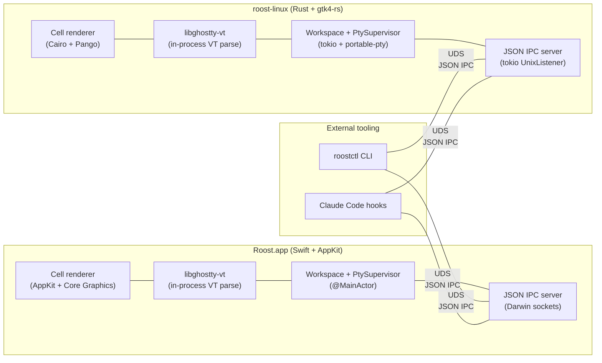

# Vision: Native UIs with in-process workspace

This is the **target architecture** Roost is migrating toward. It is the durable north star for every PR on the long-lived refactor branch `feature/rust-port` (predecessor `claude/discuss-architecture-refactor-cjU3E` is frozen at `00b3d10`). The currently-shipping Go + GTK4 implementation is described in [spec.md](spec.md) and the **legacy** [architecture.md](../reference/architecture.md); those documents remain authoritative for `main` until the cutover described in [Phased path](#phased-path) below.

## North Star

A single-window cross-platform terminal multiplexer with a sidebar of projects, tabs per project, and one terminal per tab — built as **two native UIs that each embed the workspace + PTY supervisor in-process**: Swift + AppKit on macOS (`Roost.app`) and Rust + gtk4-rs on Linux (`roost-linux`). External tooling (the `roostctl` CLI, Claude Code hooks) talks to a running UI via newline-delimited JSON over a Unix-domain socket; the wire format lives in `crates/roost-ipc/src/messages.rs` and is documented in [`docs/reference/ipc.md`](../reference/ipc.md). `libghostty-vt` is vendored once and linked directly into both UIs for in-process VT parsing and rendering.

This is the post-2026-05-23 shape. The pre-2026-05-23 phases of the migration went through a Rust gRPC daemon (`roost-core`); that intermediate shape is preserved in the [historical proto schema](../archive/roost.proto) for reference, and in the daemon-era phase files under `plans/`. The shipped UIs no longer depend on a daemon.

## Why this shape

**Native Mac UI.** AppKit gives the right trackpad, menu, accessibility, and notarization story for macOS. A Swift `.app` bundle drops the Homebrew GTK4 dependency entirely and makes signing + DMG distribution a standard Apple workflow.

**No daemon.** Each UI is a single process that owns its PTY supervisor, workspace state, and IPC server. There is no separate `roost-core` binary to spawn, supervise, or lifecycle. The earlier gRPC-daemon design was correct for a "many headless clients sharing one core" world that never materialized — the realistic deployment is one user, one UI process, with `roostctl` and Claude hooks as occasional control-plane callers. Collapsing the daemon back into the UI removes the cross-process serialization, removes the gRPC bindings (`tonic`, `prost`, `grpc-swift`), removes SQLite, and removes the entire `proto/` directory; ~4,400 LOC of plumbing falls out.

**JSON IPC, not gRPC.** With control-plane traffic only (no streaming PTY bytes), the wire surface is small enough that a hand-rolled newline-delimited JSON framing protocol over UDS is simpler than HTTP/2 + protobuf. Frame cap is 16 MiB, the schema is documented in one Markdown file, hand-debuggable with `nc -U`. The cost of dropping protobuf evolution rules is acceptable because the only producers + consumers are versioned together inside the same repo.

**Rust core (Linux UI + IPC + CLI).** Memory-safe, ergonomic FFI in both directions, mature async (`tokio`), small static binaries. The systems-level work — PTY lifecycle, OSC parsing, IPC framing — is exactly what Rust is good at.

**gtk4-rs over Go + GTK on Linux.** Same toolchain as the rest of the Rust workspace means one Cargo build, no cgo, no `gotk4` binding gotchas (the `pangocairo.ContextSetFontOptions` mismatch that today forces the `internal/pangoextra` workaround dies with the Go code).

**Two languages, not one.** Swift on Linux would still bind GTK4 (no AppKit on Linux), so "uniform language" doesn't actually unify the UI code — it just adds the Swift runtime to Linux bundles and trades `gotk4` for the less-mature SwiftGTK. The thing worth unifying is the JSON IPC wire format + the PTY/workspace state machines, and those are mirrored idiomatically in each language without trying to share source.

## Architecture

**Hot path.** PTY bytes flow `kernel → master fd → in-process drain task → libghostty-vt vt_write → renderer`. Everything is in the same process; the IPC socket carries only control messages and event broadcasts, never PTY content.

**Why the renderer stays out of the IPC.** Putting cell deltas or rendered frames over a socket means every redraw is a context switch and a serialization cost. With the workspace in-process, PTY bytes never cross any process boundary — the hot path is one kernel `read()` per chunk, then everything else is in-process memory.

## Non-goals

- **No web/Electron UI.** Native renderers only.
- **No Windows.** macOS and Linux exclusively.
- **No multi-window.** One window per Roost instance, projects in the sidebar, tabs in the projects.
- **No remote / network IPC.** Unix domain socket only. The JSON wire format is local IPC, not a public API.
- **No rendered output over the wire.** PTY bytes only ever live in-process.
- **No shared UI code between Mac and Linux beyond the JSON wire format.** Each UI is idiomatic to its platform.
- **No core rewrites in third languages.** Rust for the Linux UI + CLI + IPC + supporting crates; Swift for the Mac UI.

## Phased path

Each phase is a commit (or small PR) on the refactor branch, with explicit exit criteria. The existing Go binary keeps building from `cmd/` and `internal/` throughout; new code lives in new top-level directories (`crates/`, `mac/`, `third_party/ghostty/`).

| Phase | Goal | Status |
|---|---|---|
| 0. Direction-setter | Vision doc, README/CLAUDE.md edits, skeleton dirs, refactor CI scaffold | ✅ done |
| 1. De-risk spikes | Verify the FFI surfaces from Rust + Swift | ✅ done |
| 2. Proto + workspace | (initially gRPC) Cargo workspace, Xcode skeleton, vendored Ghostty build | ✅ done |
| 3. Rust core MVP | (legacy) `roost-core` daemon: one PTY, gRPC StreamPty | ✅ done, then deleted in M7 |
| 4. Smoke client | (legacy) `roost-smoke` pipes a shell through the daemon | ✅ done, then deleted in M7 |
| 5. Mac UI MVP | Single-tab AppKit window | ✅ done |
| 6a. Mac structural | Multi-tab, sidebar, projects, persistence, menus, shortcuts, focus | ✅ done |
| 6b. Mac OSC + notifications | OSC scanning, `set_hook_active` semantics, `claude-hook` | ✅ done |
| 7. Linux Rust UI | `crates/roost-linux/`, gtk4-rs, Cairo + Pango cell renderer | ✅ done |
| 7.5. Linux/Mac polish | Drag-reorder, CSS, headerbar, status indicators | ✅ done |
| **M0–M9. Inline-core refactor** | **Collapse the daemon into each UI in-process; replace gRPC with JSON IPC over UDS; rename CLI to `roostctl`; delete `roost-core`, `roost-proto`, `roost-common`, `roost-smoke`** | ✅ done (PR #78) |
| 8. Bundling | Mac `.app` + DMG; Linux `.deb` via apt-charliek | ✅ done — v0.0.1 (`.deb` not AppImage; DMG ad-hoc-signed pending Apple creds, [#83](https://github.com/charliek/roost/issues/83)) |
| 9. Cutover to main | Merge `feature/rust-port` → `main`; rust-primary CI; docs reoriented | ✅ done 2026-05-23 |
| GODELETE | Delete `cmd/`, `internal/`, `go.mod`, `build/`, `go-legacy.yml` (the Go code) | ⏳ pending — after Rust/Swift parity (see `plans/GODELETE.md`) |

## Decision log

Short ADR-style entries. Each captures a live decision so it is not relitigated by accident.

### DL-1: Swift + AppKit on Mac, not Rust

Swift owns the macOS native experience: HIG, AppKit lifecycle, accessibility, notarization, App Store-adjacent tooling. A Rust UI on Mac would either depend on a cross-platform toolkit (loses native feel) or hand-roll Cocoa bindings (multiplies cost). The JSON IPC boundary makes mixing languages costless.

### DL-2: JSON IPC, not gRPC (revised 2026-05-23)

Original DL-2 chose protobuf + gRPC because the architecture had a daemon serving streaming PTY bytes to thin remote-style clients. That premise dissolved in the M0–M9 inline-core refactor: each UI now owns its PTY supervisor in-process, so the IPC surface is small (a few dozen control ops + an event subscription), strictly local, and small enough to inspect by hand. Newline-delimited JSON over UDS with a 16 MiB frame cap costs ~600 lines (`crates/roost-ipc`) vs. a multi-crate tonic + prost dependency. The wire spec lives in [`docs/reference/ipc.md`](../reference/ipc.md). The pre-rewrite proto schema is preserved at [`docs/archive/roost.proto`](../archive/roost.proto) for historical reference.

### DL-3: Unix domain socket, not TCP

Roost is a local desktop app. UDS gets us filesystem permissions for free, no port allocation, no exposure to network attackers, and lower latency. If a future need warrants remote access, that is a separate proxy concern, not a contract change.

### DL-4: Each UI owns its own workspace (revised 2026-05-23)

The pre-rewrite design had a shared `roost-core` daemon owning workspace state in SQLite; UIs were thin gRPC clients. In practice the realistic deployment is one user, one UI process, plus occasional control-plane callers (`roostctl`, Claude hooks). Collapsing the workspace into each UI removes the gRPC pump, removes SQLite, removes cross-process serialization, and removes the entire "cross-client convergence" rabbit hole that the daemon-era code spent significant effort on. State persistence is a small `state.json` atomically rewritten via tmp + fsync + rename (Linux) / `replaceItemAt` (Mac); it carries the projects plus each project's tab **layout** (title + cwd + position), so a relaunch re-opens the prior tabs as fresh shells in their saved directories — no live process or scrollback is restored (see DL-7).

### DL-5: Two languages, not Rust everywhere

Considered and rejected: Rust + gtk4-rs on Mac. This still requires hand-rolled AppKit/macOS integration for menus, dock, notifications, and notarization metadata. Net effort is higher than just using Swift, and the Mac feel is worse. The unification benefit (one less language) does not pay for itself when the AppKit surface is the larger half of any Mac terminal's "native" experience.

### DL-6: gtk4-rs does not need a `pangoextra` workaround

The current code carries `internal/pangoextra` because `gotk4`'s `pangocairo.ContextSetFontOptions` expects `cairo.FontOptions` to follow the gextras "record" struct convention while gotk4's cairo package uses a raw native pointer. `gtk4-rs` calls `pango_cairo_context_set_font_options` directly via raw FFI and does not have this mismatch. The workaround dies with the Go code in GODELETE.

### DL-7: Tabs persist as layout, not live state (revised 2026-05-24)

History: the original DL-7 said "SQLite migrations port byte-for-byte" so Go-binary users could point a new build at their `roost.db`. The 2026-05-23 inline-core refactor moved persistence to a tiny `state.json` carrying only projects + the monotonic `next_id`, and tabs did **not** survive a UI quit (every launch started empty and seeded one tab).

Revised 2026-05-24: `state.json` now also stores each project's tab **layout** — `{title, cwd, position}` per tab, plus the active project + active tab position. On relaunch each project re-opens its prior tabs as **fresh shells** in their saved directories (a project with no saved tabs, or a `state.json` from an older build, seeds one tab). What is *not* restored: the live process and scrollback — "preserving" those was always a fiction since the daemon-era `StreamPty` re-spawned the shell on attach anyway. So restore is deliberately layout-only: same project + tab count, same directories, fresh shells. The `tabs` array and `active_*` fields are additive + defaulted, so a file written by one build (or the other UI) still loads in the other. Coupled with the last-tab cascade (closing a project's last tab closes the project; emptying the workspace quits), this gives a predictable relaunch: you get back the projects and tabs you left, in the directories you left them.

### DL-8: OSC routing is the differentiator

Phase 6b is intentionally split out. The state machine in `internal/osc/scanner.go` (and its Swift / Rust ports in `mac/Sources/Roost/OscScanner.swift` and `crates/roost-osc/src/lib.rs`) plus the per-tab `set_hook_active` suppression rule is subtle and is what makes Roost useful to anyone running multiple AI coding agents in parallel. Bundling it inside structural feature parity risks under-budgeting it.

### DL-9: CLI is `roostctl` (revised 2026-05-23)

The transitional name `roost-cli-rs` and the Phase 9 rename both fell into the M0–M9 refactor: `crates/roost-cli` ships a `roostctl` binary directly. The Mac bundle embeds it under `Contents/Resources/bin/roostctl` so `claude install` invoked from inside `Roost.app` writes hook paths that point at the bundled location.

### DL-10: Ghostty SHA pinned in two places during the transition

`build/build.sh` (legacy Go cgo) and `third_party/ghostty/build.sh` (Rust + Swift) both pin the same Ghostty commit. Bumps must move both in lockstep until GODELETE retires `build/build.sh` with the Go code. Cross-link comments at the top of each script make this explicit.

## Relationship to existing docs

| Document | Role |
|---|---|
| [`docs/development/spec.md`](spec.md) | Original design spec for the **legacy Go + GTK4 implementation**. Historical; retained until GODELETE. |
| [`docs/reference/architecture.md`](../reference/architecture.md) | Package layout and threading contract for the **post-M0–M9 inline-core implementation** (refactor branch). |
| `docs/development/vision.md` (this file) | The **target** architecture. Every refactor PR cites it. |
| [`docs/reference/ipc.md`](../reference/ipc.md) | JSON IPC wire format spec — canonical. |
| [`docs/archive/roost.proto`](../archive/roost.proto) | Historical reference for the pre-rewrite gRPC contract. |
| `CLAUDE.md` | Project conventions enforced by review. Describes the in-process Rust/Swift architecture; references to the legacy Go binary remain accurate until GODELETE. |

After GODELETE, `spec.md` and the legacy architecture diagrams move to `docs/historical/` with a one-line note at the top.
