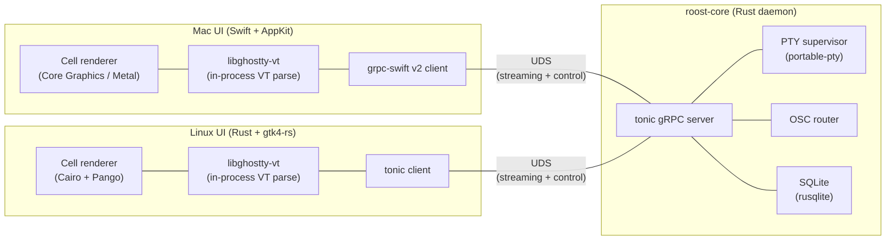

# Vision: Native UIs over a Rust core

This is the **target architecture** Roost is migrating toward. It is the durable north star for every PR on the long-lived refactor branch `feature/rust-port` (predecessor `claude/discuss-architecture-refactor-cjU3E` is frozen at `00b3d10`). The currently-shipping Go + GTK4 implementation is described in [spec.md](spec.md) and [architecture.md](../reference/architecture.md); those documents remain authoritative for `main` until the cutover described in [Phased path](#phased-path) below.

## North Star

A single-window cross-platform terminal multiplexer with a sidebar of projects, tabs per project, and one terminal per tab — built around a Rust gRPC daemon (`roost-core`) and **native UIs on each platform**: Swift + AppKit on macOS, Rust + gtk4-rs on Linux. The IPC contract is defined in `proto/roost.proto` and consumed by both UIs via generated bindings (`tonic` / `prost` for Rust, `grpc-swift` for Swift) over a Unix domain socket. libghostty-vt is vendored once and linked directly into both UIs for in-process VT parsing and rendering. Two languages total: Rust and Swift. The proto schema mediates everything.

## Why this shape

**Native Mac UI.** AppKit gives the right trackpad, menu, accessibility, and notarization story for macOS. A Swift `.app` bundle drops the Homebrew GTK4 dependency entirely and makes signing + DMG distribution a standard Apple workflow.

**Proto contract as keystone.** Once two UIs depend on the daemon, the wire format becomes the most expensive thing to change. Defining it in `.proto` with checked-in generated bindings forces an explicit boundary, gives schema-evolution rules out of the box, and makes future clients (CLI, headless tests, possible mobile companion) cheap.

**Rust core.** Memory-safe, ergonomic FFI in both directions, mature async (`tokio` + `tonic`), small static binaries. The systems-level work — PTY lifecycle, OSC parsing, SQLite, IPC — is exactly what Rust is good at.

**gtk4-rs over Go + GTK on Linux.** Same toolchain as the core means one Cargo workspace, one set of build conventions, and no cgo. gtk4-rs is officially supported and uses raw FFI for `pango_cairo`, side-stepping the gotk4 `pangocairo.ContextSetFontOptions` mismatch that today forces the `internal/pangoextra` workaround.

**Two languages, not one.** Swift on Linux would still bind GTK4 (no AppKit on Linux), so "uniform language" doesn't actually unify the UI code — it just adds the Swift runtime to Linux bundles and trades `gotk4` for the less-mature SwiftGTK. The thing worth unifying is the proto contract, and that already is.

## Architecture

**Hot path.** PTY bytes flow `core → UI` as gRPC server-streams (`StreamPty`). The UI parses VT and renders **in-process**, never over the wire. Keystrokes flow `UI → core` as the client side of the same bidirectional stream. OSC events detected during VT parsing in the UI **upcall** to the core (`ReportOsc`), which decides whether to fire a notification.

**Why the renderer stays out of the IPC.** Putting cell deltas or rendered frames over a socket means every redraw is a context switch and a serialization cost. By keeping VT parsing and rendering in the UI process, the hot path is one socket read per chunk of bytes, then everything else is in-process memory.

## Non-goals

- **No web/Electron UI.** Native renderers only.
- **No Windows.** macOS and Linux exclusively.
- **No multi-window.** One window per Roost instance, projects in the sidebar, tabs in the projects.
- **No remote / network gRPC.** Unix domain socket only. The proto schema is local IPC, not a public API.
- **No rendered output over the wire.** PTY bytes only. UI parses and renders in-process.
- **No shared UI code between Mac and Linux beyond the generated proto bindings.** Each UI is idiomatic to its platform. The temptation to extract a "common UI core" should be resisted — the platforms diverge enough at the surface (menus, gestures, accessibility, lifecycle) that the abstraction tax exceeds the savings.
- **No core rewrites in third languages.** Rust for the daemon. If a future need is genuinely better served elsewhere, the proto contract makes a swap tractable, but it is not a goal.

## Phased path

Each phase is a commit (or small PR) on the refactor branch, with explicit exit criteria. The existing Go binary keeps building from `cmd/` and `internal/` throughout; new code lives in new top-level directories (`proto/`, `crates/`, `mac/`, `linux/`, `third_party/ghostty/`).

| Phase | Goal | Exit criteria |
|---|---|---|
| 0. Direction-setter | Vision doc, README/CLAUDE.md edits, skeleton dirs, refactor CI scaffold | Old Go CI green on Linux + Mac; refactor.yml stub job runs |
| 1. De-risk spikes | Verify tonic UDS, grpc-swift v2 UDS, libghostty-vt FFI from Rust + Swift | All three spikes green; spikes archived before Phase 2 |
| 2. Proto + workspace | `proto/roost.proto`, Cargo workspace, Xcode skeleton, vendored Ghostty build | `cargo check --workspace` green; Xcode builds empty app; codegen-check job green |
| 3. Rust core MVP | `roost-core` daemon: one PTY, `StreamPty`, SQLite migrations ported | `cargo test -p roost-core` green; daemon serves on UDS |
| 4. Smoke client | `crates/roost-smoke/` pipes a shell through the daemon | `bash` runnable end-to-end through `roost-core` |
| 5. Mac UI MVP | Single-tab AppKit window backed by `roost-core` | Type into a bash session in a Mac window. **Architecture proof point.** |
| 6a. Mac structural | Multi-tab, sidebar, projects, persistence, menus, shortcuts, focus | Structural feature parity |
| 6b. Mac OSC + notifications | Core-side OSC scanning, `set_hook_active` semantics, `claude-hook` | Mac feature parity with the current Go binary |
| 7. Linux Rust UI | `crates/roost-linux/`, gtk4-rs, tonic client, Cairo+Pango cell renderer | ✅ closed 2026-05-17 (PR #50, squash `421b384`) |
| 7.5. Linux/Mac polish + automation gaps | Drag-to-reorder UI, CSS port, headerbar icons, AdwTabPage status indicators, `tab snapshot` RPC, `roost-cli-rs watch`, wide-char width | Optional cleanup pass; see [`plans/phase-7-5-polish-and-gaps.md`](../../plans/phase-7-5-polish-and-gaps.md) |
| 8. Bundling | Mac `.app` + notarytool + DMG; Linux AppImage | Tagged-release CI produces downloadable artifacts. **Gates `feature/rust-port → main`.** |
| 9. Cutover | Delete `cmd/`, `internal/`, Go-specific Make targets and CI jobs | `main` builds Rust + Swift only |

## Decision log

Short ADR-style entries. Each captures a live decision so it is not relitigated by accident.

### DL-1: Swift + AppKit on Mac, not Rust

Swift owns the macOS native experience: HIG, AppKit lifecycle, accessibility, notarization, App Store-adjacent tooling. A Rust UI on Mac would either depend on a cross-platform toolkit (loses native feel) or hand-roll Cocoa bindings (multiplies cost). The proto boundary makes mixing languages costless.

### DL-2: Protobuf + gRPC, not JSON-RPC

The current `internal/ipc` layer is newline-delimited JSON-RPC and has served well. For two clients with concurrent PTY streams, OSC upcalls, cancellation, and backpressure, hand-rolling a multiplexed framing protocol begins to reinvent HTTP/2. gRPC over UDS gets streaming, cancellation, and a debugger ecosystem (`grpcurl`) for the cost of a few megabytes of binary size and zero meaningful wall-clock latency.

### DL-3: Unix domain socket, not TCP

Roost is a local desktop app. UDS gets us filesystem permissions for free, no port allocation, no exposure to network attackers, and lower latency. If a future need warrants remote access, that is a separate proxy concern, not a contract change.

### DL-4: grpc-swift v2 (not v1, not raw length-prefixed)

`grpc-swift` v2 is async/await-native, swift-nio-based, and Apple-supported. UDS support is built on swift-nio's `NIOPipeBootstrap`. v1 is end-of-life; raw length-prefixed framing is on the table only as a fallback if v2 + UDS proves untenable in Phase 1 spikes.

### DL-5: Two languages, not Rust everywhere

Considered and rejected: Rust + gtk4-rs on Mac. This still requires hand-rolled AppKit/macOS integration for menus, dock, notifications, and notarization metadata. Net effort is higher than just using Swift, and the Mac feel is worse. The unification benefit (one less language) does not pay for itself when the AppKit surface is the larger half of any Mac terminal's "native" experience.

### DL-6: gtk4-rs does not need a `pangoextra` workaround

The current code carries `internal/pangoextra` because `gotk4`'s `pangocairo.ContextSetFontOptions` expects `cairo.FontOptions` to follow the gextras "record" struct convention while gotk4's cairo package uses a raw native pointer. `gtk4-rs` calls `pango_cairo_context_set_font_options` directly via raw FFI and does not have this mismatch. The workaround dies with the Go code in Phase 9.

### DL-7: SQLite migrations port byte-for-byte

The schema in `internal/store/migrations/` is plain SQL and survives the rewrite verbatim. `rusqlite` runs them through `refinery` or an equivalent migration runner. A user with an existing `roost.db` can point a new build at it without a wipe — preserving project state across cutover is a real user-facing concern.

### DL-8: OSC routing is the differentiator and gets its own slice

Phase 6b is intentionally split out. The state machine in `internal/osc/scanner.go` plus the per-tab `set_hook_active` suppression rule is subtle and is what makes Roost useful to anyone running multiple AI coding agents in parallel. Bundling it inside structural feature parity risks under-budgeting it. Read the existing scanner end-to-end before reimplementing.

### DL-9: New Rust CLI lands under a transitional binary name

Phase 2 introduces `roost-cli` in Rust under the transitional name `roost-cli-rs` so a user can have both during the transition. The rename to canonical `roost-cli` happens in the Phase 9 cutover commit, which also deletes `cmd/roost-cli`.

### DL-10: Ghostty SHA pinned in two places during the transition

`build/build.sh` (current) and `third_party/ghostty/build.sh` (new, landed in Phase 2) both pin the same Ghostty commit. Bumps must move both in lockstep until Phase 9. Cross-link comments at the top of each script make this explicit.

## Relationship to existing docs

| Document | Role |
|---|---|
| [`docs/development/spec.md`](spec.md) | Original design spec for the **current Go + GTK4 implementation**. Authoritative for `main` until Phase 9. |
| [`docs/reference/architecture.md`](../reference/architecture.md) | Package layout and threading contract for the **current implementation**. Authoritative for `main` until Phase 9. |
| `docs/development/vision.md` (this file) | The **target** architecture. Every refactor PR cites it. |
| `CLAUDE.md` | Project conventions enforced by review. The Threading, Library preferences, gotk4 gotchas, Build, and Style sections describe the **current** Go binary and remain accurate until Phase 9; the Direction and Branch policy sections at the top point at this vision doc. |

After Phase 9 cutover, `spec.md` and the current `architecture.md` move to `docs/historical/` with a one-line note at the top, and a new `architecture.md` describing the Rust + Swift implementation takes their place. Until then, all four docs are part of the working canon: legacy docs describe what runs on `main`, this vision doc describes where the branch is heading.
