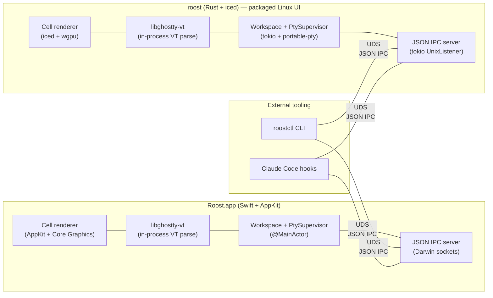

# Roost architecture & principles

This is Roost's **living architecture** and the principles behind it —
the north star every PR is measured against.

## The product

A single-window, cross-platform terminal multiplexer: a sidebar of
projects, tabs per project, one terminal per tab. The differentiator is
the multi-project workspace with **notification routing for AI coding
agents** (Claude Code, Codex, …). It ships **two platform products, each
embedding the workspace + PTY supervisor in-process** — Swift + AppKit on
macOS (`Roost.app`), Rust + iced on Linux (`roost`, the packaged `.deb`).
The same iced binary additionally ships an **experimental macOS build**,
`Roost-Iced.dmg`, with its own bundle id and its own update feed; it
installs beside `Roost.app` and is not a third implementation, just the
Linux UI on a different host. `libghostty-vt` is vendored once and
linked into both for in-process VT parsing and rendering. There is no
daemon by default — the one opt-in exception is `roost-session`, a
headless daemon for host-sessions ([DL-17](#dl-17-an-opt-in-headless-roost-session-daemon-for-host-sessions-2026-08-28)).

## The command core (north star)

Every way to drive Roost — **mouse/clicks, hotkeys, the `roostctl` CLI,
and any future scripting surface** — converges on **one core: the
workspace operation set** (open/close/focus tab,
create/rename/delete/reorder project, set-state, notify, dump, … plus a
few view ops like screenshot / open-palette). Each surface is a *thin
adapter* onto that core, and the **UI is a reaction to the core's
events — never its own source of truth.**

```
  roostctl (CLI) ──┐
  (future scripts) ┤──▶ IPC handler ──┐
                                      ├─▶  workspace op set  ──emit──▶ events ──▶ UI re-renders
  mouse / clicks ─┐                   │       (THE CORE)
  hotkeys ────────┤──▶ UI dispatch ───┘
```

- **The CLI** is out-of-process → reaches the core over the IPC socket
  (the handler is its adapter). A scripting surface, when one lands
  (DL-12), sits on top of that same op set rather than beside it.
- **Clicks + hotkeys** are in-process → call the same op set directly
  (their adapter is the UI command / keybind handler).
- A hotkey (`Cmd+Shift+T`) and a `roostctl` call invoke the **same**
  command — e.g. "run action" or "open tab".

**One contract, two implementations.** There is no shared *codebase*
core across languages — Swift and Rust can't share one. There is one
shared **contract** — the IPC op set in
[`crates/roost-ipc`](../reference/ipc.md) — implemented by **Swift
`Workspace` + AppKit** and **Rust + iced** (the Rust side over the
toolkit-neutral `roost-engine`). "Same interface" means same op contract
+ behavioral parity, which the cross-platform E2E suite
([test-automation.md](test-automation.md)) exists to enforce. Per
implementation: identical command surface, platform-specific guts
(`forkpty` vs `portable-pty`; Core Graphics vs iced + wgpu).

**Two seams** connect the surfaces to the core:

1. **surfaces → core** (commands in): the CLI via IPC, UI/hotkeys
   direct. Every UI/hotkey action should route through the op set, not
   carry divergent local logic. *Convergence is an ongoing invariant —
   each place the UI keeps its own truth instead of reacting to a core
   event is a bug to retire (e.g. the dropped `active.changed` the Mac
   UI used to ignore).*
2. **core → UI** (view reach-back: screenshot / dump / activate): on
   Linux, `roost-engine`'s one `UiRequest` port, delivered to the iced
   UI over the single engine feed it drains on the main thread; on Mac,
   the one `UiBridge` seam — a single registered path from the IPC
   handler to the main thread either way, not an ad-hoc channel per op.

**Why this is the north star.** It buys the three things Roost optimizes
for at once:

- **Testability** — tests drive the same op set users do and assert on
  its events/state. No test-only backdoors that can drift from reality.
- **Programmability** — the op set *is* the public surface; the launcher
  (and a future scripting surface) are first-class clients of it, same
  as the CLI.
- **Clean architecture** — one place owns each mutation; the UI is a
  pure projection of core state; adding a capability is "add an op +
  thin adapters", not bespoke logic per surface.

Every decision below — and every new feature — is measured against it:
*does it route through the one op set, keep the UI reactive, and stay at
parity across both implementations?*

## Why this shape

**Native Mac UI.** AppKit gives the right trackpad, menu, accessibility,
and notarization story for macOS, and a Swift `.app` bundle needs no
third-party toolkit installed to run — signing + DMG distribution are a
standard Apple workflow.

**No daemon.** Each UI is a single process that owns its PTY supervisor,
workspace state, and IPC server. There is no separate `roost-core`
binary to spawn, supervise, or lifecycle. An earlier design had a gRPC
daemon owning state for thin clients; the realistic deployment is one
user, one UI process, with `roostctl` and Claude hooks as occasional
control-plane callers. Collapsing the daemon into the UI removed the
cross-process serialization, the gRPC bindings (`tonic`, `prost`,
`grpc-swift`), SQLite, and the entire `proto/` directory — ~4,400 LOC of
plumbing.

**The one exception is opt-in.** `roost-session`
([DL-17](#dl-17-an-opt-in-headless-roost-session-daemon-for-host-sessions-2026-08-28))
is a headless daemon for host-sessions — a workspace that outlives any
UI attached to it, e.g. left running on a remote host — not a
replacement for the one-user-one-UI-process deployment this paragraph
describes. A user opts in with `roostctl session start`; nothing changes
for anyone who doesn't.

**JSON IPC, not gRPC.** With control-plane traffic only (no streaming
PTY bytes), the wire surface is small enough that a hand-rolled
newline-delimited JSON framing protocol over a Unix socket is simpler
than HTTP/2 + protobuf. Frame cap is 16 MiB, the schema is one Markdown
file, hand-debuggable with `nc -U`. Dropping protobuf evolution rules is
acceptable because the only producers + consumers are versioned together
in this repo.

**Rust core (Linux UI + IPC + CLI).** Memory-safe, ergonomic FFI in both
directions, mature async (`tokio`), small static binaries. The
systems-level work — PTY lifecycle, OSC parsing, IPC framing — is
exactly what Rust is good at.

**History: gtk4-rs was the first Linux UI.** Roost's Linux UI shipped on
gtk4-rs — chosen over Go + GTK for the same toolchain as the rest of the
workspace: one Cargo build, no cgo, no `gotk4` binding gotchas. After
the iced cutover it stayed in-repo a while longer as the parity
reference iced was measured against, and was removed once iced *was* the
product. See [DL-15](#dl-15-linux-ships-iced-gtk4-rs-is-retired-and-removed-2026-08-25).

**Two languages, not one — for now.** Swift on Linux has no AppKit, so a
"uniform language" would still mean binding a foreign toolkit from
Swift: it adds the Swift runtime to Linux bundles and unifies no UI
code. What is worth unifying is the JSON IPC wire format + the
PTY/workspace state machines, and those are mirrored idiomatically in
each language today. Whether that stays the right trade is exactly what
[Direction](#direction-under-evaluation) is gating.

## Architecture


```mermaid
flowchart LR
  subgraph MacApp["Roost.app (Swift + AppKit)"]
    macView["Cell renderer<br/>(AppKit + Core Graphics)"]
    macVT["libghostty-vt<br/>(in-process VT parse)"]
    macWS["Workspace + PtySupervisor<br/>(@MainActor)"]
    macIPC["JSON IPC server<br/>(Darwin sockets)"]
    macView --- macVT --- macWS
    macWS --- macIPC
  end

  subgraph LinuxApp["roost (Rust + iced) — packaged Linux UI"]
    linuxView["Cell renderer<br/>(iced + wgpu)"]
    linuxVT["libghostty-vt<br/>(in-process VT parse)"]
    linuxWS["Workspace + PtySupervisor<br/>(tokio + portable-pty)"]
    linuxIPC["JSON IPC server<br/>(tokio UnixListener)"]
    linuxView --- linuxVT --- linuxWS
    linuxWS --- linuxIPC
  end

  subgraph External["External tooling"]
    roostctl["roostctl CLI"]
    claude["Claude Code hooks"]
  end

  roostctl -- "UDS<br/>JSON IPC" --- macIPC
  roostctl -- "UDS<br/>JSON IPC" --- linuxIPC
  claude -- "UDS<br/>JSON IPC" --- macIPC
  claude -- "UDS<br/>JSON IPC" --- linuxIPC
```

**Hot path.** PTY bytes flow `kernel → master fd → in-process drain task
→ libghostty-vt vt_write → renderer`. Everything is in the same process;
the IPC socket carries only control messages and event broadcasts, never
PTY content.

**Why the renderer stays out of the IPC.** Putting cell deltas or
rendered frames over a socket means every redraw is a context switch and
a serialization cost. With the workspace in-process, PTY bytes never
cross any process boundary — the hot path is one kernel `read()` per
chunk, then everything else is in-process memory.

## Non-goals

- **No web/Electron UI.** Native renderers only.
- **No Windows.** macOS and Linux exclusively.
- **No multi-window.** One window per Roost instance, projects in the
  sidebar, tabs in the projects.
- **No split-pane.** One terminal per tab.
- **No remote / network IPC.** Unix domain socket only — including the
  session socket `roost-session`
  ([DL-17](#dl-17-an-opt-in-headless-roost-session-daemon-for-host-sessions-2026-08-28))
  serves, which is still a local UDS with a same-UID peer check, not a
  network listener. The JSON wire format is local IPC, not a public API.
  A planned bridge for reaching a session on a remote host (HS-3) tunnels
  over SSH stdio rather than networking the protocol itself.
- **No rendered output over the wire.** PTY bytes only ever live
  in-process.
- **No shared UI code between Mac and Linux beyond the JSON wire
  format.** Each UI is idiomatic to its platform. *(The one non-goal
  currently under review — see
  [Direction](#direction-under-evaluation).)*
- **No core rewrites in third languages.** Rust for the Linux UI + CLI +
  IPC + supporting crates; Swift for the Mac UI. Lua, if it ever lands,
  is an *embedded scripting surface* for user automation (see DL-12),
  not a third implementation language.

## Decision log

Short ADR-style entries. Each captures a live decision so it is not
relitigated by accident.

### DL-1: Swift + AppKit on Mac, not Rust

Swift owns the macOS native experience: HIG, AppKit lifecycle,
accessibility, notarization, App Store-adjacent tooling. A Rust UI on
Mac would either depend on a cross-platform toolkit (loses native feel)
or hand-roll Cocoa bindings (multiplies cost). The JSON IPC boundary
makes mixing languages costless.

### DL-2: JSON IPC, not gRPC (revised 2026-05-23)

Original DL-2 chose protobuf + gRPC because the architecture had a
daemon serving streaming PTY bytes to thin remote-style clients. That
premise dissolved in the inline-core refactor: each UI now owns its PTY
supervisor in-process, so the IPC surface is small (a few dozen control
ops + an event subscription), strictly local, and small enough to
inspect by hand. Newline-delimited JSON over a Unix socket with a 16 MiB
frame cap costs ~600 lines (`crates/roost-ipc`) vs. a multi-crate tonic +
prost dependency. The wire spec lives in [`ipc.md`](../reference/ipc.md).
The pre-rewrite proto schema is preserved at
[`docs/archive/roost.proto`](../archive/roost.proto) for reference.

### DL-3: Unix domain socket, not TCP

Roost is a local desktop app. UDS gets filesystem permissions for free,
no port allocation, no exposure to network attackers, lower latency. If
a future need warrants remote access, that is a separate proxy concern,
not a contract change.

### DL-4: Each UI owns its own workspace (revised 2026-05-23)

The pre-rewrite design had a shared `roost-core` daemon owning workspace
state in SQLite; UIs were thin gRPC clients. The realistic deployment is
one user, one UI process, plus occasional control-plane callers.
Collapsing the workspace into each UI removed the gRPC pump, SQLite,
cross-process serialization, and the "cross-client convergence" rabbit
hole. State persistence is a small `state.json` (atomic tmp + rename;
write-through, fsync on clean exit) carrying projects + `next_id` + each
project's tab **layout** (title + cwd + position) + active selection (see
DL-7).

### DL-5: Two languages, not Rust everywhere

Considered and rejected: Rust + gtk4-rs on Mac. This still requires
hand-rolled AppKit/macOS integration for menus, dock, notifications, and
notarization metadata. Net effort is higher than just using Swift, and
the Mac feel is worse. The unification benefit does not pay for itself
when the AppKit surface is the larger half of a Mac terminal's native
experience.

*[2026-08-25: the toolkit this rejected was gtk4-rs. The same question
is open again for a different toolkit — see
[DL-16](#dl-16-an-experimental-mac-iced-build-ships-beside-swift-2026-08-25)
and [Direction](#direction-under-evaluation). The AppKit-surface
argument above is the bar that evaluation has to clear.]*

### DL-6: gtk4-rs does not need a `pangoextra` workaround

**Retired 2026-08-25 — moot.** The gtk4-rs UI was removed
([DL-15](#dl-15-linux-ships-iced-gtk4-rs-is-retired-and-removed-2026-08-25));
kept as the record of a `gotk4` gotcha that never applied to us.

`gtk4-rs` calls `pango_cairo_context_set_font_options` directly via raw
FFI and does not have the `gotk4` `cairo.FontOptions` record-struct
mismatch that would otherwise force a separate `pangocairo` FFI
workaround.

### DL-7: Tabs persist as layout, not live state (revised 2026-05-24)

`state.json` stores each project's tab **layout** — `{title, cwd,
position}` per tab, plus the active project + active tab position. On
relaunch each project re-opens its prior tabs as **fresh shells** in
their saved directories. What is *not* restored: the live process and
scrollback ("preserving" those was always a fiction since the daemon-era
`StreamPty` re-spawned the shell on attach anyway). The `tabs` array +
`active_*` fields are additive + defaulted, so a file written by one
build (or the other UI) still loads in the other. Coupled with the
last-tab cascade (closing a project's last tab closes the project;
emptying the workspace quits), relaunch is predictable: same projects +
tabs, same directories, fresh shells.

### DL-8: OSC routing is the differentiator

The OSC scanner (`crates/roost-osc`, `mac/Sources/Roost/OscScanner.swift`)
plus the per-tab `set_hook_active` suppression rule is subtle and is what
makes Roost useful to anyone running multiple AI coding agents in
parallel. It is treated as a first-class slice, not bundled into
structural feature parity.

### DL-9: CLI is `roostctl`

`crates/roost-cli` ships a `roostctl` binary. The Mac bundle embeds it
under `Contents/Resources/bin/roostctl`, and each tab's
`$ROOST_AGENT_HOOK` points at that copy — so an agent hook installed
from inside `Roost.app` runs the bundled binary without any absolute
path being written into the agent's own config.

### DL-10: Ghostty SHA pinned in `third_party/ghostty/build.sh`

`third_party/ghostty/build.sh` pins the libghostty-vt commit for the
Rust + Swift builds — the single source of the pin.

### DL-11: One command core, thin per-surface adapters (2026-05-26)

Every input surface — UI clicks, hotkeys, `roostctl`, and any scripting
surface added later — routes
through the **same workspace operation set**; the UI is a reaction to the
core's events, not a parallel source of truth. Adding a capability means
adding an op + thin adapters, not per-surface logic. This is the
[north star](#the-command-core-north-star); it is the test applied to
every change, because it is what buys testability, programmability, and a
clean architecture simultaneously. Concretely it forbids: UI state that
diverges from the workspace, ops reachable from one surface but not
another without reason, and the two implementations drifting out of
behavioral parity.

### DL-12: pytest drives the tests; Lua is a user-scripting surface (2026-05-26)

**Status: the pytest half shipped; the Lua half is not implemented** —
there is no Lua engine, no `mlua` dependency, and no `.lua` anywhere in
the tree. What follows is the settled *role split*, not a description of
shipped behavior.

Two distinct roles, one shared core:

- **Tests** are driven by **pytest** over the IPC op set (plus
  `roostctl`/shell for simple cases) — mature fixtures, parametrization
  over both UIs, and reporting, with the affordances that actually kill
  flakiness (`roostctl wait`, `tab.dump`) living in the app, not the
  runner. See [test-automation.md](test-automation.md). **Shipped** as
  [`tools/roosttest/`](https://github.com/charliek/roost/blob/main/tools/roosttest/README.md).
- **Lua**, *if and when it lands*, is an **embedded user-scripting
  surface** for the Cmd+Shift+T launcher and complex user-authored
  multi-step actions — a first-class client of the same op set,
  deliberately **scoped, not the test mechanism**. We add it where it
  earns user-facing programmability and avoid over-investing it as test
  infrastructure. The launcher ships today driven by config-declared
  commands, not scripts.

Both would remain thin adapters onto the one command core (DL-11): a
scripted action and a pytest step invoke the same ops.

### DL-13: The agent state model — four axes, one derivation (2026-07-27)

Replaced the two-field agent model (`Tab.state` + `Tab.hook_active`,
three unrelated writers sharing one field) with four independent axes
— shell state (OSC 133 marks), agent lifecycle (agent adapters),
attention (notifications), and ownership (`{source, session_id,
last_event_at, detail, metadata}`) — living in `roost-ipc::agent`
(`crates/roost-ipc/src/agent.rs`) and mirrored in
`mac/Sources/Roost/AgentState.swift`. `tab.state` on the wire becomes a
**derived projection**, computed by a pure function
(`agent::effective`) rather than written directly by any of the three
former writers; `Tab.hook_active` is likewise derived, from ownership's
liveness. `AgentLifecycle::Failed` projects onto `TabState::NeedsInput`
— not a new wire value — because `tab.state` is pinned as a closed
four-value enum for both Swift decoders (`IPCTabState`,
`Workspace.TabState` have no fallback case) and this doc's own
Versioning section (see [`ipc.md`](../reference/ipc.md)), which
classifies a new enum value as a breaking change. The full mapping,
the op that writes it (`tab.agent_report`), and the compatibility
contract are in [`ipc.md`](../reference/ipc.md).

Parity between the two UIs *[at the time: Swift and the gtk4-rs Linux
UI; the Rust half is now `crates/roost-iced`, pinned by the same corpus]*
is held the same way `tests/word-fixtures/`
already pins tokenization: a shared, language-neutral corpus —
`tests/agent-state-fixtures/*.json` — drives both
`crates/roost-ipc/tests/agent_state_fixtures.rs` and
`mac/Tests/RoostTests/AgentStateFixtureTests.swift`. It covers
derivation, the `rank()` ordering the sidebar rollup and (eventually)
the agent switcher share, and report-transition semantics — the
higher-risk half, since it's state-machine logic, not a pure function
over static input. A behavioral drift between the two ports surfaces
as a red fixture test, not a bug report. *[This entry was one layer of a
four-layer agent-roadmap document (L0 state model, L1 agent adapter
seam, L2 diagnostics, L3 agent UX). That document was deleted once the
spike completed; the state model it produced is what this entry
records.]*

### DL-14: Ownership is a label, not a suppression switch (2026-07-27)

Ownership identity is the **pair** `(source, session_id)`, not
`session_id` alone — two agents could otherwise collide on an opaque
id from a different source. There is deliberately **no TTL or
heartbeat**: Claude fires no periodic hook, so a long tool call would
look stale and get released mid-turn under any lease scheme, which is
worse than the alternative. Instead, a stale owner degrades
*cosmetically* — because derivation falls through to shell state the
moment the agent axis stops driving (`agent_lifecycle == inactive` or
no live ownership), a dead agent leaves a tab mislabeled ("this tab
still says `claude`") rather than broken. Ownership is cleared only by
an explicit rule: a matching release, an unconditional `claim`
(supersede — the only path that can take a tab from a live owner), or
PTY replacement (tab close today; #170's hard-restart lands the same
rule without a hardcoded path, since it's stated as "the PTY was
replaced," not "the tab was closed"). (Amended by plan 052: the
`pty_replaced` primitive was removed with no caller; a close drops
the row, and #170's hard-restart rebuilds the reset with its
respawn.)

Raw-OSC suppression (dropping OSC 9/99/777 while a live agent owns the
tab) is the **one exception that gets a real failsafe**, because it's
the one place a stale owner is actually harmful — muting a tab's
notifications forever with no agent left to unmute it. An OSC 133
`A`/`B`/`D` mark (the shell reaching a prompt, which only happens once
whatever the agent was running has exited) drops the lifecycle to
`inactive` while keeping ownership as a label, which simultaneously
re-derives shell state and re-opens raw OSC. Every other consumer of
ownership (the tab tint, the rollup, the switcher) needs no equivalent
failsafe, because the cosmetic-degradation argument in the paragraph
above already covers them. See
[`notifications.md`](../guides/notifications.md#hook-session-osc-suppression)
for the user-facing behavior.

### DL-15: Linux ships iced; gtk4-rs is retired and removed (2026-08-25)

The Linux product is `crates/roost-iced` — the `.deb` installs it as
`/usr/bin/roost` (v0.0.18) — and the gtk4-rs UI (`crates/roost-linux`)
is deleted from the repo.

Why iced won:

- **The renderer was already ours.** Both UIs walked libghostty-vt's
  render state and drew cell-aligned rects + text themselves, so Cairo +
  Pango bought nothing the terminal grid needed; iced + wgpu puts the
  same draw on the GPU.
- **One Rust codebase, two host OSes.** iced runs on Linux *and* macOS,
  so the binary that ships the `.deb` is the binary the macOS
  experiment bundles — versus a toolkit that only exists on one of the
  two target platforms.
- **`roost-engine` is shared, not duplicated.** Both Rust UIs already
  sat on the toolkit-neutral engine, so retiring one adapter removed
  ~16k LOC of adapter, four CI jobs, a clippy config, and two harness
  lanes without touching the core.
- **The parity-reference role expired.** GTK's remaining job after the
  Linux cutover was to be the thing iced was measured against. Once
  iced *was* the product, the reference was the product.

What was deliberately **kept**: the on-disk contract. The packaged Linux
build resolves the same profile paths the GTK package owned — socket,
`state.json`, both locks, log dir — and `packaging/roost-gtk-alias.desktop`
keeps launcher pins created before the rename working, so an in-place
upgrade needs no migration step. Only the profile's *name* changed
(`roostctl --target gtk` → `--target linux`,
`ROOST_BUNDLE_PROFILE=gtk` → `=linux`).

### DL-16: An experimental mac-iced build ships beside Swift (2026-08-25)

v0.0.18 added `Roost-Iced-<version>.dmg` — the same iced binary bundled
for macOS with its own bundle id (`ai.stridelabs.Roost.iced`), its own
socket/state/log paths, its own Sparkle feed and signing key
(`docs/appcast-iced.xml`), a native menu bar, a Dock badge, and
`UNUserNotificationCenter` banners (plans 027 / 028 / 030). It is opt-in,
installs beside `Roost.app`, and never appears in the Swift app's
release artifacts. **The Swift app remains the macOS product.**

**This entry records a hypothesis, not a decision.** The *convergence
hypothesis* is that one iced codebase can serve both platforms well
enough to retire the second implementation — and the only place to test
that against the Swift app is daily use, which is what this build exists
for. What the evaluation turns on, and what each outcome implies, is in
[Direction (under evaluation)](#direction-under-evaluation).

Accepted going in, decided rather than discovered: **accessibility**.
AppKit gives the Swift sidebar and menus VoiceOver support for free; an
iced canvas gives essentially none. Named here so it stays a conscious
trade rather than a late surprise.

### DL-17: an opt-in headless roost-session daemon for host-sessions (2026-08-28)

Plan 035 (HS-1a) added `crates/roost-session`, a headless daemon built on
`roost-engine` that owns a workspace + PTY supervisor with no UI
attached — the first exception to
[DL-3](#dl-3-unix-domain-socket-not-tcp)'s "local desktop app" framing
and [DL-4](#dl-4-each-ui-owns-its-own-workspace-revised-2026-05-23)'s
"each UI owns its own workspace," and to the "no daemon" language in
[Why this shape](#why-this-shape) and the non-goals above. It exists for
[host-sessions](https://github.com/charliek/roost/blob/main/discovery/host-sessions.md):
a workspace that outlives any UI connecting to it, e.g. left running on
a remote Linux host. It does not change the default deployment — a UI
still owns its PTY supervisor in-process unless a user opts in with
`roostctl session start`.

DL-3 and DL-4 otherwise still hold: the session socket is a Unix domain
socket with a same-UID peer check and `0700`/`0600` posture, not TCP,
and session ops are gated to that one socket — UI sockets report
`session.*` as `unknown-op` and `events.subscribe` as `not-implemented`,
byte-identical to before this landed. See
[ipc.md](../reference/ipc.md#session-sockets) for the wire contract.

**Three deviations from the architecture doc are provisional, not
final**, and tracked to close in HS-1b *(since closed — HS-1b shipped
all three, including the lease as the anticipated breaking wire change;
the list below is the deviation state as recorded on 2026-08-28, kept
for the historical record. See
[ipc.md](../reference/ipc.md#session-sockets) for the shipped contract
and DL-18 below for the HS-2 client built on it)*
([`discovery/host-sessions-roadmap.md`](https://github.com/charliek/roost/blob/main/discovery/host-sessions-roadmap.md)):
`events.subscribe` ships leaseless, ahead of the `session.connect` lease
[the architecture doc](https://github.com/charliek/roost/blob/main/discovery/host-sessions-architecture.md)
specifies — HS-1b's lease will be a breaking wire change for any client
written against HS-1a; `session.stop` notifies push clients by closing
the connection rather than the architecture doc's labeled envelope; and
headless tabs have no server VT, so terminal-generated queries (DA/DSR/
color) go unanswered until HS-1b adds one. Full deviation list in
[ipc.md](../reference/ipc.md).

### DL-18: hosts UX, attach-on-focus, effects + theme reseed, and the Mac gate (2026-08-29)

Plan 037 (HS-2) is the first user-visible ship of host sessions: the
iced UI attaches to a `roost-session` daemon as a "host" in the
sidebar, so closing the app no longer kills what was running in it.
Four decisions pinned there, each recorded because it proved
non-obvious enough to relitigate otherwise:

- **Hosts UX.** The single "PROJECTS" sidebar header becomes one band
  per host once at least one is saved — LOCAL first, then each saved
  host by label, each with a connection dot and an agent rollup —
  while zero saved hosts renders exactly today's sidebar (the
  roadmap's D8 zero-change rule). Every host action lives in the
  command palette rather than a host menu: one row per (verb, host)
  pair, appearing only when it applies (Stop only while connected,
  Remove only while disconnected). Add Host is the one flow that needs
  free text and is a small modal dialog, validating by dialing
  `session.identify` before it saves.
- **Attach-on-focus.** A client attaches a tab's data connection only
  while it is the focused tab, detaching — never stopping — on
  switch-away; a background host tab stays current through the events
  mirror alone (titles, agent state), with its scrollback living
  server-side. This bounds client memory and live data connections at
  one per host, nowhere near the server's own 16-token quota, at the
  cost of a small per-focus round trip that resume makes cheap.
- **Effects + theme reseed.** The two open questions
  [DL-17](#dl-17-an-opt-in-headless-roost-session-daemon-for-host-sessions-2026-08-28)
  left on the server side close as the smallest useful slice: a
  session forwards a tab's bell and OSC 52 clipboard writes to
  whichever client holds its lease (`tab.effect` events, 256 KiB
  clipboard cap), and a connecting client seeds every tab's server
  `Terminal` with its own palette (`session.set_theme`) so a color
  query answers with what the client is actually rendering rather than
  the server's factory default. Both are additive;
  `SESSION_PROTOCOL_VERSION` stays `2`.
- **The Mac gate**, refining rather than contradicting the roadmap's
  "no visible dead end" rule: there is no macOS `roost-session` build,
  so the Roost-Iced Mac client hides the `localhost` surface entirely
  — no seeded Connect row, no launch auto-reconnect, no
  spawn-if-missing. **Add Host stays** on macOS regardless: pointing it
  at an `ssh -L` forward to a Linux host is the feature's whole
  Mac→Linux payoff, not a dead end.
  *Superseded by [DL-19](#dl-19-macos-ships-roost-session-too-the-mac-gate-lifts-2026-09-01) — the gate lifted in HS-4b.*

See [`guides/host-sessions.md`](../guides/host-sessions.md) for the
user-facing shape and
[`development/host-sessions.md`](host-sessions.md) for the
architecture (component topology, the attach sequence, the
lease/takeover lifecycle); the roadmap's D11 — Hosts UX
([`discovery/host-sessions-roadmap.md`](https://github.com/charliek/roost/blob/main/discovery/host-sessions-roadmap.md))
is the source decision this entry summarizes.

### DL-19: macOS ships `roost-session` too, the Mac gate lifts (2026-09-01)

Plan 041 (HS-4b) closes the gap
[DL-18](#dl-18-hosts-ux-attach-on-focus-effects-theme-reseed-and-the-mac-gate-2026-08-29)
left open: `roost-session` now builds, bundles, and ships inside
`Roost-Iced.app` (`Contents/MacOS/roost-session`, individually signed,
with a relative symlink beside the bundled `roostctl` so its own
sibling-of-exe lookup resolves the daemon too), so the Mac gate lifts
unconditionally — every build now offers the `localhost` surface: the
seeded **Connect Host: localhost** row,
spawn-if-missing, and launch-time auto-reconnect (connect-if-present,
localhost-only, never spawning) all behave identically on macOS and
Linux. A host session's projects and tabs now persist across quitting
Roost on both platforms — the same "host-section state outlives the
app, an ordinary local tab doesn't" contract Linux already had under
DL-18.

What's still not shipped: connecting *to* a Mac as an SSH host (the
install/upgrade bootstrap's `check_os` still refuses a Darwin remote)
and a standalone darwin `roost-session` release artifact — both
deliberately deferred to HS-4c. The Swift `Roost.app` remains
permanently excluded, unchanged from DL-18.

See [`guides/host-sessions.md`](../guides/host-sessions.md) for the
user-facing shape, including the new [launchd supervision
recipe](../guides/host-sessions.md#surviving-reboots-launchd) for
surviving a Mac's own reboots.

### DL-20: a UI socket may route a mutation to a session (2026-09-04)

Plan 044 (#398) made `tab.reorder` and `project.reorder` accept the
host-qualified `h<host>.<id>` spelling on a **UI socket**, and that is a
first worth writing down. Every earlier host-qualified op on a UI socket
— `tab.dump`, `tab.focus` and their siblings — answers from **client**
state: a terminal this client has already hydrated, a selection this
client owns. The two reorder ops are the first to forward a **mutation**
to another process and answer with *its* verdict. Two consequences fall
straight out of that and are otherwise unexplainable. The App's arm
cannot answer inside `update` the way every other host request does,
because it has to await a network round trip — so it moves the reply
into the spawned future and answers from there (a dropped one surfaces
as `internal: UI dropped reply`, deliberately loud). And
`host-unavailable` had to exist at all: a UI socket that forwards can
now fail in a way no local op can, by not reaching the far side.

**This does not reopen
[DL-4](#dl-4-each-ui-owns-its-own-workspace-revised-2026-05-23).** The
UI still owns exactly one workspace — its own — and a host-routed
reorder never touches it (a lane asserts precisely that). The qualified
id does not fold a session's workspace into this UI; it names a
workspace this UI is a *client* of, which
[DL-17](#dl-17-an-opt-in-headless-roost-session-daemon-for-host-sessions-2026-08-28)
already carved out. Ownership is unmoved: the session decides, the reply
is the session's, and the sidebar's new order arrives on the session's
own `tabs.reordered` / `projects.reordered` event rather than from the
reply. The client never mints an order of its own.

**Nor
[DL-11](#dl-11-one-command-core-thin-per-surface-adapters-2026-05-26).**
It is one op set: one op name, one param shape, one set of partial-order
rules, honoured identically at both ends. The routing *is* the thin
adapter — a request is read, its id-space is decided, and it goes to the
one instance that owns it. And it closes an asymmetry DL-11 explicitly
forbids: before 044 a host section's order was reachable by mouse and by
nothing else — no op, therefore no `roostctl`, no script, and no test.
The tension a reader feels is real but narrow, and worth naming so
nobody has to rediscover it: one op name now resolves against two
different workspaces depending on how an id is spelled. The spelling is
the entire disambiguator, which is why it must be canonical, why a
request may carry only one id-space, and why a mixed one is refused
rather than guessed at.

**The rule for the next op that wants to route this way** — stated as a
rule because the second one will not get the same review the first did:

- **One id-space per request.** All-bare goes local; all-qualified on
  one incarnation goes to that host. Anything mixed is `invalid-param`
  naming the rule — never a partial application, never a guess. Decide
  what an **empty** list means and write it down, because "all bare" and
  "all qualified" are both vacuously true of one: for these two ops an
  empty `project_ids` routes local, while an empty `tab_ids` follows its
  `project_id`, which is the only ref that can carry an id-space. See
  [ipc.md's routing matrix](../reference/ipc.md#the-reorder-routing-matrix).
- **A session socket refuses the qualified form** (`invalid-param`), so
  the spelling means "client, route this" and can never mean anything
  else.
- **Answer from the spawned future, not from `update`.** A routed op is
  a round trip; replying before the far side has spoken is answering
  for it.
- **Display state follows the session's event, not the reply.** The two
  ride separate connections with no ordering between them. The held drag
  preview is the corollary, not a special case.
- **Which codes may cross.** A session's own refusal keeps its code when
  that code is one both sockets share, so a caller matching
  `invalid-param` sees the same thing whichever end refused. (Ten when
  this was written; DL-22's `too-large` and `store-full` joined the list
  later — [`ipc.md`](../reference/ipc.md#wire-format) is the current
  one.) A
  session-scoped code must **fold**: `shutting-down` is session-socket
  only, and so is anything a newer session invents — both become
  `host-unavailable` with the original code and sentence kept in
  `message`. A UI socket must never answer a code its own list does not
  name. A connection that is not there is `host-unavailable`; an
  incarnation this client is not connected to is `not-found`.

See [`development/host-sessions.md`](host-sessions.md) for how a
reorder actually travels and why the preview is held, and
[`reference/ipc.md`](../reference/ipc.md#tabreorder) for the wire form.

### DL-21: `App` stays unconstructible in tests — guards are lifted, `App` delegates (2026-09-04)

Plan 045 (#383) settled a question plan 044 had answered three times by
necessity. `App` has one constructor, `App::bootstrap`
(`crates/roost-iced/src/app.rs`), and it measures fonts through iced,
builds a tokio runtime, hydrates the workspace and binds the socket. The
issue's first sketch was a test constructor that skips those. It was
refused on evidence, not taste: `App` has 89 fields, and the five guard
paths the issue names read eight of them. A test constructor would build
81 fields nothing under test reads, and it would be a second `App` —
one that passes while production fails, the failure mode plan 040 §3.6
named. The codebase had already answered the other way:
`app/interactions.rs` has 87 tests and not one of them constructs an
`App` — every decision it tests is a free function over explicit state,
and its `impl App` blocks hold the delegations — and `host_conn.rs`'s
suite already tests an app-side decision (`offer_for`) against a real
`HostConnSet`.

**The rule, in three shapes — pick by what the thing under test *is*:**

- A **decision** is a pure function over its inputs (`offer_for`,
  `hold_verdict`, `current_stop`, `step`).
- A **decision with state effects** is a function over the *narrowest
  constructible cluster* it reads and writes. `ExitState`, `HostConnSet`
  and `BootstrapsInFlight` are constructible in a unit test; `App` is
  not, and a test constructor for it is refused by default — revisited
  only for a behaviour that genuinely depends on an `App`-wide invariant
  no cluster can carry, recorded here when it happens. (`reconnect_due`,
  `tunnel_ready`, `dial_saved_host` in `app/host_lifecycle.rs`.)
- **Wiring** — "the drain calls X on edge Y" — is tested by lifting the
  *edge handler* so the call is inside it (`settle_host_state` carries
  the probe cancel a `Disconnected` must make).

What stays on `App` is a delegation plus the effects that need a
window, a workspace or a spawned task — never a branch of its own. New
guards follow this shape from the start rather than reaching it through
a 340-line refactor after the bug.

**The limit, stated:** the lifted function is fenced; the one-line
delegation to it is not, and neither are the window/workspace/task
effects the caller performs on what it returns. A change that bypasses
the lift is caught by review and by the e2e lanes, not by a unit test.
When a returned value *is* the next decision (an offer to raise, a
reason to show), carry it in the return — `TunnelLanding::Landed
{ reason }`, `HostEdge { offer }` — so the wiring between two decisions
is inside the fence rather than in the caller. Every fence is proven
with a negative control — stub the guard, watch the test fail, revert,
watch it pass — because a guard whose test passes with the guard
deleted has not been tested.

**The seam this does not bless, and tolerates:** a `#[cfg(test)]` arm
in a production enum (`DeadTunnel::Recorded`) is a last resort,
acceptable only when the value's *source* is another crate's private
state that no constructible cluster can reach. That is why it stays
until #385's seam is cheap (costed in plan 045 §3.4).

### DL-22: files cross a host boundary as bytes through the op set, pasted as bare host paths the client has validated (2026-09-06)

Plan 047 (#406) made a pasted image and a dropped file work in a host
tab. The mechanism is worth writing down because the obvious one is
wrong. Pasting an image into an agent looks like a clipboard feature,
and it is not: **every** agent Roost supports reads the clipboard
*itself* on Ctrl+V, on the machine it is running on. Over SSH that
machine is not the one holding the clipboard, so no amount of clipboard
plumbing composes. What every agent *also* accepts is a filesystem path
it can open. That is the only contract that survives the boundary, so
that is the one Roost targets: the bytes travel as an **op**
(`session.put_file` — lease-gated, one frame, 10 MiB, answering with the
host path), and the client pastes the path that comes back.

**Bare, not quoted or escaped.** The single spelling every agent
unquotes identically is no quoting at all. The five parsers each strip
*something* — one shlex-tokenizes, one un-backslashes, they disagree on
`file://` — and there is no guarantee of parity across them for any
escaped form, so escaping the returned path (which is what the local
drop route does to a local one) would be betting the feature on five
independent implementations agreeing. Instead, "paste-safe" becomes a
property of the whole path rather than a transformation applied at the
end: `name` is validated, never repaired
(`[A-Za-z0-9._-]`, refused otherwise), and the session checks its
*entire* resolved store path against `[A-Za-z0-9._/-]` at start, moving
to a `/tmp` root if a `$HOME` with a space in it would have made every
upload unpasteable.

**And the client re-checks the reply before it types it.** The returned
path must be absolute, in that grammar, end in exactly the `name` that
was sent, and report the byte count that was sent. This is not
belt-and-braces about our own session: a path from a socket becomes
*typed input into a live shell*, which is the one place a malformed or
hostile answer would be executed rather than displayed. Validating at
the point of use is what makes the guarantee independent of who answered.

**The op set is the whole surface, as usual.** One entry point,
`tab.send_file`, is what a native drop, a clipboard-image paste and
`roostctl tab send-file` all drive — the drop *is* the op minus the
window event, which is also why the e2e can exercise drops without
XDND. Policy (what uploads, what is skipped, what a batch costs) is a
pure planner in `roost-ui-model` so the Swift fold-in mirrors it rather
than re-deriving it; inspection and upload are the impure layers around
it. Uploads ride a **dedicated per-incarnation dispatcher** on their own
connection, never the control leg, because that loop awaits each call
inline and could not admit an upload while one was in flight.

**The contract this is written against**, from the agents' own sources
(2026-09):

| Agent | A pasted absolute path |
|---|---|
| Claude Code | Attaches images and PDFs. |
| Codex | Attaches images, gated on the user's `image_paste_enabled`; a single path per paste. |
| OpenCode | Attaches images and PDFs; a single path per paste. |
| grok / gx | Attaches images; rejects tiny ones, so fixtures must be real-sized. |
| cursor-agent | **Does not attach** a pasted path — verified live, and identically for a local paste, so the gap is its composer, not the host path. |

Two consequences are load-bearing, not incidental. **A multi-path paste
attaches in none of them**, so a multi-file drop is a paste of real host
paths and nothing more — which is honest, and is why the guide says so.
And **any regular file uploads**, not only images: the deliverable is a
working host path, and whether it becomes an attachment chip is the
agent's decision, not Roost's.

**What this cost, stated plainly:** `SESSION_PROTOCOL_VERSION` moved
2 → 3, which disables *every* host session until its far side is
updated, not just file paste. The rule that made it move is now written
on the constant — an additive op bumps when a pre-bump peer could not
refuse it meaningfully — and a pre-047 session could only answer
`unknown-op` to a file the user had just pasted. The alternative (keep
`2`, degrade per paste) was narrower and equally honest; it was declined
rather than overlooked, because carrying that fallback forever is a debt
and this is a young protocol.

See [`reference/ipc.md`](../reference/ipc.md#tabsend_file) for both ops'
wire shapes, [`reference/paths.md`](../reference/paths.md#session-profile)
for where the files land, and the [host-sessions
guide](../guides/host-sessions.md#pasting-images-and-files-into-a-host-tab)
for the user-facing shape.

### DL-23: the interactive lease is re-cut — reads free, attach input + `tab.write` owned (2026-09-07)

Plan 049 (R1, [#418](https://github.com/charliek/roost/issues/418))
found the lease gating the wrong axis. HS-1b put `events.subscribe` and
`tab.attach` behind it and left `tab.write` open to anything that could
reach the socket — a phone watching a session the desktop drives is
exactly backwards from that: the read was locked and the write was
wide open. Every multi-client story past this point needs
reads-free/writes-owned, so R1 flips both halves at once.

**The lease is interactive-ownership coordination, not a security
boundary** — restated, not new: any same-UID client could already
`session.connect{takeover: true}` on purpose, and still can. What
changed is what the lease *gates*. `events.subscribe` no longer
requires one at all; presenting one now only **classifies** the
resulting stream — a current lease gets the driver's full feed
including `tab.effect` (bells, OSC 52 clipboard writes, still scoped to
the driver alone per [DL-18](#dl-18-hosts-ux-attach-on-focus-effects-theme-reseed-and-the-mac-gate-2026-08-29)),
anything else gets an observer feed of workspace state plus
`notification.fired`. What becomes **owned** is precisely attach input
(unchanged from HS-1b) and, newly, `tab.write` on a session socket —
not "writes" as a category: `tab.resize` and the administrative
mutations (`tab.open`, `project.*`, `tab.agent_report`) stay lease-free,
same-UID control-plane use exactly as before.

**Takeover stopped being terminal for event streams.** A driver's
control and data connections still close on takeover, same as always
*(reversed by [DL-25](#dl-25-raw-input-is-open-to-every-same-uid-client-the-lease-is-the-foreground-2026-09-08): a takeover now closes nothing)*,
but its event stream now survives, reclassified to observer in place
and told once via the new non-terminal `session.driver_changed{taken_by}`
envelope — the sibling of the terminal `session.stopping`, not a
replacement for it. This is what lets the displaced iced window keep
its tab list, titles, agent status, and notifications live while only
the terminal grid freezes, and what lets a second client watch a
session without ever claiming the lease at all.

**The label is display metadata, never identity.** `taken_by` carries
whatever the connecting client's `session.connect{client_label}` stated
about itself — a hostname, an app name — normalized (trimmed,
control-stripped, capped) but never authenticated; the UI renders it as
what the client "reports itself as." A phone can call itself anything.

`SESSION_PROTOCOL_VERSION` moved `3` → `4` for the breaking half of
this (a `3` client's leaseless write is refused by a `4` session, and a
`4` client's leaseless subscribe is refused by a `3` one); the new
`session.identify.features` open list exists precisely so the *next*
additive session op doesn't need a fifth generation the way
`session.put_file` needed a fourth.

See [`reference/ipc.md`](../reference/ipc.md#eventssubscribe) and
[`reference/ipc-compatibility.md`](../reference/ipc-compatibility.md#version-bumps)
for the wire contract, and
[`development/host-sessions.md`'s lease/takeover lifecycle](host-sessions.md#the-leasetakeover-lifecycle)
for the shipped mechanics.

*Amended by [DL-25](#dl-25-raw-input-is-open-to-every-same-uid-client-the-lease-is-the-foreground-2026-09-08) — the "attach input + `tab.write` owned" half is reversed; reads-free stands.*

*Superseded by [DL-26](#dl-26-there-is-no-lease-2026-09-12) — the lease itself, and everything it gated, is retired at protocol 5.*

### DL-24: no supervisor artifact — a session comes up on demand (2026-09-08)

A session comes up exactly three ways: a client's own localhost
`Connect` walking the launch ladder, the SSH bootstrap ladder reaching a
remote box, or `roostctl session start` run by hand. All three are
client-initiated. Nothing needs a session up *before* a client exists to
connect to it — a reboot ends every shell inside a session regardless of
whether the session itself was pre-started, and the only thing a
pre-started session buys over the first `Connect` starting it fresh is
skipping the few hundred milliseconds it takes to open shells in their
saved directories, which the first `Connect` does anyway.

The opt-in daemon from [DL-17](#dl-17-an-opt-in-headless-roost-session-daemon-for-host-sessions-2026-08-28)
shipped a supervisor artifact for it in this cycle — `roostctl session
autostart install|uninstall`, writing a `systemd --user` unit or a
launchd LaunchAgent (plan 052, [#424](https://github.com/charliek/roost/issues/424)).
It grew a profile-collision defect
([#438](https://github.com/charliek/roost/issues/438)) whose fix was a
~2,500-line hardening pass (plan 055) that was abandoned rather than
landed. Decision: remove the artifact
([#454](https://github.com/charliek/roost/issues/454)) before it ever
shipped in a release, rather than pay that hardening cost for a verb
with no consumer. herdr, the substrate roost measures itself against,
ships no supervisor either.

The standing rule going forward: do not add a unit, a plist, or a
doctor probe for one, without a case that needs a session up before any
client exists. The [user guide](../guides/host-sessions.md#surviving-reboots-launchd)
still shows a hand-written `systemd --user` unit and launchd LaunchAgent
for anyone who wants reboot survival anyway — that is a recipe the
reader owns and edits, not a feature roost ships, installs, or verifies
for them.

### DL-25: raw input is open to every same-UID client; the lease is the foreground (2026-09-08)

[DL-23](#dl-23-the-interactive-lease-is-re-cut-reads-free-attach-input-tabwrite-owned-2026-09-07)
(plan 049, R1) made reads free and writes owned: `events.subscribe`
needed no lease any more, but attach input and `tab.write` did. Plan
057 (R15, [#453](https://github.com/charliek/roost/issues/453))
reverses the second half on purpose, leaving the first exactly as it
was — this is not a retreat from R1, it is R1's other half turning out
to have been the wrong call.

The 2026-09-08 measurement against tmux and herdr, the two substrates
roost keeps comparing itself to, is what forced the call: tmux lets
every attached client type into a shared pane, and any same-UID process
can `send-keys` into one whether or not it is attached at all; herdr's
multi-client attach has no owner concept for input in the first place.
Both still put bells, clipboard writes, and pane sizing on one
foreground client — neither substrate gates *typing* on ownership, only
the side effects that have to pick a single recipient. Roost's owned
input was stricter than either for no product gain, and it had a real
cost: the product's pitch is "start it on the desktop, pick it up on
the phone, sit back down," and a phone that wanted to type one line had
to depose the desktop to do it, which froze the desktop's grid in the
old lease semantics. That is a worse multi-device story than either
thing roost measures itself against ships today.

**What the lease still means.** Being the foreground is exactly four
things: the connection's `events.subscribe` stream is classified driver
and receives `tab.effect` (bells, OSC 52 clipboard writes); its
`session.set_focus` is the one that mutes notifications;
`session.driver_changed` names it; and the session-wide settings and
upload ops — `session.set_theme`, `session.set_agent_hooks`,
`session.put_file`, `session.set_focus` — accept only its lease. It
never again gates `tab.write` or `tab.attach`. `session.connect
{takeover}` itself is unchanged: one holder, takeover invalidates and
tombstones the old one, `already-connected` without `takeover` — what
changed is what holding the lease is *for*, not how it changes hands.

**Geometry follows the last client that interacted, not the lease.**
herdr's rule — the last geometry-bearing interaction (a focused attach,
a data-plane INPUT or RESIZE frame, `tab.resize`) sizes the PTY — is
adopted as-is. Smallest-wins, the alternative considered, was rejected
because it makes a phone glancing at a tab shrink the desktop's grid
for everyone; last-interactor-wins at least ties the resize to someone
actually doing something with the tab, even though two clients
alternating keystrokes will flap the size between them. That flapping
is accepted, not solved, here.

**Additive, not a new generation.** `SESSION_PROTOCOL_VERSION` stays
`4`; the reopened gate is advertised as `open_input` in
`session.identify.features`, so a `4` session that has not yet picked
this up still answers a leaseless write with `connect-required` and a
client feature-detects the difference rather than assuming it from the
number. Because nothing about `tests/ipc-vectors/session.identify.response.v4.json`
moved — `features` is asserted as a subset, not compared field-for-field
— shed's pinned identify vector needs no re-pin for this.

See [`reference/ipc.md`](../reference/ipc.md#sessionconnect),
[`reference/ipc-compatibility.md`](../reference/ipc-compatibility.md#version-bumps),
and
[`development/host-sessions.md`'s lease/takeover lifecycle](host-sessions.md#the-leasetakeover-lifecycle)
for the shipped mechanics.

*Superseded by [DL-26](#dl-26-there-is-no-lease-2026-09-12) — the lease itself is retired at protocol 5; geometry stays last-interactor, unchanged.*

### DL-26: there is no lease (2026-09-12)

[DL-23](#dl-23-the-interactive-lease-is-re-cut-reads-free-attach-input-tabwrite-owned-2026-09-07)
and [DL-25](#dl-25-raw-input-is-open-to-every-same-uid-client-the-lease-is-the-foreground-2026-09-08)
kept narrowing what the interactive lease gated until what was left —
"the foreground" — was four things: which stream got `tab.effect`,
whose focus muted notifications, who `session.driver_changed` named,
and which connection the session-wide settings ops would accept.
Measured against the two substrates roost keeps comparing itself to,
that residue bought nothing *for roost's requirement* — though the
measurement deserves stating precisely, because an earlier draft of this
entry overstated it. **tmux** is the clean case: bells and OSC 52 go to
every attached client, sizing follows the latest, and none of it is
gated on an owner. **herdr is not an owner-free design**, and citing it
as one was wrong. It keeps a `foreground_client_id` — "the client
currently driving session-wide host presentation and side effects"
(`src/server/headless.rs:210`) — and its bells, window title and PTY
sizing (`effective_size`) all key off that one client. Its *direct*
terminal attach goes further still, with a single writable owner per
terminal (`terminal_attach_owners`) that a second client must pass
`--takeover` to seize.

Two things distinguish it from what roost retired, and they are the
whole of the argument. herdr's foreground is **derived, not claimed**:
`latest_shell_client` is simply the connection with the newest activity
stamp, promoted automatically, never a token a client holds and another
must take. And its ordinary multi-pane client mode gates **no input** on
any of it — the owner exists only for the raw single-terminal attach.
Roost's lease was the other shape: an explicitly minted token, held
across reconnects, seized by an announced takeover. Roost also goes
further than herdr rather than copying it — effects reach every
subscriber and the viewing client decides what to apply, and muting is a
union rather than one elected client's property. What
the residue *cost* was most of the host-session client's complexity —
the reconnect probe, observer mode, deposed-but-serving, the in-place
retake, the carried lease through an outage, the takeover banner — for
a coordination problem that turned out not to need a single answer.

**Charlie's product requirement is simpler than a lease:** the client
you are viewing from gets the notifications; other connected clients
may get them too. That is "deliver to every subscriber, and each
client applies an effect to the tab it is viewing" — not an election.
The one thing that genuinely needs a single answer — which tab is
muted because someone is looking at it — is a **union** over
connections, not a claim.

**Two rules replace the lease, in full:**

1. **Effects fan out; the viewing client applies them.** Every
   subscriber receives every `tab.effect`. A bell is worth marking on
   any tab a client owns; an OSC 52 clipboard write is applied only to
   the tab that client is actually viewing, independent of window
   focus. There is no "driver" stream and no `session.driver_changed`
   — every stream is the same stream.
2. **Focus is a union.** `session.set_focus` is a per-connection
   viewing statement that moves nothing else; a tab is muted while
   **any** connection says it is looking at it. Two clients on two
   different tabs both get muted correctly, with no re-election and no
   ping-pong between them.

Session protocol `5` retires `session.connect`, the `lease` field on
every op, `session.driver_changed`, and the three retired refusal codes
(`connect-required`, `already-connected`, `taken-over`) — a hard,
breaking bump with no compatibility shim in either direction, because
nothing built on this wire had shipped past v0.0.19's protocol `2`
(see CHANGELOG). Geometry stays last-interactor
([DL-25](#dl-25-raw-input-is-open-to-every-same-uid-client-the-lease-is-the-foreground-2026-09-08)) —
that rule never depended on the lease and needed no change. `roostctl`,
same-UID access, and the attach ticket are unchanged; only the
authority layer on top of them is gone.

See [`reference/ipc.md`](../reference/ipc.md#sessionconnect) for the
wire contract at `5` and
[`development/host-sessions.md`'s multiple-clients section](host-sessions.md#the-leasetakeover-lifecycle)
for the shipped mechanics.

## Direction (under evaluation)

**Status: under evaluation — not a commitment.** Nothing in this section
is decided. It is written down so the next stretch of work is read
against it. Decision-log entries land in the PR that actually builds the
thing, not here — the same rule `discovery/` sets for itself.

**The fixed point is one shared Rust core.** Maintaining two full
codebases long-term delays features and is not acceptable. There is
already far too much duplicated code: the workspace state machine, the
agent-state derivation, config/theme/keybind parsing, URL detection and
word selection, and the IPC wire types all exist twice — once in Rust,
once in Swift — pinned to each other by shared fixture corpora precisely
*because* they are duplicates. Merging the codebases is what makes the
advanced features feasible at all.

**The open question is the Mac shell**, and it is gated on one thing:
whether iced visuals on macOS can reach parity with the Swift app.

- **(a) If they can** — converge on iced as the single codebase. Both
  platforms first-class, feature parity by construction, and the
  platform-specific items (menu bar, notifications, Dock, updater, TCC,
  vibrancy) live behind seams/interfaces instead of in a second
  application.
- **(b) If they cannot** — keep Swift as the Mac shell and drive it to
  reuse much more of the Rust core, shrinking the duplication from the
  other end.

Either branch pays off the same investment — the iced UI,
`roost-engine`, and `roost-ui-model` — which is why the question is
gated rather than answered early. The unproven Swift-facing facade
([#286](https://github.com/charliek/roost/issues/286)) is the (b) seam,
held at "don't invest, don't delete" until the direction resolves.

**What either branch unlocks** is the `discovery/` backlog as the
candidate roadmap. The first spike, **remote host support without
needing tmux or herdr**
([`discovery/host-sessions.md`](https://github.com/charliek/roost/blob/main/discovery/host-sessions.md)),
is landing, not just a candidate: `roost-session`
([DL-17](#dl-17-an-opt-in-headless-roost-session-daemon-for-host-sessions-2026-08-28)),
an opt-in session daemon built from `roost-engine` with the UI as one of
its clients, shipped its lifecycle + control plane as HS-1a; the data
plane (attach, leases, headless `tab.dump`, snapshot payload) is HS-1b,
tracked in
[`discovery/host-sessions-roadmap.md`](https://github.com/charliek/roost/blob/main/discovery/host-sessions-roadmap.md).
It revises the "no daemon" non-goal for that feature without reversing
the default. Its companion, **agent watching**
([`discovery/agent-watching.md`](https://github.com/charliek/roost/blob/main/discovery/agent-watching.md)),
adding screen/process observation as a fallback writer into the four
agent axes rather than a replacement for hooks, remains an unscheduled
discovery note; the two don't wait on each other.

## Migration history

The Rust + Swift port is **complete** (cutover to `main` 2026-05-23). The
phased plan that built it — direction-setter → FFI spikes → (interim
gRPC daemon) → Mac UI → Linux UI → inline-core refactor (daemon → JSON
IPC, `roostctl`, delete `roost-core`/`roost-proto`/`roost-common`/
`roost-smoke`) → bundling → cutover — is done; Roost has been Swift
(macOS) + Rust (Linux) over in-process JSON IPC since.

**The iced migration (M1–M6, 2026-08).** A second Rust UI,
`crates/roost-iced`, began as a POC on the `poc/iced` branch alongside a
toolkit-neutral engine extraction (`roost-engine` + `roost-ui-model`)
that both Rust UIs then shared. It merged to `main` on 2026-08-02 as
merge-quality work rather than a throwaway (M1–M2), then reached
functional parity with the GTK UI over a series of slices — `app.rs`
decomposition, project lifecycle, sidebar resize, push subscriptions in
place of a tick, chrome polish, native D-Bus notifications (M3) —
carried by the render-path work that made it viable: dirty-row tracking,
sprite/box-drawing parity, IME input, and crash robustness (the engine
track). **M4** swapped the Linux `.deb`: `/usr/bin/roost` became the
iced binary, built with the `linux-package` feature so it adopts the
production profile the GTK package owned — same socket, same
`state.json`, no migration step. **M5** (Rust under Swift) is frozen.
**M6** bundled the same binary for macOS as the experimental
`Roost-Iced.dmg` — bundle + parallel install, an `objc2` native seam,
Sparkle, menu bar, macOS notifications (plans 027 / 028 / 030). Both
shipped in **v0.0.18** (2026-08-25). Plan 031 then removed
`crates/roost-linux` and the "three implementations" framing with it.
The full account is in
[Iced migration — history & status](iced-migration.md).

## Relationship to existing docs

| Document | Role |
|---|---|
| `docs/development/vision.md` (this file) | The **living architecture + principles**. Every PR is measured against the north star + decision log here. |
| [`docs/development/test-automation.md`](test-automation.md) | How the north star is verified: the three-layer harness map, the CI lanes, and the determinism principles. |
| [`docs/development/iced-migration.md`](iced-migration.md) | How Roost got to two implementations — the iced migration's milestones, status, and what remains. |
| [`docs/reference/ipc.md`](../reference/ipc.md) | JSON IPC wire format spec — the canonical command contract. |
| [`docs/reference/architecture.md`](../reference/architecture.md) | Package layout + threading contract for the in-process implementation. |
| [`docs/archive/roost.proto`](../archive/roost.proto) | Historical reference for the pre-rewrite gRPC contract. |
| `CLAUDE.md` | Project conventions enforced by review; mirrors the principles here. |
