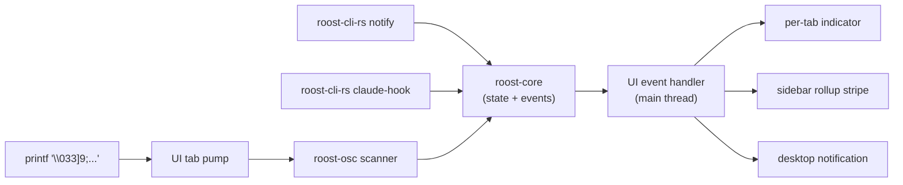

# Architecture

Roost is a Rust gRPC daemon (`roost-core`) plus a native UI on each platform — Swift + AppKit on macOS, Rust + gtk4-rs on Linux. The UIs share a single proto schema (`proto/roost.proto`) and communicate with the daemon over a Unix domain socket. `libghostty-vt` is vendored once and linked directly into both UIs for in-process VT parsing and rendering.

For the durable design rationale (why two languages, why proto, why local UDS) see [Vision](../development/vision.md). For the legacy Go binary's architecture see [Legacy → Architecture](legacy-go/architecture.md).

## Stack

| Layer | macOS | Linux |
|---|---|---|
| Window + chrome | Swift + AppKit | Rust + gtk4-rs + libadwaita |
| Renderer | Core Graphics over libghostty-vt cell grid | Cairo + Pango over libghostty-vt cell grid |
| Terminal engine | `libghostty-vt` (vendored, shared archive) | `libghostty-vt` (vendored, shared archive) |
| gRPC client | `grpc-swift` v2 | `tonic` |
| Daemon | `roost-core` (Rust, `tonic` server) | (same) |
| PTY supervision | `portable-pty` inside `roost-core` | (same) |
| Persistence | `rusqlite` inside `roost-core` | (same) |
| OSC routing | `roost-osc` crate inside the daemon | (same) |
| Companion CLI | `roost-cli-rs` (transitional name) | (same) |

The UIs are written separately and idiomatic to their platform; only the proto bindings are shared between them.

## Repository layout

```text
proto/                    # roost.proto — single source of truth for the wire contract
crates/
  roost-proto/            # tonic-generated bindings for Rust consumers
  roost-common/           # shared paths, UDS connector
  roost-vt/               # libghostty-vt FFI wrapper (used by roost-linux)
  roost-osc/              # OSC scanner + state machine
  roost-core/             # daemon: tonic server, PTY supervisor, SQLite
  roost-smoke/            # end-to-end smoke binary
  roost-cli-rs/           # CLI (renamed to roost-cli in Phase 9)
  roost-linux/            # Linux UI (gtk4-rs)
mac/                      # Swift package (Roost.app)
  Sources/Roost/          # AppKit + libghostty-vt + grpc-swift v2
  scripts/bundle.sh       # SwiftPM → .app bundle
  Tests/RoostTests/
third_party/ghostty/      # Vendored libghostty-vt build (collapses with build/ in Phase 9)
cmd/, internal/, build/   # Legacy Go binary — see Legacy section
```

## Hot path

PTY bytes flow `core → UI` as gRPC server-streams (`StreamPty`). The UI parses VT and renders **in-process** — never over the wire. Keystrokes flow `UI → core` as the client side of the same bidirectional stream. OSC events detected during VT parsing in the UI upcall to the core (`ReportOsc`), which decides whether to fire a notification.



Keeping VT parsing in the UI process means each redraw is in-process memory — only raw PTY bytes cross the socket. Putting cell deltas over the wire would convert every screen update into a context switch and a serialization cost.

## Threading

Both UI toolkits (AppKit, GTK4) are single-threaded. Widget operations must run on the main thread.

| Layer | Thread |
|---|---|
| UI widgets, draw, input | Main thread only |
| `libghostty-vt` terminal handle | Main thread only |
| gRPC stream pumps (`StreamPty`, `WatchEvents`) | Background; results marshalled to main |
| PTY read/write (inside `roost-core`) | Tokio task per tab |
| OSC scanner (inside `roost-core`) | Same task as the PTY pump |
| SQLite writes (`rusqlite`) | Serialized inside `roost-core` |
| tonic server handlers | Tokio worker pool |

The UIs marshal stream events to the main thread via `glib.IdleAdd` on Linux and `DispatchQueue.main.async` (or `@MainActor`) on macOS.

## Boundaries

- The UIs talk to `roost-core` over gRPC only — never read the SQLite database, never touch `libghostty-vt` initialization, never hold daemon state.
- `libghostty-vt` lives inside each UI for VT parsing + rendering. The daemon doesn't parse VT — it shuttles bytes.
- OSC routing sits in the daemon (`roost-osc`) because the per-tab `set_hook_active` suppression rule depends on cross-client state.
- The legacy Go `cmd/` + `internal/` tree is unaffected by the Rust workspace and builds independently via `build/build.sh` until the Phase 9 cutover.

See [Vision → Decision log](../development/vision.md#decision-log) for the rationale behind each major choice.
