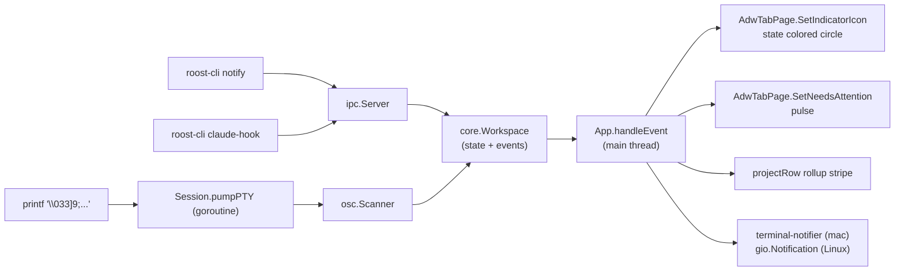

# Architecture

Roost is one binary with a strictly layered package structure. The UI talks to a workspace coordinator, which owns persistence and emits events. PTY supervision and the libghostty-vt cgo boundary live in their own packages and never touch the UI layer.

## Stack

| Layer                  | Implementation                                       |
|------------------------|------------------------------------------------------|
| UI                     | GTK4 + libadwaita via `diamondburned/gotk4`          |
| Renderer               | Cairo + Pango drawing into a `GtkDrawingArea`        |
| State / persistence    | `internal/core` + `internal/store` (modernc/sqlite)  |
| Terminal engine        | `internal/ghostty` (cgo wrapper around libghostty-vt) |
| PTY                    | `internal/pty` (creack/pty)                          |
| OSC fallback           | `internal/osc` (streaming Go scanner)                |
| IPC                    | `internal/ipc` (Unix socket, JSON-RPC)               |
| Companion CLI          | `cmd/roost-cli`                                      |

## Package layout

```text
cmd/
  roost/                # GUI binary
    main.go             # entry, config + store + workspace + GTK app bootstrap
    app.go              # App struct: owns sessions map, sidebar, tab views, IPC handler
    session.go          # Session: PTY + libghostty terminal + render state + DrawingArea
    render.go           # Cairo cell drawing + selection overlay
    input.go            # GDK key event → libghostty key encoder → PTY bytes
    keymap.go           # GDK keyval → ghostty.Key + ghostty.Mods (pure Go, no cgo)
    selection.go        # Stable selection model + ribbon-rect math for the renderer
    notify.go           # Desktop notification (gio on Linux, osascript on macOS)
    loghandler.go       # slog filter for noisy GLib theme warnings
  roost-cli/            # Companion CLI binary
    main.go             # notify, set-title, identify
internal/
  core/                 # Project + Tab models, Workspace coordinator, event channel
  store/                # SQLite schema + migrations + CRUD
  config/               # Cross-platform path resolution
  ghostty/              # cgo bindings to libghostty-vt
  pangoextra/           # cgo wrapper for Pango/Cairo font options
  pty/                  # creack/pty wrapper
  osc/                  # OSC 9 / OSC 777 streaming parser
  ipc/                  # Unix socket protocol + server + client helper
build/
  build.sh              # zig build for libghostty-vt + go build
```

## Threading contract

GTK4 is strictly single-threaded. Widget operations must run on the main thread.

| Layer                                  | Thread                                       |
|----------------------------------------|----------------------------------------------|
| GTK widgets, draw functions, input     | Main thread only                              |
| `ghostty_terminal_vt_write`            | **Main thread**                               |
| `ghostty_render_state_update` and walk | **Main thread**                               |
| `KeyEncoder` / `MouseEncoder` (encode + `setopt_from_terminal`) | **Main thread** (same handle reused per session) |
| `EncodePaste` / `CopyViewportSelection` | **Main thread**                               |
| Per-tab PTY `Read` / `Write`           | One goroutine per tab                         |
| OSC scanner (parses notifications)     | Same goroutine as the PTY pump                |
| SQLite writes                          | Goroutine-safe (database/sql handles locking) |
| IPC server (Unix socket)               | Goroutines per connection                     |

Goroutines marshal back to the main thread via `glib.IdleAdd`. The shortcut controller runs in GTK's *capture* phase so app-level keybindings fire before the focused terminal sees the event.

## Event flow: a notification



Three input paths (`roost-cli notify`, `roost-cli claude-hook`, OSC 9/777) converge on `core.Workspace`. The Workspace emits four event kinds the UI cares about:

- `EventNotification` — drives the desktop banner and the `SetNeedsAttention` pulse.
- `EventTabNotificationChanged` — fires when the per-tab pending-attention flag flips. Today consumed only for symmetry; future surfaces (sidebar dot count, etc.) layer on top.
- `EventTabStateChanged` — drives the per-tab indicator icon and the project rollup stripe recompute.
- `EventTabDeleted` — carries `ProjectID` so the rollup stripe can be recomputed without a separate lookup.

The App subscribes once and marshals each event to the main thread via `coreglib.IdleAdd` before touching widgets. Banners on macOS go through `terminal-notifier` (`-execute "roost-cli tab focus --tab N"` for click-through, `-group roost.tab.<id>` for supersede); on Linux a `gio.SimpleAction` wires the banner's default action to in-process `App.FocusTab`.

OSC suppression: when a tab has an active hook session (`system.set_hook_active`), the OSC scanner's `OnNotification` callback drops raw OSC 9/777 from inside the agent. Hook events are the trusted channel; OSC is the fallback for tools that can't be modified.

## Boundaries

- The UI layer (`cmd/roost`) calls `core.Workspace` only — never `internal/store` directly. This preserves the option of moving the workspace into a separate daemon process later.
- cgo lives in `internal/ghostty` (libghostty-vt embedding) and `internal/pangoextra` (a small wrapper for `pango_cairo_context_set_font_options`, present only because gotk4's binding for the same call crashes). Every other package is pure Go.
- Per-tab Sessions are independent: closing one cannot affect another's pump or libghostty terminal.

See [Design Spec](../development/spec.md) for the rationale behind these choices.
