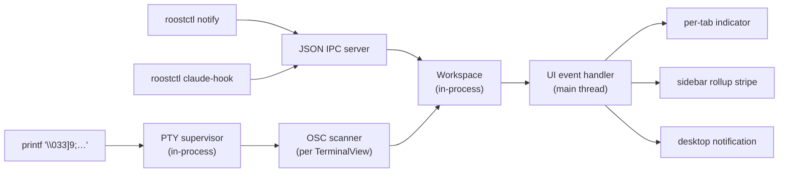

# Architecture

Roost ships two native UIs — Swift + AppKit on macOS (`Roost.app`) and Rust + gtk4-rs on Linux (`roost-linux`) — that each embed the workspace + PTY supervisor in-process. External tooling (the `roostctl` CLI, Claude Code hooks) talks to a running UI via newline-delimited JSON over a Unix-domain socket; the wire format is documented in [`docs/reference/ipc.md`](ipc.md). `libghostty-vt` is vendored once and linked directly into both UIs for in-process VT parsing and rendering.

For the durable design rationale (why two languages, why in-process, why local UDS) see [Vision](../development/vision.md). The retired Go + GTK4 prototype's architecture is archived in the separate `roost-legacy-go` repository.

## Stack

| Layer | macOS | Linux |
|---|---|---|
| Window + chrome | Swift + AppKit | Rust + gtk4-rs + libadwaita |
| Renderer | Core Graphics over libghostty-vt cell grid | Cairo + Pango over libghostty-vt cell grid |
| Terminal engine | `libghostty-vt` (vendored, shared archive) | `libghostty-vt` (vendored, shared archive) |
| Workspace | `mac/Sources/Roost/Workspace.swift` (`@MainActor`) | `crates/roost-linux/src/daemon/state.rs` |
| PTY supervisor | `mac/Sources/Roost/PtySupervisor.swift` (forkpty + DispatchSourceRead) | `crates/roost-linux/src/daemon/pty.rs` (`portable-pty` + tokio tasks) |
| Persistence | `state.json` via tmp + fsync + `replaceItemAt` | `state.json` via tmp + fsync + rename + parent-dir fsync |
| IPC server | `mac/Sources/Roost/IPCServer.swift` (Darwin sockets) | `crates/roost-ipc/src/server.rs` (tokio `UnixListener`) |
| IPC wire types | `mac/Sources/Roost/IPCMessages.swift` (Codable) | `crates/roost-ipc/src/messages.rs` (serde) |
| OSC scanning | `mac/Sources/Roost/OscScanner.swift` per `TerminalView` | `roost-osc` crate per per-tab drain task |
| Single-instance | `mac/Sources/Roost/SingleInstance.swift` (flock via `@_silgen_name`) | `crates/roost-linux/src/single_instance.rs` (`fs2::FileExt::try_lock_exclusive`) |
| Shell-integration CLI | `roostctl` (binary from `crates/roost-cli`) — same binary on both platforms | (same) |

The UIs are written separately and idiomatic to their platform; only the JSON IPC wire format is shared between them (via the `roost-ipc` crate on the Rust side + its hand-mirrored Swift counterpart in `IPCMessages.swift`).

## Repository layout

```text
crates/
  roost-ipc/              # JSON wire format, framing, client, server, paths, target picker
  roost-vt/               # libghostty-vt FFI wrapper (--features ffi)
  roost-osc/              # OSC scanner + state machine
  roost-cli/              # roostctl binary
  roost-linux/            # Linux UI (gtk4-rs) — embeds Workspace + PtySupervisor + IPC server
mac/
  Sources/Roost/          # Swift Mac UI — embeds Workspace + PtySupervisor + IPC server
  Resources/              # themes, Info.plist.template, Roost.entitlements
  Tests/RoostTests/       # swift-testing test suite
  scripts/bundle.sh       # SwiftPM → .app bundle + embedded roostctl + ad-hoc codesign
docs/
  reference/ipc.md        # JSON IPC wire spec — canonical
  archive/roost.proto     # Historical reference (the pre-M7 gRPC schema)
third_party/ghostty/      # Vendored libghostty-vt build
```

## Hot path

PTY bytes flow `kernel → master fd → in-process drain task → libghostty-vt vt_write → renderer`. Everything is in the same process; the IPC socket carries only control messages (`tab.open`, `tab.write`, `events.subscribe`, etc.) and event broadcasts. The renderer never sees the wire.



The wire surface is small enough to inspect by hand:

```bash
echo '{"id":"1","op":"identify","params":{}}' | nc -U ~/Library/Caches/Roost/roost.sock
```

## Threading

Both UI toolkits (AppKit, GTK4) are single-threaded. Widget operations and `libghostty-vt` calls must run on the main thread.

| Layer | Thread |
|---|---|
| UI widgets, draw, input | Main thread only |
| `libghostty-vt` terminal handle + `vt_write` | Main thread only |
| PTY read (master fd) | `DispatchSourceRead` background queue (Mac) / dedicated tokio task (Linux) |
| PTY write | Main thread (`LocalClient.writeTab`) |
| OSC dispatch | Main thread (hopped from the read queue) |
| IPC accept loop | Detached `Task` (Mac) / tokio task (Linux) — never blocks main |
| IPC handler dispatch | Per-connection `Task` (Mac) / tokio task (Linux); mutations hop to main |
| `state.json` writes | Main thread (small; atomic via tmp + rename) |

The Mac PTY read path uses a dedicated pattern: the `DispatchSourceRead` closure is installed via a `nonisolated static` helper so Swift 6 doesn't infer `@MainActor` isolation on the closure body (which would trip `dispatch_assert_queue(main)` from the dispatch worker thread). Bytes bridge to the main actor through a `Sendable AsyncStream<InternalEvent>` that a drain `Task { @MainActor in ... }` consumes — see `mac/Sources/Roost/PtySupervisor.swift` for the comment block that walks through this.

## Boundaries

- Each UI process owns its workspace, PTY supervisor, and IPC server. There is no separate daemon. State is in memory + the bundle-profile `state.json` file.
- `libghostty-vt` lives inside each UI for VT parsing + rendering.
- OSC scanning lives in the UI (`OscScanner.swift` on macOS, `roost-osc` crate on Linux) because OSC parsing walks the same byte stream the VT parser does. OSC events apply directly to the local workspace via `LocalClient.applyOSC`.
- Terminal *query* replies (the program asking the terminal for its colors, device attributes, etc.) split across two channels — embedder-synthesized OSC color replies vs. libghostty-answered device replies. See [Terminal query replies](terminal-queries.md) for which is which and why.
- The IPC server is per-UI: external tooling (`roostctl`, Claude hooks) talks to the bundle profile's socket (`~/Library/Caches/Roost/roost.sock` for Mac, `$XDG_RUNTIME_DIR/roost/roost.sock` for Linux). `roostctl --target {mac,gtk}` routes to the right one; `roostctl` with no `--target` auto-detects via a parallel `connect()` probe of both candidate sockets.
- Single-instance enforcement uses `flock(LOCK_EX | LOCK_NB)` on a pidfile next to the socket. Second launches read the holder PID and exit 0. `ROOST_ALLOW_MULTI=1` bypasses for dev/test workflows.

See [Vision → Decision log](../development/vision.md#decision-log) for the rationale behind each major choice.
