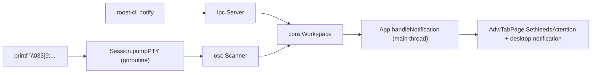

# Architecture

Roost is one binary with a strictly layered package structure. The UI talks to a workspace coordinator, which owns persistence and emits events. PTY supervision and the libghostty-vt cgo boundary live in their own packages and never touch the UI layer.

## Stack

| Layer                  | Implementation                                       |
|------------------------|------------------------------------------------------|
| UI                     | GTK4 + libadwaita via `diamondburned/gotk4`          |
| Renderer               | Cairo + Pango drawing into a `GtkDrawingArea`        |
| State / persistence    | `internal/core` + `internal/store` (modernc/sqlite)  |
| Terminal engine        | `internal/ghostty` (cgo wrapper around libghostty-vt) |
| PTY                    | `internal/pty` (creack/pty)                          |
| OSC fallback           | `internal/osc` (streaming Go scanner)                |
| IPC                    | `internal/ipc` (Unix socket, JSON-RPC)               |
| Companion CLI          | `cmd/roost-cli`                                      |

## Package layout

```text
cmd/
  roost/                # GUI binary
    main.go             # entry, config + store + workspace + GTK app bootstrap
    app.go              # App struct: owns sessions map, sidebar, tab views, IPC handler
    session.go          # Session: PTY + libghostty terminal + render state + DrawingArea
    render.go           # Cairo cell drawing
    input.go            # GDK key event → PTY bytes
    notify.go           # Desktop notification (gio on Linux, osascript on macOS)
    loghandler.go       # slog filter for noisy GLib theme warnings
  roost-cli/            # Companion CLI binary
    main.go             # notify, set-title, identify
internal/
  core/                 # Project + Tab models, Workspace coordinator, event channel
  store/                # SQLite schema + migrations + CRUD
  config/               # Cross-platform path resolution
  ghostty/              # cgo bindings to libghostty-vt (the only cgo package)
  pty/                  # creack/pty wrapper
  osc/                  # OSC 9 / OSC 777 streaming parser
  ipc/                  # Unix socket protocol + server + client helper
build/
  build.sh              # zig build for libghostty-vt + go build
```

## Threading contract

GTK4 is strictly single-threaded. Widget operations must run on the main thread.

| Layer                                  | Thread                                       |
|----------------------------------------|----------------------------------------------|
| GTK widgets, draw functions, input     | Main thread only                              |
| `ghostty_terminal_vt_write`            | **Main thread**                               |
| `ghostty_render_state_update` and walk | **Main thread**                               |
| Per-tab PTY `Read` / `Write`           | One goroutine per tab                         |
| OSC scanner (parses notifications)     | Same goroutine as the PTY pump                |
| SQLite writes                          | Goroutine-safe (database/sql handles locking) |
| IPC server (Unix socket)               | Goroutines per connection                     |

Goroutines marshal back to the main thread via `glib.IdleAdd`. The shortcut controller runs in GTK's *capture* phase so app-level keybindings fire before the focused terminal sees the event.

## Event flow: a notification



Both input paths converge on `core.Workspace.Notify`, which emits an `EventNotification` on the workspace event channel. The App subscribes to that channel and marshals each event to the main thread before touching widgets.

## Boundaries

- The UI layer (`cmd/roost`) calls `core.Workspace` only — never `internal/store` directly. This preserves the option of moving the workspace into a separate daemon process later.
- cgo lives only in `internal/ghostty`. Other packages are pure Go.
- Per-tab Sessions are independent: closing one cannot affect another's pump or libghostty terminal.

See [Design Spec](../development/spec.md) for the rationale behind these choices.
