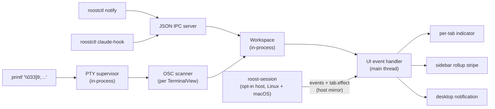

# Architecture

Roost ships two platform products — Swift + AppKit on macOS (`Roost.app`) and Rust + iced on Linux (`roost`, packaged as the `.deb`) — that each embed their runtime in-process. The same iced binary also builds an experimental `Roost-Iced.app` for macOS, which is the Linux UI on a different host rather than a third implementation. External tooling (the `roostctl` CLI, Claude Code hooks) talks to a running UI via newline-delimited JSON over a Unix-domain socket; the wire format is documented in [`docs/reference/ipc.md`](ipc.md). `libghostty-vt` is vendored once and linked directly into both UIs for in-process VT parsing and rendering.

One contract, two implementations: the op set in `roost-ipc` is the contract, the Rust side implements it over the toolkit-neutral `roost-engine`, and the Swift side implements it over its own `@MainActor` workspace.

For the durable design rationale (why two languages, why in-process, why local UDS) see [Vision](../development/vision.md).

## Stack

| Layer | macOS (`mac/`, Swift + AppKit) | Linux (`crates/roost-iced`, Rust + iced) |
|---|---|---|
| Window + chrome | Swift + AppKit | Rust + iced (`crates/roost-iced/src/app.rs`) |
| Renderer | Core Graphics over libghostty-vt cell grid | iced + wgpu over libghostty-vt cell grid (`crates/roost-iced/src/terminal_widget.rs`) |
| Terminal engine | `libghostty-vt` (vendored, shared archive) | `libghostty-vt` (vendored, shared archive) |
| Workspace | `mac/Sources/Roost/Workspace.swift` (`@MainActor`) | `crates/roost-engine/src/workspace.rs` |
| PTY supervisor | `mac/Sources/Roost/PtySupervisor.swift` (forkpty + `DispatchSourceRead`) | `crates/roost-engine/src/pty.rs` (`portable-pty` + tokio tasks) |
| Persistence | `state.json` via tmp + fsync + `replaceItemAt` | `state.json` via tmp + fsync + rename + parent-dir fsync (`crates/roost-engine/src/persistence.rs`) |
| IPC server | `mac/Sources/Roost/IPCServer.swift` (Darwin sockets) | `crates/roost-ipc/src/server.rs` (tokio `UnixListener`) |
| IPC wire types | `mac/Sources/Roost/IPCMessages.swift` (Codable) | `crates/roost-ipc/src/messages.rs` (serde) |
| OSC scanning | `mac/Sources/Roost/OscScanner.swift` per `TerminalView` | `roost-osc` crate + `crates/roost-engine/src/osc.rs` (`OscRouter`), per per-tab drain task |
| URL detection (clickable links) | `mac/Sources/Roost/UrlDetection.swift` — hand-mirrored, parity-pinned against `tests/url-fixtures/` | `crates/roost-url` |
| Agent state model (shell/lifecycle/attention/ownership axes, `tab.state` derivation) | `mac/Sources/Roost/AgentState.swift` | `crates/roost-ipc/src/agent.rs` |
| Agent adapters (Claude Code today) | `roostctl claude-hook` (binary from `crates/roost-cli`, links `crates/roost-agent`) — same binary on both UIs | (same) |
| Single-instance (two flocks: socket/bind + state — see [Paths](paths.md#two-single-instance-locks)) | `mac/Sources/Roost/SingleInstance.swift` (flock via `@_silgen_name`) | `crates/roost-engine/src/single_instance.rs` (`File::try_lock`) |
| Shell-integration CLI | `roostctl` (binary from `crates/roost-cli`) — same binary on both UIs | (same) |

The two UIs are written separately and idiomatic to their platform. What they share is the JSON IPC wire format (the `roost-ipc` crate on the Rust side, its hand-mirrored Swift counterpart in `IPCMessages.swift`) and the agent state model. Below the toolkit line the Rust UI additionally sits on `roost-engine` (workspace, PTY, persistence, events, single-instance) and `roost-ui-model` (config, theme, keybinds, palette, providers, agent/notification projections) — crates that are deliberately toolkit-neutral, both because the same code has to serve iced on two host OSes and because a future Swift adapter over the same core is an open direction. See [Shared Rust engine](../development/shared-rust-engine.md).

## Repository layout

```text
crates/
  roost-ipc/              # JSON wire format, framing, client, server, paths, target picker
  roost-agent/            # Pure agent adapters (Claude Code today) — hook event JSON in,
                          # tab.agent_report params out; no I/O, no socket, no clap
  roost-engine/           # Toolkit-neutral workspace, PTY, persistence, events, IPC dispatch
  roost-ui-model/         # Toolkit-neutral config, theme, keybind, palette, provider, agent/notification projections
  roost-vt/               # libghostty-vt FFI wrapper (--features ffi)
  roost-osc/              # OSC scanner + state machine
  roost-url/              # Shared URL detection for clickable links
  roost-cli/              # roostctl binary
  roost-iced/             # iced UI — packaged .deb ships it as /usr/bin/roost;
                          #   src/macos/ holds the AppKit seams for Roost-Iced.app
  roost-session/          # opt-in headless host-session daemon (roost-session binary);
                          #   Linux + macOS (bundled in Roost-Iced.app),
                          #   started with `roostctl session start`
mac/
  Sources/Roost/          # Swift Mac UI — embeds Workspace + PtySupervisor + IPC server
  Resources/              # themes, Info.plist.template, Info-iced.plist.template, entitlements
  Tests/RoostTests/       # swift-testing test suite
  scripts/bundle.sh       # SwiftPM → Roost.app + embedded roostctl + codesign
  scripts/bundle-iced.sh  # cargo → Roost-Iced.app (same signing/notarization path)
docs/
  reference/ipc.md        # JSON IPC wire spec — canonical
  archive/roost.proto     # Historical reference (the pre-M7 gRPC schema)
third_party/ghostty/      # Vendored libghostty-vt build
```

## Hot path

PTY bytes flow `kernel → master fd → in-process drain task → libghostty-vt vt_write → renderer`. Everything is in the same process; the IPC socket carries only control messages (`tab.open`, `tab.write`, `events.subscribe`, etc.) and event broadcasts. The renderer never sees the wire.


```mermaid
flowchart LR
    CLI["roostctl notify"]
    Hook["roostctl claude-hook"]
    OSC["printf '\\033]9;…'"]
    PTY["PTY supervisor<br/>(in-process)"]
    Workspace["Workspace<br/>(in-process)"]
    Scanner["OSC scanner<br/>(per TerminalView)"]
    UI["UI event handler<br/>(main thread)"]
    Indicator["per-tab indicator"]
    Stripe["sidebar rollup stripe"]
    Banner["desktop notification"]
    IPC["JSON IPC server"]
    Session["roost-session<br/>(opt-in host, Linux + macOS)"]

    CLI --> IPC
    Hook --> IPC
    IPC --> Workspace
    OSC --> PTY --> Scanner --> Workspace
    Workspace --> UI
    Session -- "events + tab.effect<br/>(host mirror)" --> UI
    UI --> Indicator
    UI --> Stripe
    UI --> Banner
```

**The session/client edge is the one path that skips `Workspace`.** A `roost-session` a UI has connected to (host sessions, `docs/development/host-sessions.md`) is a *separate* in-process workspace running on another machine or process; its tabs never enter this UI's own `Workspace`. Instead `HostConn` mirrors that session's events straight into the UI event handler, so a host tab's bell, clipboard write (`tab.effect`), and attention notifications reach the same output surfaces a local tab's do: the notification inbox, the desktop banner, the sidebar's rows and dots, and the agents palette. Those surfaces are host-*aware* where identity matters — every row is keyed by `TabKey`, so a host tab and a local tab that share a number can never be confused, and the agents palette names the host in each row's context — and host-*blind* in what they render, since a remote row is drawn by the same widgets as a local one.

**A host's connection state is the client's own, and it is readable from outside.** `HostConnSet` (`crates/roost-iced/src/host_conn.rs`) holds each host's `HostConnState` on the main thread — one `HostEntry` per saved host, so a host's connection, retained rows, attempt generation, ssh transport, outage and bootstrap note are created and torn down in one place rather than six — `Disconnected` / `Connecting` / `Connected` / `TakenOver` / `Stopped` / `NeedsRestart` — and one reducer projects it twice: into the sidebar section's status band, and onto the wire as [`host.status`](ipc.md#host-registry-host), which reports the band's own `rollup` string rather than re-deriving it. That is what makes the state assertable without reading pixels or log lines; `roostctl host status` is the same read from a shell. The two failure shapes are deliberately different: a connection that *dropped* retries itself (a localhost backoff, or the SSH ladder's ten jittered rungs — while one of those rungs is armed the band can only show the countdown, so the classified cause rides beside it in `retry.reason`), while a `localhost` session that could not be *started* settles on the first attempt — a `reason` for the band, a `detail` naming what the launch ladder actually hit, and no retry armed, because nothing a retry can do will create that binary. See [Host sessions (development)](../development/host-sessions.md) for the state machine and the SSH transport it rides.

The wire surface is small enough to inspect by hand:

```bash
echo '{"id":"1","op":"identify","params":{}}' | nc -U ~/Library/Caches/Roost/roost.sock
```

## Threading

AppKit is strictly single-threaded for UI work, and iced's winit event loop is likewise single-threaded for its `update`/`view` cycle. Widget operations and `libghostty-vt` calls must run on that thread.

| Layer | macOS | Linux (iced) |
|---|---|---|
| UI widgets, draw, input | Main thread only | Main thread only (the winit event-loop thread, driven from `update` / `view`) |
| `libghostty-vt` handle + `vt_write` | Main thread only (`@MainActor`) | Main thread only, driven from `update` |
| PTY read (master fd) | `DispatchSourceRead` on a background queue | Per-tab `tokio::spawn_blocking` read loop in `roost-engine` |
| PTY write | Main thread (`LocalClient.writeTab`) | A per-tab ordered tokio task draining an input + resize command channel, so submission order is preserved |
| Engine → UI feed | n/a (in-process `@MainActor` calls) | Workspace events, PTY output and IPC requests land on **one** channel from background tokio tasks; a `Notify`-backed iced `Subscription` wakes `update` to drain it on the main thread (`crates/roost-iced/src/engine_feed.rs`) |
| OSC dispatch | Main thread (hopped from the read queue via `DispatchQueue.main.async`) | Main thread (delivered through the engine feed) |
| IPC accept loop | Detached `Task` — never blocks main | tokio task — never blocks main |
| IPC handler dispatch | Per-connection `Task`; mutations hop to main | The handler hands each request to the engine feed and awaits a oneshot reply, so mutations happen on the main thread in FIFO order |
| `state.json` writes | Main thread (small; atomic via tmp + rename) | Main thread (same) |

Both UIs are therefore single-actor for state: every request is applied on the UI thread, and responses come back in completion order rather than request order.

The Mac PTY read path uses a dedicated pattern: the `DispatchSourceRead` closure is installed via a `nonisolated static` helper so Swift 6 doesn't infer `@MainActor` isolation on the closure body (which would trip `dispatch_assert_queue(main)` from the dispatch worker thread). Bytes bridge to the main actor through a `Sendable AsyncStream<InternalEvent>` that a drain `Task { @MainActor in ... }` consumes — see `mac/Sources/Roost/PtySupervisor.swift` for the comment block that walks through this.

The iced side's equivalent subtlety is the drain: the feed is batched (capped per wake), and a request that arrives in a batch which already carries pending workspace mutations forces a mid-drain reconcile first, so an IPC caller never observes state from before the mutations that preceded it on the same channel. The macOS-only AppKit ops in `crates/roost-iced/src/macos/` additionally require an `objc2::MainThreadMarker` and fail loudly rather than touch AppKit off-thread.

## Boundaries

- Each UI process owns its workspace, PTY supervisor, and IPC server. There is no separate daemon by default — the one opt-in exception is `roost-session` (`crates/roost-session/`), a headless daemon for host-sessions, started with `roostctl session start` (see [`ipc.md`](ipc.md#session-sockets)). State is in memory + the bundle-profile `state.json` file. A saved host's *connection* state is the running UI's alone — `state.json` persists only the `{id, label, target, last_connected}` registry — which is why `host.connect` / `host.disconnect` / `host.status` have no headless form and answer `internal: no UI attached` without one.
- `libghostty-vt` lives inside each UI for VT parsing + rendering.
- OSC scanning lives in the UI (`OscScanner.swift` on macOS, the `roost-osc` crate + `roost-engine`'s `OscRouter` in the Rust UI) because OSC parsing walks the same byte stream the VT parser does. OSC events apply directly to the local workspace via `LocalClient.applyOSC`.
- Terminal *query* replies (the program asking the terminal for its colors, device attributes, etc.) all come from libghostty, through the `write_pty` effects callback each UI installs and drains onto the tab's PTY input. Roost's OSC scanner sees those queries but answers none of them — it did synthesize the OSC color replies until the pinned SHA started answering them, at which point synthesizing too meant double-answering. See [Terminal query replies](terminal-queries.md).
- The IPC server is per-UI: external tooling (`roostctl`, Claude hooks) talks to the bundle profile's socket. Dev builds of iced (and the experimental `Roost-Iced.app`) use isolated `Roost-iced`/`roost-iced` paths; the packaged `.deb` build resolves the production `Linux` profile instead (see [Paths & Environment](paths.md)). `roostctl --target {mac,linux,iced}` routes explicitly; with no selector it probes every distinct candidate concurrently and requires a choice if multiple UIs answer.
- Single-instance enforcement uses `flock(LOCK_EX | LOCK_NB)` on **two** lock files, one per thing guarded: `roost.lock` beside the socket (the bind lock, following `XDG_RUNTIME_DIR`) and `state.lock` beside `state.json` (following `ROOST_STATE_DIR`). They are taken socket-first and released in reverse. Losing the **socket** lock reads the holder PID, activates the running window and exits 0; losing the **state** lock **fails closed** — it guards `state.json`, and the owner's socket is undiscoverable in that case by construction. `ROOST_ALLOW_MULTI=1` bypasses enforcement on **macOS only** (the Swift app); the iced UI has no bypass. See [Paths & Environment](paths.md).

See [Vision → Decision log](../development/vision.md#decision-log) for the rationale behind each major choice.
