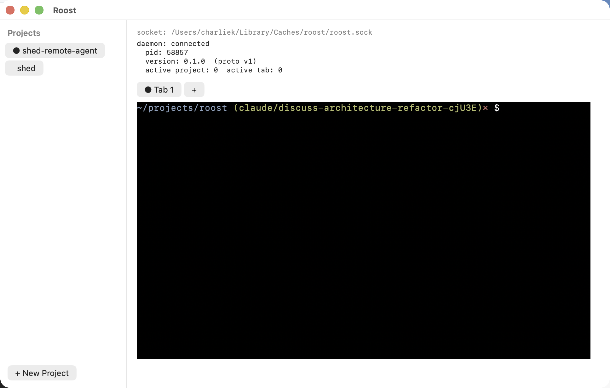
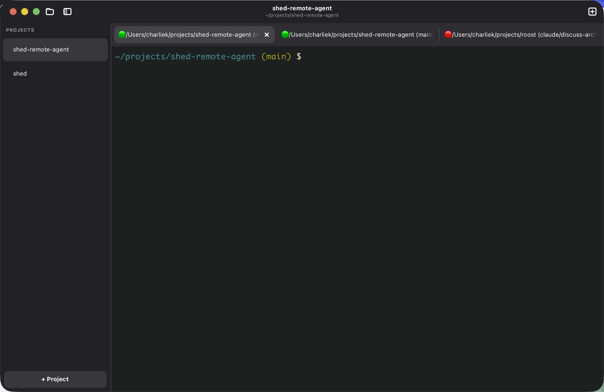
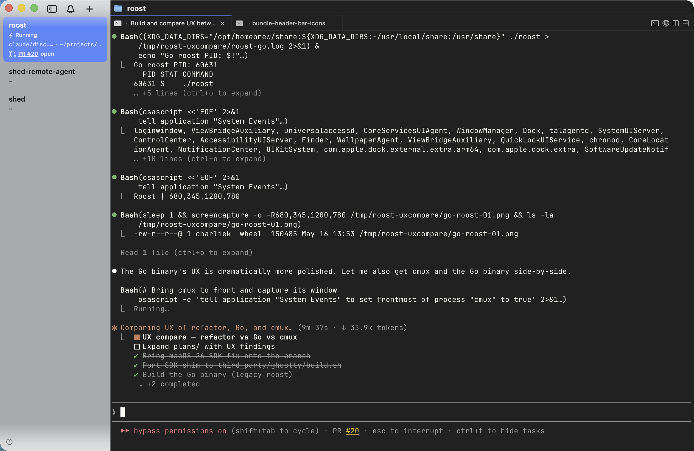
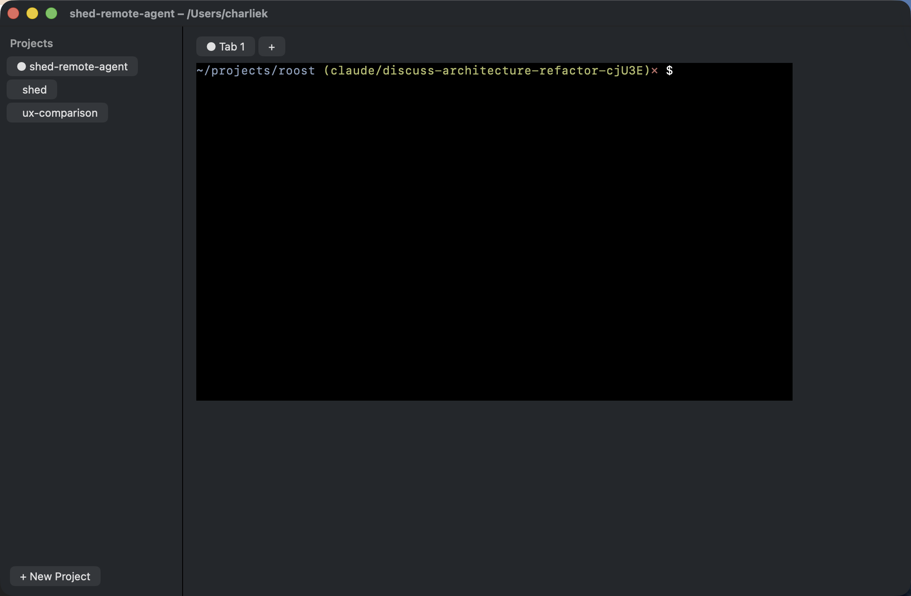

# UX assessment — 2026-05-16

> **Status**: historical snapshot. Decisions captured here were folded
> into [`goal-rust-port-polish-2026-05-16.md`](goal-rust-port-polish-2026-05-16.md)
> on the same day. The "Three directions" framing below resolved to
> direction A (polish-first), with scope expanded to also cover
> WatchEvents, headless CLI, and window resize. The polish-pass edits
> referenced in the "Polish pass landed in the working tree" section
> land on a `polish/chrome-foundation` topic branch into
> `feature/rust-port` as the first PR of the goal.

Frank, picture-led evaluation of the refactor's Mac UI prototype against
the shipping Go binary and against cmux (the spiritual reference).
Written from a fresh build of `claude/discuss-architecture-refactor-cjU3E`
on macOS 26.4.1 (Apple Silicon).

The point of this document is to feed the question: *should this
prototype be considered a viable replacement for the Go binary, or is
the gap large enough that we should rethink the path?* It does **not**
prescribe a decision — it organises evidence and a few directions you
can drive into the existing phase docs.

Companion screenshots live under [`screenshots-2026-05-16/`](screenshots-2026-05-16/).

## Build status on this machine

| Component | Status | Notes |
|---|---|---|
| `build/build.sh libghostty` (Go path) | ✅ builds | macOS 26 SDK shim activated automatically (`f6e0d64` merged from `main`). |
| `third_party/ghostty/build.sh` (Rust/Swift path) | ✅ builds | Shim mirrored verbatim onto the branch (`00b3d10`). Both scripts now route Zig 0.15.2 through `MacOSX15.sdk` on macOS 26. |
| `./build/build.sh build` → `./roost` + `./roost-cli` | ✅ runs | Daemon comes up at `~/Library/Application Support/Roost/roost.sock`. |
| `cargo build -p roost-core` | ✅ runs | Daemon comes up at `~/Library/Caches/roost/roost.sock`. Separate path → no conflict with the Go binary. |
| `cargo build -p roost-cli-rs` | ✅ runs | Surface: `project list/create/rename/delete`, `tab list/focus/set-state/clear-notification`, `notify`, `set-title`, `identify`. |
| `mac && swift build` → `Roost.app` | ✅ runs | Roughly two minutes for a clean first build (~50 grpc-swift NIO transitive deps). |
| GTK on Mac for the Rust UI (Phase 7 stretch) | ❌ not attempted | Phase 7 hasn't started. Feasible — same `crates/roost-vt` library and same `roost-core` daemon both work on Mac. Brew already ships `libgtk-4-dev` + `libadwaita`. |

Toolchain on the machine:

* `mise install` provisioned Go 1.25.10, Zig 0.15.2, Rust 1.85.0.
* `brew install protobuf` provisioned `protoc 34.1` (needed by `swift build`'s `GRPCProtobufGenerator` plugin).
* Apple Command Line Tools' `MacOSX15.sdk` is what both shims fall back to.

## What you see when you launch each one

### Swift Mac UI (refactor branch)



Reading the window top to bottom:

* Stock `NSWindow` titlebar — title literally `"Roost"`. No project name, no
  cwd subtitle.
* Sidebar: a `"Projects"` label (looks like an inline `NSTextField`, not an
  AppKit section header), one rounded `NSButton` per project with a
  `"● "` text prefix to mark "active". `"+ New Project"` is a vanilla
  rounded button anchored at the bottom.
* Content pane top: **debug chrome surfaces in production UI** — the socket
  path is rendered as monospace text along with `"daemon: connected pid: …
  version: 0.1.0 (proto v1) active project: 0 active tab: 0"`. The active
  IDs read `0`/`0` here even though there's a focused tab, because the
  status label was written for the Phase 5 step 2 Identify spike and never
  updated to track post-bootstrap state.
* Tab strip: another `NSButton` row with the same `"● Tab 1"` text marker
  + a `"+"` button. No tab title, no cwd, no status indicator.
* Terminal area: actually working — `bash` runs, prompt renders, the
  `CGhosttyVT` integration is real. Glyph rendering is clean.

The fundamentals of the architecture work. The visual layer is at the
"engineering prototype" level — what you would expect at Phase 5's
checkpoint, not at the end of Phase 6a step 2b.

### Go GTK4 UI (`main`, shipping today)



Reading the same window top to bottom:

* `AdwHeaderBar` shows the **active project name as the title and its cwd
  as the subtitle**. Window chrome integrates with macOS traffic lights.
  The two icons in the header (folder + sidebar-toggle on the left,
  "+ tab" on the right) render as empty squares — that's the known broken
  icon issue you flagged, fix in flight on a separate branch.
* Sidebar: `"PROJECTS"` caps section header, native row styling with the
  active project's row drawn on a subtle highlighted background (no `● `
  marker — the highlight *is* the affordance). `"+ Project"` is a styled
  button at the bottom of the sidebar.
* Tab strip: three tabs visible, each labelled with the **tab's cwd**
  (`/Users/charliek/projects/shed-remote-agent (main)`), each with a
  **colored status dot** to its left (green = running, red = the agent in
  the third tab is stopped), and the **active tab has a `×` close button**
  (inactive tabs don't, until hovered).
* Terminal area: dark theme, tilde-abbreviated path in green, git branch
  in parens, clean glyph rendering.

This is the bar the Swift UI needs to clear before it can replace the Go
binary as the user-facing experience on Mac. None of these pieces are
exotic — they are widely used libadwaita / native idioms, and they are
the difference between "running prototype" and "real app."

### cmux (reference)



cmux is a larger product and out of scope for parity in the MVP, but it
is the reference for what a polished Swift/AppKit terminal multiplexer
*can* look like:

* A vertical workspace sidebar where each row is a small card showing
  *title + git branch + pane state + last activity* — multi-line, dense,
  but readable.
* Notification rings on panes, sidebar badges, an actual notifications
  panel (`⌘I`), and `⌘⇧U` to jump to latest unread.
* Splits within a workspace, navigation between splits with `⌥⌘←→↑↓`.
* SSH workspaces, browser panes, scriptable CLI for everything.
* `~/.config/ghostty/config` honoured for theme/font/colors.

The cmux Swift codebase (`../cmux/Sources/`) is roughly 200+ files; the
sidebar alone is its own subdirectory; the terminal view is one
14,155-line file. The Swift Roost UI is currently 5 files / ~1,900 lines.
**This is not a "we are nearly there" situation — cmux is years of work
on the polish layer alone.** Trying to chase cmux feature-for-feature in
Roost would re-scope the project. Treat cmux as a *source of patterns
worth borrowing* (the sidebar information density, the notification
panel, the keybind surface), not as a parity target.

## Honest delta between Swift and Go

Already tracked in `phase-6a-mac-structural.md` (in priority order from
the existing doc):

* **Step 2c — WatchEvents subscription.** *Verified missing in the live
  build.* I created project `ux-comparison` via `roost-cli-rs project
  create` while the Swift UI was open; the sidebar did not refresh. The
  Go binary has the same listProjects-on-boot model today, but its
  intra-process callbacks already cover the "create via UI, refresh
  sidebar" path. **Until WatchEvents lands, the Swift UI is uniquely
  bad at multi-client scenarios.**
* Step 2d — Keybind override config.
* Step 2e — Secondary shortcuts.
* Step 2f — Selection + copy/paste.
* Step 2g — Window resize → terminal reflow.
* Step 2h — Wide-char cell width.
* Step 2i — "Visual polish."

The phase doc treats 2i as a small bullet at the end. Looking at the
two screenshots side-by-side, **"visual polish" is the headline gap, not
a closing detail.** The structural pieces (2c–2h) are individually
well-scoped; the polish work is the larger of the two bodies of work
and deserves its own first-class slice. Specific work hidden under "2i":

1. **HeaderBar / title-bar.** Adopt `NSToolbar` or a borderless title
   approach. Bind window title to active project name; subtitle to its
   cwd. The Go binary uses libadwaita's `AdwWindowTitle` for this;
   AppKit's modern equivalent is `NSWindow.subtitle` (Big Sur+) and a
   styled toolbar — both work.
2. **Sidebar.** Replace the `NSButton` stack with `NSOutlineView` (the
   real native workhorse) or `NSCollectionView` with a custom item
   prototype. Each row becomes its own view: name (bold if active), cwd
   (secondary text), badge (notification dot). Active state is conveyed
   by row selection, not by a `● ` prefix.
3. **Tab strip.** Use `NSTabViewController` styling cues (custom backing
   `NSView` per tab). Each tab gets: small status dot, cwd-truncated
   label, `×` on active. The Go binary's `cmd/roost/project_row.go` and
   `cmd/roost/app.go::buildTabBar` are the structural reference; the
   visual reference is any well-styled IDE tab strip.
4. **Theme.** A first-pass dark theme (matching the Go binary's
   defaults). Read from `~/.config/roost/config.conf` later (Step 2d
   territory), but ship sensible dark defaults *now* so the prototype
   stops looking like a debug skeleton at launch.
5. **Remove the debug chrome.** The socket path / daemon status block
   that occupies the top of the content pane is a Phase 5 artefact.
   Move it to a hidden "About / Diagnostics" panel; the user-facing
   default should never expose the socket path.
6. **Window sizing.** Today the window is locked at the `80×24` cell
   metric plus padding, with `minSize` set so it cannot shrink. The Go
   binary opens at a normal-feeling size and reflows. Even before Step
   2g (PTY-side reflow) we can let the window open larger and stop
   pinning `minSize` to the cell-grid intrinsic size.

Beyond the Go binary's surface:

* **Headless control surface.** The CLI on both sides is built for
  shell-integration / notify hooks, not for driving the UI for
  testing. Neither `roost-cli` (Go) nor `roost-cli-rs` (Rust) can:
  * Open a new tab (only the UI's `+` button does this).
  * Send keystrokes to a tab's PTY.
  * Snapshot the rendered terminal contents.
  * Resize a tab.
  * Trigger a screenshot of a window.

  This blocks "let an agent drive the UI without a human in the loop"
  for both regression-testing and exploratory testing. See [§ Adding a
  headless control surface](#adding-a-headless-control-surface) below.

## What's working better than I expected

* **The PTY round-trip is solid.** The Swift `StreamPty` plumbing
  (Phase 5 step 5b) and the libghostty-vt key encoder fallback (Phase
  5.5c-lite) are doing real work — typing in the Swift window
  produces a real bash prompt with cwd, git branch in the prompt,
  arrow keys, and so on. The hard parts of the rewrite (cross-language
  FFI, bidi gRPC stream, async key routing) are not the blockers.
* **The daemon split is clean.** I can run the Go binary against its
  socket and the Rust daemon against its own socket simultaneously
  without cross-talk. The two `Library/Application Support` paths
  differ by case (`Roost/` vs `roost/`) but otherwise the two
  workspaces are completely isolated, which makes side-by-side
  evaluation cheap.
* **The proto contract is real.** `roost-cli-rs project create` over
  the same gRPC server the Swift UI uses works end-to-end. Every gap
  I found is in the UI layer or the CLI ergonomics, not the wire.

## Risk you should weight

* **Phase 7 (Linux UI in gtk4-rs) is not free.** It's a parallel
  implementation of every Phase 5 + 6a UI step in a second language and
  toolkit. The current Go binary already ships a Linux build for free
  from the same codebase. Choosing to do Phase 7 is choosing to write a
  second UI in exchange for the architectural cleanliness of
  "everything is Rust except the Mac UI." That is a defensible call,
  but it should be made eyes-open.
* **The Swift UI's "polish gap" is structural, not cosmetic.** The
  current Swift code (`mac/Sources/Roost/App.swift`) builds the UI
  with `NSStackView` of `NSButton`s. Going to `NSOutlineView` +
  `NSTabViewController` + a real `NSToolbar` is a rewrite of the
  layout layer, not a cosmetic pass over what's there. That's
  honestly fine — Phase 5 + 6a step 2b were always going to be
  scaffolding — but the next phase has to be planned as a *rewrite of
  the AppKit layer*, not a styling pass.

## Three directions you could take

These are not exclusive; pick one and the others fall out as
consequences.

### A. Polish-first: rewrite the AppKit layer before adding features

Carve "Step 2i" out of `phase-6a` into its own
`phase-6c-mac-ui-polish.md`. Land NSToolbar + NSOutlineView sidebar +
proper tab strip + theme + window sizing *before* doing 2c/2d/2e. This
lets you keep dogfooding the Swift binary alongside the Go binary and
get an honest feel for whether the new shape is worth keeping; if
something feels wrong, you catch it before pouring more feature work
on top of bad bones.

**Best if** the strategic goal is to validate the prototype's UX
direction. Slows feature parity by ~1 phase.

### B. Feature-first: keep grinding Phase 6a

Land 2c–2h as planned. Treat the polish as cosmetic and tackle it last
(2i, as the existing doc has it). This is the current plan.

**Best if** the strategic goal is to get to feature parity with the Go
binary on Mac at any visual cost, and you trust your future self to do
the polish pass without having to re-do the structural layout.

**Risk**: by Phase 7, you have two unpolished UIs (Swift + gtk4-rs).
The polish gap snowballs.

### C. Shelve the Swift UI; ship the Go binary; pull the daemon out under it

Re-evaluate whether the architectural win of "Rust daemon + Swift UI"
is worth the rewrite. The Go binary works. The OSC differentiator
ships on it today. A narrower scope: extract `internal/core` into a
Rust daemon (which already exists as `roost-core`), keep `cmd/roost`
GTK4 + libadwaita as the *only* UI on both platforms, and stop trying
to write Swift.

**Best if** you decide that "GTK4 on Mac" — which both libadwaita
ships and the Go binary already runs — is actually fine, and the
Swift rewrite is over-investment relative to the polish budget
available.

This is a real option. The Go binary's screenshot in this document
*looks like a polished libadwaita app on macOS* despite being GTK4.
The thing it lacks is bundling, notarization, and that Mac feel — but
GTK4 native menu integration on macOS exists, and a notarized
libadwaita-on-Mac `.app` is well-trodden ground.

## Adding a headless control surface

For the immediate "let Claude drive the UI without me being present"
goal, the highest-leverage adds are to `roost-cli-rs`:

```text
# Tab lifecycle
roost-cli-rs tab open --project-id P [--cwd PATH]
roost-cli-rs tab close --tab-id T
roost-cli-rs tab resize --tab-id T --cols N --rows M

# Input
roost-cli-rs tab send --tab-id T --bytes "ls\n"
roost-cli-rs tab send --tab-id T --keystroke "Ctrl+C"
roost-cli-rs tab paste --tab-id T --text "..."

# Output
roost-cli-rs tab snapshot --tab-id T [--format text|json]
roost-cli-rs tab watch --tab-id T              # tail the PTY stream
```

These map cleanly to the existing daemon surface:

* `tab open` → `OpenTab` RPC (the Swift UI already calls it).
* `tab close` → `CloseTab` RPC.
* `tab resize` → a new `PtyResize` request on the bidi `StreamPty`
  stream — needed anyway for Phase 6a step 2g.
* `tab send` → write bytes to the PTY via `StreamPty`.
* `tab snapshot` → new daemon RPC that walks libghostty-vt's render
  state and returns plain text. Phase 6a doesn't ship this yet; it's
  ~half a day of work daemon-side.
* `tab watch` → already exists conceptually as `StreamPty` server-side
  output; just need a CLI-friendly subcommand.

For UI-side automation (driving the actual Swift window):

* `screencapture -l <windowID>` is what I used here. Wrap that in a
  `Roost.app`-aware script so any future agent can do "open
  Roost.app, take a screenshot, compare it to a golden."
* For keystroke / click automation, `osascript "tell application
  System Events to keystroke …"` works against a focused window.
  Heavier-weight: `cliclick` from brew gives mouse coordinates +
  clicks.

These are tracked in the goal doc as **M4 — Headless CLI surface**.

## Stretch: GTK-on-Mac for the Rust path (Phase 7 brought forward)

Your stretch ask: build the future Linux UI (`crates/roost-linux`,
gtk4-rs) on this Mac, so both target UIs can be developed and
compared without a Linux box. The mechanics are tractable:

* `gtk4-rs` builds against Homebrew GTK4 / libadwaita on macOS.
* `crates/roost-vt` already bindgen-links libghostty-vt and is
  cross-platform.
* The daemon (`roost-core`) already runs natively on Mac.
* `cargo build -p roost-linux` would just need `pkg-config` to find
  `/opt/homebrew`'s `gtk4-pc` + `libadwaita-1-pc`.

Suggest deferring until after a decision on directions A/B/C above —
spinning up Phase 7 on Mac now puts you in a "three UIs in flight"
state (Go GTK, Swift, Rust GTK), which is the maximum scope for the
minimum strategic clarity.

If you do want to start it: `crates/roost-linux/` skeleton + an Identify
window over the existing Rust daemon is a clean half-day spike to
establish that gtk4-rs builds and links on Mac and runs end-to-end. The
phase doc already describes the steps from there (`plans/phase-7-linux-ui.md`).

## Concrete proposed edits to existing plan docs

I am not committing these — leaving them as suggestions for you to
consume:

1. **`plans/phase-6a-mac-structural.md`** — split step 2i ("Visual
   polish") into its own phase doc as outlined under direction A, OR
   rewrite the bullet to enumerate the specific items in [§ Honest
   delta](#honest-delta-between-swift-and-go) above (HeaderBar,
   sidebar, tabs, theme, debug-chrome removal, window sizing). Either
   way, do not leave it as a one-line "look at home on Mac" bullet —
   it's the work that will determine whether the prototype is worth
   continuing.
2. **`plans/phase-6a-mac-structural.md`** — add a step "2j — Headless
   control surface" with the `tab open / send / snapshot / resize`
   surface from above. Calling out the gap in the plan helps prevent
   it being deferred indefinitely.
3. **`plans/phase-7-linux-ui.md`** — under "Follow-ups", note that the
   crate also builds on macOS against Homebrew GTK4 and that's the
   recommended development environment when the Mac UI maintainer
   needs to test cross-platform behavior. Useful information that
   nobody's written down.
4. **`plans/README.md`** — update the status snapshot date and reflect
   the macOS-26-SDK-shim merge.

## Polish pass landed in the working tree (uncommitted)

While drafting this assessment I made four small, low-risk
improvements to `mac/Sources/Roost/App.swift` so there'd be something
concrete to look at on your return. The changes are **uncommitted** —
on the working tree only — so you can revert with `git checkout
mac/Sources/Roost/App.swift` if you don't like them.

* **Removed debug chrome.** The `socket: …` + `daemon: connected pid:
  … active project: 0 active tab: 0` block at the top of the content
  pane is gone. Connection failures now raise a sheet (`NSAlert`)
  with a real explanation; success is logged via `NSLog`.
* **Window title binds to active project.** `NSWindow.title` is now
  the project's name; `NSWindow.subtitle` (Big Sur+) is its cwd.
  Updated from `selectProject` and `rebuildSidebar`. Matches the
  `AdwWindowTitle` pattern the Go binary uses.
* **Sensible default window size.** Was 1232×616 pinned to the
  80×24 cell-grid intrinsic + headerSliceHeight. Now 1100×700 with a
  720×420 minSize — freely resizable, not glued to the cell grid.
* **Dark chrome.** `window.appearance = NSAppearance(named: .darkAqua)`
  so the titlebar, sidebar, and content pane don't sit in a glaring
  white frame around the terminal's dark canvas.

Before / after:

| Before | After |
|---|---|
|  |  |

Not touched in this pass (deliberately — they need direction A vs B
discussion):

* Sidebar still uses `NSButton` rows with `"● "` text markers, not
  `NSOutlineView` rows with native selection. Plan-doc item Step 2i.
* Tab strip still uses `NSButton`s in an `NSStackView` with `"● "`
  prefix. Same story.
* Tabs have no cwd label, no status indicator, no `×` close button.
* Window's expanded space is empty — the terminal stays pinned to
  80×24 cells. Phase 6a step 2g is the unblocker.
* No headless control surface in the CLI. Documented above as a gap
  but not implemented.

## What I'd ask you, when you're back

The decision lever is direction A vs B vs C in [§ Three directions](
#three-directions-you-could-take). I would benefit from your read
on:

* Does the Swift UI feel like it has to look native-Mac, or is "this
  is the dev/internal build, ship the Go GTK on Mac" acceptable for
  the foreseeable future?
* Is the GTK-on-Mac stretch goal for your own dogfood, or is it on the
  critical path for shipping the Linux build (since you don't have a
  Linux dev box right now)?
* If we go direction A, do you want the polish pass to happen on this
  branch, or should we cut a `claude/mac-ui-polish` topic branch off
  it so the structural work can keep moving on `cjU3E`?
* The four polish-pass edits to `App.swift` are uncommitted. If you
  like the direction, the cleanest single commit on `cjU3E` would be
  "Phase 6a step 2i (first cut): drop debug chrome, bind window title
  to active project, dark appearance, default window sizing." If you
  want a topic branch instead, say so before I commit.
